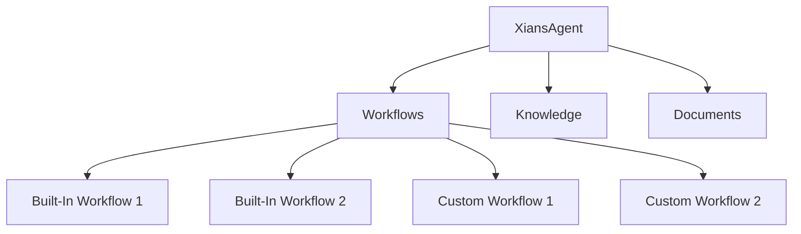
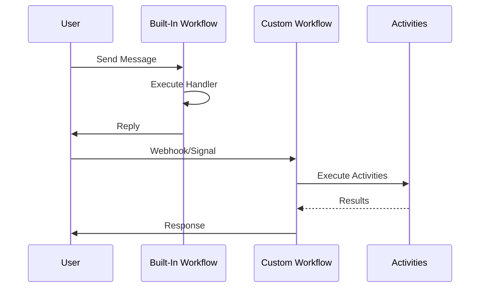

# Agents & Workflows

## Overview

Agents in Xians are database entities that provide identity and management capabilities for your AI applications. They serve as containers for workflows, knowledge, documents, and other resources, with built-in multi-tenancy and isolation.

## Core Concepts

### Agents

An **Agent** is a registered entity that:

- Provides an identity for management and isolation purposes
- Can be **system-scoped** (templates deployable across tenants) or **tenant-scoped** (deployed to a specific tenant)
- Owns and manages collections of workflows, knowledge, and documents
- Automatically handles tenant isolation and resource scoping



### Workflows

**Workflows** are Temporal-based execution units attached to agents. There are two types:

#### Built-In Workflows

Pre-built workflows with plumbing for common patterns:

- Listen to user messages (chat and data)
- Handle webhook invocations
- No workflow class definition required

#### Custom Workflows

Plain Temporal workflows you define:

- Full control over workflow logic
- Access to all Temporal features (signals, queries, updates, child workflows)
- Automatic tenant isolation
- Scheduled execution support



## Agent Registration

### Creating an Agent

```csharp
var xiansPlatform = await XiansPlatform.InitializeAsync(new XiansOptions
{
    ServerUrl = "https://your-server.com",
    ApiKey = "agent-certificate"
});

var agent = xiansPlatform.Agents.Register(new XiansAgentRegistration
{
    Name = "MyAgent",
    Version = "1.0.0",
    Description = "My intelligent agent",
    IsTemplate = true  // or false for tenant-specific
});
```

### System-Scoped vs Tenant-Scoped

| Type | Scope | Use Case | Deployment |
|------|-------|----------|------------|
| **System-Scoped** | Multi-tenant template | Reusable agents across tenants | Registered once, deployed to multiple tenants |
| **Tenant-Scoped** | Single tenant | Tenant-specific customizations | Deployed to developer's tenant only |

## Agent API Reference

### Properties

| Property | Type | Description |
|----------|------|-------------|
| `Name` | `string` | Unique identifier for the agent |
| `Version` | `string?` | Optional version identifier |
| `Description` | `string?` | Human-readable description |
| `IsTemplate` | `bool` | Whether agent is multi-tenant template |
| `Workflows` | `WorkflowCollection` | Collection of workflows |
| `Knowledge` | `KnowledgeCollection` | Knowledge base management |
| `Documents` | `DocumentCollection` | Document storage and retrieval |

### Methods

| Method | Description |
|--------|-------------|
| `GetBuiltInWorkflow(string? name)` | Get a built-in workflow by name (null for unnamed) |
| `GetCustomWorkflow<T>()` | Get a custom workflow by type |
| `GetAllWorkflows()` | Get all workflows for this agent |
| `UploadWorkflowDefinitionsAsync()` | Upload workflow definitions to server |
| `RunAllAsync(CancellationToken)` | Run all registered workflows |

## Defining Workflows

### Built-In

Built-in workflows are ideal for message-driven patterns:

```csharp
// Define an unnamed built-in workflow
var workflow = agent.Workflows.DefineBuiltIn();

// Define a named built-in workflow
var chatWorkflow = agent.Workflows.DefineBuiltIn(name: "ChatHandler");

// Register message handler
chatWorkflow.OnUserChatMessage(async (context) =>
{
    var userMessage = context.Message.Text;
    var response = await ProcessMessage(userMessage);
    await context.ReplyAsync(response);
});

// Register data message handler
chatWorkflow.OnUserDataMessage(async (context) =>
{
    var data = context.Message.Data;
    await ProcessData(data);
});
```

### Custom

Custom workflows give you full Temporal capabilities:

```csharp
// Define custom workflow
var customWorkflow = agent.Workflows.DefineCustom<MyCustomWorkflow>();

// Add activities
customWorkflow.AddActivity<MyActivity>();
customWorkflow.AddActivity(new MyActivityInstance());

// Add multiple activities
customWorkflow.AddActivities(
    new Activity1(),
    new Activity2(),
    new Activity3()
);
```

#### Example Custom Workflow Class

```csharp
using Temporalio.Workflows;

[Workflow]
public class MyCustomWorkflow
{
    [WorkflowRun]
    public async Task<string> RunAsync(WorkflowInput input)
    {
        // Execute activities
        var result = await Workflow.ExecuteActivityAsync(
            (MyActivity act) => act.ProcessAsync(input),
            new() { StartToCloseTimeout = TimeSpan.FromMinutes(5) }
        );
        
        // Wait for signals
        await Workflow.WaitConditionAsync(() => signalReceived);
        
        return result;
    }
    
    [WorkflowSignal]
    public async Task HandleSignalAsync(SignalData data)
    {
        // Handle signal
    }
    
    [WorkflowQuery]
    public string GetStatus() => currentStatus;
}
```

## Workflow API Reference

### Properties

| Property | Type | Description |
|----------|------|-------------|
| `WorkflowType` | `string` | Unique workflow type identifier (prefixed with agent name) |
| `Name` | `string?` | Optional workflow name |
| `Workers` | `int` | Number of worker instances, Default is 100 |
| `Schedules` | `ScheduleCollection?` | Scheduled execution management |

### Methods

| Method | Description |
|--------|-------------|
| `AddActivity(object)` | Register activity instance (shared across workers) |
| `AddActivity<T>()` | Register activity type (new instance per worker) |
| `AddActivities(params object[])` | Register multiple activity instances |
| `OnUserChatMessage(Func<UserMessageContext, Task>)` | Register chat message handler (built-in only) |
| `OnUserDataMessage(Func<UserMessageContext, Task>)` | Register data message handler (built-in only) |
| `RunAsync(CancellationToken)` | Start workflow workers |

## Message Context

When handling messages in built-in workflows, you receive a `UserMessageContext`:

### UserMessageContext Properties

| Property | Type | Description |
|----------|------|-------------|
| `Message` | `CurrentMessage` | The current message with text, data, and context information |
| `Metadata` | `Dictionary<string, string>?` | Optional metadata for the message |
| `SkipResponse` | `bool` | Set to true to prevent messages from being sent to the user |

### UserMessageContext Methods

| Method | Description |
|--------|-------------|
| `ReplyAsync(string text)` | Send a simple text reply |
| `ReplyAsync(string text, object? data)` | Send a reply with text and data |
| `SendDataAsync(object data, string? content)` | Send a data message with optional text |
| `GetChatHistoryAsync(int page, int pageSize)` | Retrieve paginated chat history |
| `GetLastHintAsync()` | Retrieve the last hint for this conversation |
| `SendHandoffAsync(string targetWorkflowId, ...)` | Hand off conversation to another workflow |

### CurrentMessage Properties

All message properties are accessed via `context.Message`:

| Property | Type | Description |
|----------|------|-------------|
| `Text` | `string` | The text content of the message |
| `ParticipantId` | `string` | The participant (user) ID |
| `RequestId` | `string` | Unique request identifier |
| `TenantId` | `string` | The tenant ID for multi-tenancy |
| `Scope` | `string?` | Optional scope for the message |
| `Hint` | `string?` | Optional hint for context |
| `ThreadId` | `string?` | Thread ID for conversation tracking |
| `Data` | `object?` | Associated data payload |
| `Authorization` | `string?` | Authorization token if provided |

### Accessing Agent Resources

Agent resources (Knowledge, Documents, Workflows) are accessed via `XiansContext`:

```csharp
// In workflow or activity context
var agent = XiansContext.CurrentAgent;
var workflow = XiansContext.CurrentWorkflow;
var tenantId = XiansContext.TenantId;  // For system-scoped agents
```

### Example Usage

```csharp
chatWorkflow.OnUserChatMessage(async (context) =>
{
    // Access message data
    var message = context.Message.Text;
    var participantId = context.Message.ParticipantId;
    var requestId = context.Message.RequestId;
    var tenantId = context.Message.TenantId;
    var threadId = context.Message.ThreadId;
    var data = context.Message.Data;
    
    // Reply to user
    await context.ReplyAsync("Hello!");
    
    // Reply with text and data
    await context.ReplyAsync("Response text", new { key = "value" });
    
    // Send data message
    await context.SendDataAsync(new { key = "value" }, "Optional text");
    
    // Access agent's knowledge via XiansContext
    var agent = XiansContext.CurrentAgent;
    var knowledgeItem = await agent.Knowledge.GetAsync("knowledge-name");
    var allKnowledge = await agent.Knowledge.ListAsync();
    
    // Update knowledge
    await agent.Knowledge.UpdateAsync("knowledge-name", "content", type: "instruction");
    
    // Access documents
    var doc = await agent.Documents.GetAsync("doc-id");
    
    // Get chat history
    var history = await context.GetChatHistoryAsync(page: 1, pageSize: 10);
});
```

## Workflow Scheduling (Self-Scheduling Pattern)

Workflows can schedule themselves to run at specific times or intervals. This is done **inside the workflow** using `XiansContext.CurrentWorkflow.Schedules`:

### Self-Scheduling Example

```csharp
using Temporalio.Workflows;
using Xians.Lib.Agents.Core;
using Xians.Lib.Agents.Scheduling.Models;

[Workflow("MyAgent:RecurringTask")]
public class RecurringTaskWorkflow
{
    [WorkflowRun]
    public async Task RunAsync(string taskId, int intervalHours)
    {
        // At the start of the workflow, ensure a recurring schedule exists
        await EnsureScheduleExists(taskId, intervalHours);
        
        // Perform the actual work
        await DoWorkAsync(taskId);
    }
    
    private async Task EnsureScheduleExists(string taskId, int intervalHours)
    {
        try
        {
            // Self-schedule using XiansContext.CurrentWorkflow
            // Automatically uses activities when in workflow context!
            var schedule = await XiansContext.CurrentWorkflow.Schedules!
                .Create($"recurring-{taskId}")
                .WithIntervalSchedule(TimeSpan.FromHours(intervalHours))
                .WithInput(new object[] { taskId, intervalHours })
                .StartAsync();
            
            Workflow.Logger.LogInformation(
                "Schedule created - will run every {Hours} hours",
                intervalHours);
        }
        catch (ScheduleAlreadyExistsException ex)
        {
            Workflow.Logger.LogInformation(
                "Schedule already exists: {ScheduleId}",
                ex.ScheduleId);
        }
    }
    
    private async Task DoWorkAsync(string taskId)
    {
        // Your workflow logic here
        Workflow.Logger.LogInformation("Processing task: {TaskId}", taskId);
    }
}
```

## Child Workflows

Workflows can start and execute other workflows as child workflows using `XiansContext.Workflows`:

### Starting Child Workflows (Fire and Forget)

Use `StartAsync` to start a child workflow without waiting for its completion:

```csharp
[Workflow("MyAgent:ParentWorkflow")]
public class ParentWorkflow
{
    [WorkflowRun]
    public async Task RunAsync(string taskId)
    {
        // Start child workflow by type - fire and forget
        await XiansContext.Workflows.StartAsync<ChildWorkflow>(
            idPostfix: taskId,
            args: new object[] { "param1", "param2" }
        );
        
        // Continue without waiting for child to complete
        Workflow.Logger.LogInformation("Child workflow started");
    }
}
```

### Executing Child Workflows (Wait for Result)

Use `ExecuteAsync` to execute a child workflow and wait for its result:

```csharp
[Workflow("MyAgent:ParentWorkflow")]
public class ParentWorkflow
{
    [WorkflowRun]
    public async Task<string> RunAsync(string data)
    {
        // Execute child workflow and wait for result
        var result = await XiansContext.Workflows.ExecuteAsync<ChildWorkflow, string>(
            idPostfix: "process",
            args: new object[] { data }
        );
        
        return result;
    }
}
```

### XiansContext.Workflows API Reference

| Method | Description |
|--------|-------------|
| `StartAsync<TWorkflow>(string? idPostfix, params object[] args)` | Start child workflow by type without waiting |
| `StartAsync(string workflowType, string? idPostfix, params object[] args)` | Start child workflow by type string without waiting |
| `ExecuteAsync<TWorkflow, TResult>(string? idPostfix, params object[] args)` | Execute child workflow and wait for result |
| `ExecuteAsync<TResult>(string workflowType, string? idPostfix, params object[] args)` | Execute child workflow by type string and wait for result |

**Notes:**

- `idPostfix` is used to create unique workflow IDs (format: `{workflowType}-{idPostfix}`)
- If `idPostfix` is null, a GUID is generated automatically
- Throws `WorkflowAlreadyStartedException` if a workflow with the same ID is already running
- Works both inside workflows (as child workflows) and outside workflows (as new workflows)
