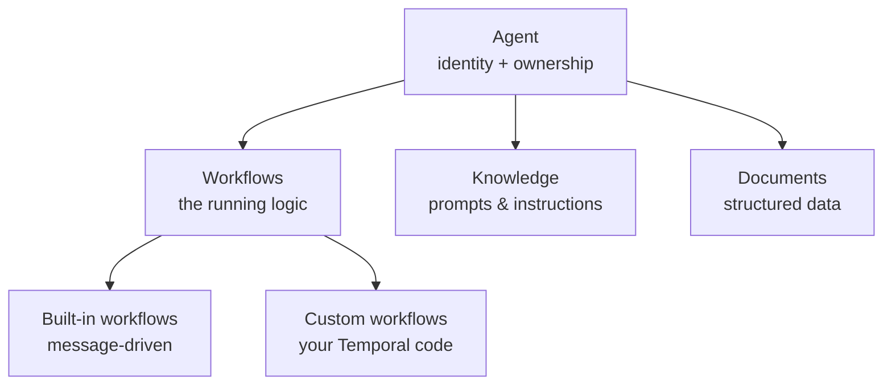

# Agents & Workflows

## Why Agents?

When you build an AI application, you quickly accumulate more than just code: prompts, stored data, schedules, conversations, and credentials. An **Agent** is the unit that owns all of these. It gives your application an identity on the platform, so the server can isolate its resources per tenant, route messages to it, and manage it from the Studio UI.


```mermaid
graph TB
    A[Agent<br/>identity + ownership] --> B[Workflows<br/>the running logic]
    A --> C[Knowledge<br/>prompts & instructions]
    A --> D[Documents<br/>structured data]
    B --> E[Built-in workflows<br/>message-driven]
    B --> F[Custom workflows<br/>your Temporal code]
```

## Why Two Kinds of Workflows?

Workflows are the executable part of an agent, built on [Temporal](https://temporal.io) for durability. Most agents need two very different styles of execution, so Xians provides both:

| | Built-in Workflow | Custom Workflow |
|---|---|---|
| **Purpose** | React to messages, chats, webhooks | Long-running business processes |
| **You write** | Just message handlers | A full Temporal workflow class |
| **Lifecycle** | Managed for you | You control (signals, queries, timers) |
| **Typical use** | Chatbot, request/reply, file intake | Order processing, scheduled jobs, approvals |

**Rule of thumb:** start with a built-in workflow for anything conversational. Reach for a custom workflow when you need control over long-running state, timers, or multi-step orchestration.

## Registering an Agent

Register the agent once at startup. The name is its identity on the server.

```csharp
var xiansPlatform = await XiansPlatform.InitializeAsync(new XiansOptions
{
    ServerUrl = "https://your-server.com",
    ApiKey = "agent-certificate"
});

var agent = xiansPlatform.Agents.Register(new XiansAgentRegistration
{
    Name = "MyAgent",
    Version = "1.0.0",
    Description = "My intelligent agent",
    IsTemplate = true  // system-scoped template, deployable to any tenant
});
```

### System-Scoped vs Tenant-Scoped

`IsTemplate` decides who can use your agent:

| Type | `IsTemplate` | Meaning | When to use |
|------|-------------|---------|-------------|
| **System-scoped** | `true` | A template registered once, deployable to many tenants | Product agents shipped to customers |
| **Tenant-scoped** | `false` | Lives in your own tenant only | Internal or tenant-specific agents |

See [Multitenancy](multitenancy.md) for how isolation works at runtime.

## Defining a Built-in Workflow

Built-in workflows need no class — just attach handlers for the message types you care about.

```csharp
// The conventional chat workflow (named "Supervisor Workflow")
var chatWorkflow = agent.Workflows.DefineSupervisor();

chatWorkflow.OnUserChatMessage(async (context) =>
{
    var response = await ProcessMessage(context.Message.Text);
    await context.ReplyAsync(response);
});

chatWorkflow.OnUserDataMessage(async (context) =>
{
    await ProcessData(context.Message.Data);
});
```

Each handler receives a `UserMessageContext` — see [Messaging – Reply](messaging-replying.md) for everything you can do with it.

## Defining a Custom Workflow

A custom workflow is a standard Temporal workflow class registered with your agent. You get the full Temporal toolbox: activities, signals, queries, timers, and child workflows.

```csharp
var customWorkflow = agent.Workflows.DefineCustom<MyCustomWorkflow>();

// Register the activities the workflow calls
customWorkflow.AddActivity<MyActivity>();       // new instance per worker
customWorkflow.AddActivity(new SharedActivity()); // shared instance
```

```csharp
using Temporalio.Workflows;

[Workflow]
public class MyCustomWorkflow
{
    [WorkflowRun]
    public async Task<string> RunAsync(WorkflowInput input)
    {
        var result = await Workflow.ExecuteActivityAsync(
            (MyActivity act) => act.ProcessAsync(input),
            new() { StartToCloseTimeout = TimeSpan.FromMinutes(5) });

        return result;
    }

    [WorkflowSignal]
    public async Task HandleSignalAsync(SignalData data) { /* ... */ }

    [WorkflowQuery]
    public string GetStatus() => currentStatus;
}
```

## Running the Agent

```csharp
await agent.RunAllAsync(cancellationToken);
```

This starts workers for every defined workflow and keeps them polling for work until cancelled.

## Common Patterns

### Self-Scheduling

A workflow can ensure its own recurring schedule exists — useful for "run every N hours" jobs that bootstrap themselves on first run:

```csharp
try
{
    await XiansContext.CurrentWorkflow.Schedules!
        .Create($"recurring-{taskId}")
        .WithIntervalSchedule(TimeSpan.FromHours(intervalHours))
        .WithInput(new object[] { taskId, intervalHours })
        .StartAsync();
}
catch (ScheduleAlreadyExistsException)
{
    // Already scheduled — nothing to do
}
```

See [Scheduling](scheduling.md) for the full schedule API.

### Child Workflows

Split large processes into smaller workflows. Fire-and-forget with `StartAsync`, or wait for a result with `ExecuteAsync`:

```csharp
// Fire and forget
await XiansContext.Workflows.StartAsync<ChildWorkflow>(
    idPostfix: taskId,
    args: new object[] { "param1" });

// Wait for the result
var result = await XiansContext.Workflows.ExecuteAsync<ChildWorkflow, string>(
    idPostfix: "process",
    args: new object[] { data });
```

The child's workflow ID becomes `{workflowType}-{idPostfix}` (a GUID is used if `idPostfix` is null). Starting a duplicate ID throws `WorkflowAlreadyStartedException`.

## API Reference

### Agent

| Member | Description |
|--------|-------------|
| `Name`, `Version`, `Description` | Identity metadata |
| `IsTemplate` | Whether the agent is a multi-tenant template |
| `Workflows`, `Knowledge`, `Documents` | Owned resource collections |
| `GetBuiltInWorkflow(string? name)` | Get a built-in workflow by name |
| `GetCustomWorkflow<T>()` | Get a custom workflow by type |
| `UploadWorkflowDefinitionsAsync()` | Push workflow definitions to the server |
| `RunAllAsync(CancellationToken)` | Run all registered workflows |

### Workflow

| Member | Description |
|--------|-------------|
| `WorkflowType` | Unique type identifier (prefixed with agent name) |
| `Workers` | Number of worker instances (default 100) |
| `Schedules` | Schedule management for this workflow |
| `AddActivity<T>()` / `AddActivity(object)` | Register activities |
| `OnUserChatMessage(...)` / `OnUserDataMessage(...)` / `OnFileUpload(...)` | Message handlers (built-in only) |
| `RunAsync(CancellationToken)` | Start this workflow's workers |
