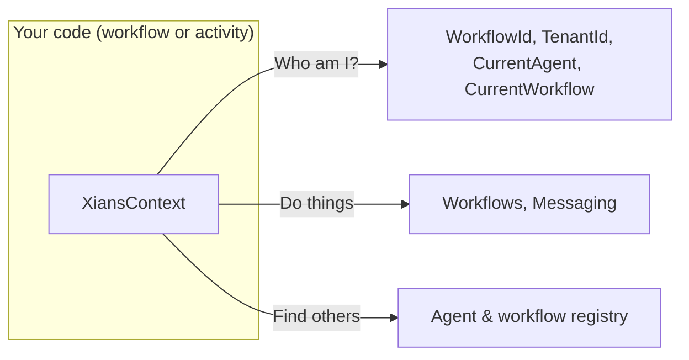

# Operating Context

## Why XiansContext?

Your agent code runs inside Temporal workflows and activities, where you can't just pass dependencies around — workflow code must be deterministic and gets replayed. `XiansContext` solves this: it is a **static entry point** that always knows *where your code is running* (which tenant, which workflow, which agent) and gives you the right SDK services for that context, no plumbing required.



## Quick Reference

| Category | Members | Use for |
|----------|---------|---------|
| **Identity** | `WorkflowId`, `TenantId`, `GetParticipantId()`, `GetTaskQueue()` | Knowing where you are |
| **Safe identity** | `SafeWorkflowId`, `SafeAgentName`, ... | Logging (never throws) |
| **Current instances** | `CurrentAgent`, `CurrentWorkflow` | Agent data, schedules, workflow metadata |
| **Helpers** | `Workflows`, `Messaging` | Starting workflows, messaging users |
| **Registry** | `GetAgent()`, `GetWorkflow()`, `TryGet...()` | Finding other registered resources |

## Knowing Where You Are

```csharp
var workflowId = XiansContext.WorkflowId;   // throws outside Temporal context
var tenantId  = XiansContext.TenantId;
var userId    = XiansContext.GetParticipantId();

// Check first if unsure
if (XiansContext.InWorkflowOrActivity) { /* safe to use context */ }
```

### Safe Properties for Logging

Regular properties throw `InvalidOperationException` outside a Temporal context. The `Safe*` variants return `null` instead — use them in code that may run anywhere (e.g. shared logging helpers):

```csharp
_logger.LogInfo("Workflow: {0}", XiansContext.SafeWorkflowId ?? "N/A");
```

## Current Agent and Workflow

These give you the resources owned by the agent/workflow your code is running in (see [SDK Patterns](sdk-patterns.md) for the ownership model):

```csharp
// Agent-owned: knowledge, documents, schedules
var config = await XiansContext.CurrentAgent.Knowledge.GetAsync("config-key");
var docs   = await XiansContext.CurrentAgent.Documents.QueryAsync(new DocumentQuery());
var schedule = await XiansContext.CurrentAgent.Schedules.GetAsync("my-schedule");

// Current workflow metadata
var workflowType = XiansContext.CurrentWorkflow.WorkflowType;
```

## Helpers for Doing Things

### Workflows — start, signal, query

```csharp
await XiansContext.Workflows.StartAsync<MyWorkflow>(args, uniqueKey);

var result = await XiansContext.Workflows.ExecuteAsync<MyWorkflow, string>(args, uniqueKey);

var handle = await XiansContext.Workflows.GetWorkflowHandleAsync<MyWorkflow>(idPostfix);
await handle.SignalAsync(wf => wf.ProcessSignalAsync(data));
var status = await handle.QueryAsync(wf => wf.GetStatus());
```

### Messaging — reach any user

```csharp
await XiansContext.Messaging.SendChatAsync(
    text: "Your order shipped!",
    participantId: "userId123");

await XiansContext.Messaging.SendDataAsync(
    text: "Order data",
    data: orderObject,
    participantId: "userId123");
```

See [Proactive Messaging](messaging-proactive.md).

## Finding Registered Resources

Every agent and workflow registered in your process is discoverable. `Get*` throws when not found; `TryGet*` returns `false`:

```csharp
var agent = XiansContext.GetAgent("MyAgent");
var workflow = XiansContext.GetWorkflow("MyAgent:CustomWorkflow");

if (XiansContext.TryGetAgent("OptionalAgent", out var optional))
{
    // exists
}

var allAgents = XiansContext.GetAllAgents();
```

## Building Workflow Identifiers

Workflow types and IDs follow strict naming conventions (`Agent:Workflow`, `tenant:Agent:Workflow`). Use these helpers instead of string concatenation:

```csharp
var type = XiansContext.BuildBuiltInWorkflowType("MyAgent", "WebWorkflow"); // "MyAgent:WebWorkflow"
var id   = XiansContext.BuildBuiltInWorkflowId("MyAgent", "WebWorkflow");  // "tenant123:MyAgent:WebWorkflow"
var custom = XiansContext.GetWorkflowTypeFor(typeof(MyCustomWorkflow));
```

## API Reference

### Properties

| Property | Type | Throws outside context | Description |
|----------|------|------------------------|-------------|
| `WorkflowId` | `string` | Yes | Current workflow ID |
| `TenantId` | `string` | Yes | Current tenant ID |
| `InWorkflow` / `InActivity` / `InWorkflowOrActivity` | `bool` | No | Context checks |
| `SafeWorkflowId`, `SafeWorkflowRunId`, `SafeWorkflowType`, `SafeAgentName`, `SafeTenantId`, `SafeParticipantId` | `string?` | No | Null-safe identity |
| `CurrentAgent` | `XiansAgent` | Yes | Current agent instance |
| `CurrentWorkflow` | `XiansWorkflow` | Yes | Current workflow instance |
| `Workflows` / `Messaging` / `Metrics` | helpers | No | Operation helpers |

### Methods

| Method | Throws | Description |
|--------|--------|-------------|
| `GetParticipantId()` | Yes | User ID from context |
| `GetIdPostfix()` | Yes | ID postfix of current workflow |
| `GetTaskQueue()` | Yes | Current task queue |
| `GetAgent(name)` / `TryGetAgent(...)` | Yes / No | Agent lookup |
| `GetWorkflow(type)` / `TryGetWorkflow(...)` | Yes / No | Workflow lookup |
| `GetBuiltInWorkflow(name)` / `TryGetBuiltInWorkflow(...)` | Yes / No | Built-in workflow lookup |
| `GetAllAgents()` / `GetAllWorkflows()` | No | List all registered |
| `BuildBuiltInWorkflowType(agent, name)` | No | `"Agent:Workflow"` |
| `BuildBuiltInWorkflowId(agent, name)` | No | `"tenant:Agent:Workflow"` |
| `GetWorkflowTypeFor(type)` | No | Workflow type from class |

## See Also

- [SDK Patterns](sdk-patterns.md) — the ownership model behind these APIs
- [Agents](agents.md) · [Workflows](workflows.md)
