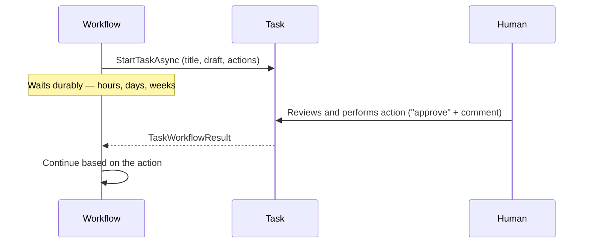
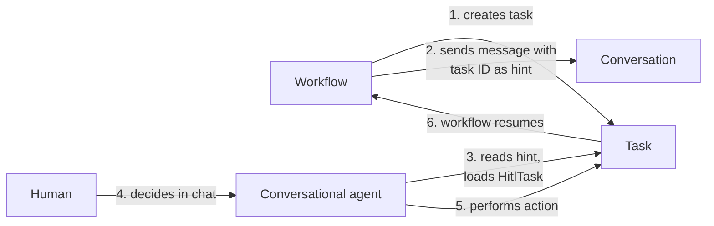

# Human-in-the-Loop Tasks

## Why HITL Tasks?

Some decisions shouldn't be automated: approving a $50,000 order, publishing content, issuing a refund. But pausing an automated process for a human is hard to build yourself — you need durable waiting (possibly for days), a UI for the reviewer, timeouts, and a way to resume the workflow with the decision. **HITL tasks** package all of that: a workflow creates a task, a human performs an action on it, and the workflow resumes with the result.



The actions are **yours to define** — whatever fits the domain:

```csharp
Actions = ["approve", "reject", "hold"]        // Order processing
Actions = ["publish", "revise", "reject"]      // Content review
Actions = ["ship", "refund", "escalate"]       // Customer service
```

If you don't specify actions, tasks default to `["approve", "reject"]`.

## Enabling Tasks

Tasks are opt-in per agent. Enabling them registers a dedicated `{AgentName}:Task Workflow` when the agent runs, which gives each agent its own isolated, tenant-scoped task queue:

```csharp
var agent = xiansPlatform.Agents.Register(new XiansAgentRegistration
{
    Name = "OrderProcessor",
    EnableTasks = true
});
```

## Creating a Task and Waiting for the Decision

```csharp
var taskHandle = await XiansContext.CurrentAgent.Tasks.StartTaskAsync(
    new TaskWorkflowRequest
    {
        TaskId = $"order-{orderId}",
        Title = "Review High-Value Order",
        Description = $"Order for ${amount} requires approval",
        DraftWork = orderDetails,                          // give the reviewer context
        Actions = ["approve", "reject", "request-info"],
        Timeout = TimeSpan.FromHours(24)                   // optional
    });

var result = await XiansContext.CurrentAgent.Tasks.GetResultAsync(taskHandle);

if (result.TimedOut)
{
    await HandleTimeout(result.TaskId);
    return;
}

switch (result.PerformedAction)
{
    case "approve":      await ProcessOrder(result.FinalWork); break;
    case "reject":       await CancelOrder(result.Comment); break;
    case "request-info": await RequestMoreInfo(result.Comment); break;
}
```

!!! tip "Waiting is free"
    `GetResultAsync()` uses Temporal's durable execution. The workflow can wait for months without consuming resources, survives restarts, and resumes exactly where it left off when the human responds.

### Creation methods

| Method | Behavior |
|--------|----------|
| `StartTaskAsync()` | Create task, return a handle immediately (wait later) |
| `GetResultAsync(handle)` | Wait durably for completion |
| `CreateAndWaitAsync()` | Create and block until completion in one call |
| `CreateAsync()` | Fire-and-forget — no result needed |

### The result

| Property | Description |
|----------|-------------|
| `PerformedAction` | The action the human chose (`null` if timed out) |
| `Comment` | Optional rationale from the human (`null` if timed out) |
| `InitialWork` / `FinalWork` | Draft when created vs. when completed — compare to see edits |
| `TimedOut` / `Completed` | Exactly one is `true`: timeout vs. human action |
| `CompletedAt` | When the task finished |

## Timeouts

Why timeouts? Without them a forgotten task blocks a workflow forever. A timeout turns "no answer" into a decision your workflow can act on — escalate, auto-approve, or cancel:

```csharp
var result = await XiansContext.CurrentAgent.Tasks.GetResultAsync(taskHandle);

if (result.TimedOut)
{
    // Business rule: auto-approve after the review period
    await ApproveOrder("Auto-approved after 72-hour review period");
}
else if (result.PerformedAction == "reject")
{
    await RejectOrder(result.Comment);
}
```

No timeout specified means the task waits indefinitely. Always check `TimedOut` before reading `PerformedAction`.

## Connecting Tasks to Conversations: The Hint Pattern

Reviewers shouldn't need a separate admin console — they can handle tasks **through chat** with your conversational agent. The link between a task and a conversation is a **message hint**:



```csharp
// Workflow side: notify the user, linking the task via hint
await XiansContext.Messaging.SendChatAsWorkflowAsync(
    "Supervisor Workflow",
    userId,
    "I found a high-value order. Please review it.",
    scope: orderId,
    hint: taskHandle.Id);
```

```csharp
// Agent side: reconstruct the task from the hint and act on it
var taskWorkflowId = await context.GetLastHintAsync();
var task = await HitlTask.FromWorkflowIdAsync(taskWorkflowId);

var info = await task.GetInfoAsync();          // title, status, available actions, draft
await task.PerformActionAsync("approve", "Verified by support team");

// Convenience shortcuts
await task.ApproveAsync("Looks good!");
await task.RejectAsync("Missing required documentation");
```

`HitlTask` also supports `UpdateDraftAsync(draft)` / `GetDraftAsync()` for collaboratively editing the work item, and works outside workflows too (webhooks, admin tools).

### Exposing tasks as AI tools

Wrap `HitlTask` calls in function tools so the LLM can guide humans through decisions conversationally:

```csharp
[Description("Perform an action on the current task")]
public async Task<string> PerformAction(
    [Description("The action to perform (e.g., approve, reject)")] string action,
    [Description("Optional comment for the action")] string? comment = null)
{
    var taskId = await _context.GetLastHintAsync();
    var task = await HitlTask.FromWorkflowIdAsync(taskId);
    await task.PerformActionAsync(action, comment);
    return $"Task action '{action}' performed successfully.";
}
```

## Complete Example

```csharp
[Workflow("OrderProcessor:Order Workflow")]
public class OrderWorkflow
{
    [WorkflowRun]
    public async Task<OrderResult> RunAsync(string customerId, decimal amount)
    {
        // Auto-approve small orders — only involve humans when it matters
        if (amount <= 100)
            return new OrderResult { Status = "Auto-Approved", Amount = amount };

        var taskHandle = await XiansContext.CurrentAgent.Tasks.StartTaskAsync(
            new TaskWorkflowRequest
            {
                Title = "Review Order",
                Description = $"Customer {customerId} - ${amount}",
                Actions = ["approve", "reject", "hold", "escalate"],
                Timeout = TimeSpan.FromHours(48)
            });

        var result = await XiansContext.CurrentAgent.Tasks.GetResultAsync(taskHandle);

        if (result.TimedOut)
            return new OrderResult { Status = "Escalated-Timeout", Amount = amount };

        return result.PerformedAction switch
        {
            "approve"  => ProcessApprovedOrder(result.Comment),
            "reject"   => CancelOrder(result.Comment),
            "hold"     => PutOnHold(result.Comment),
            "escalate" => EscalateToManager(result.Comment),
            _ => throw new InvalidOperationException($"Unknown action: {result.PerformedAction}")
        };
    }
}
```

## Task Lifecycle: Surviving the Parent

By default, a task is abandoned if its parent workflow terminates. Set `SurviveParentClose = true` when the decision must be recorded regardless — independent approvals, audit trails, decoupled processes:

```csharp
new TaskWorkflowRequest
{
    Title = "Long-Running Approval",
    Actions = ["approve", "reject"],
    SurviveParentClose = true
}
```

!!! warning
    With `SurviveParentClose = true`, the parent may be gone before the task completes, so it can't call `GetResultAsync()`. Have the task trigger a callback workflow on completion instead.

## Best Practices

- **Domain-specific actions** — `ship`, `refund`, not `initiateShippingProcess`. Handle every action in your workflow logic.
- **Give reviewers context** — pre-populate `DraftWork` and write meaningful titles/descriptions.
- **Treat timeouts as business logic** — decide what "no answer" means (escalate? auto-approve?), and check `TimedOut` first.
- **Always link via hints** so users can manage tasks in conversation.
- **Remind before timeout** — a [scheduled workflow](scheduling.md) can nudge reviewers on pending tasks.
