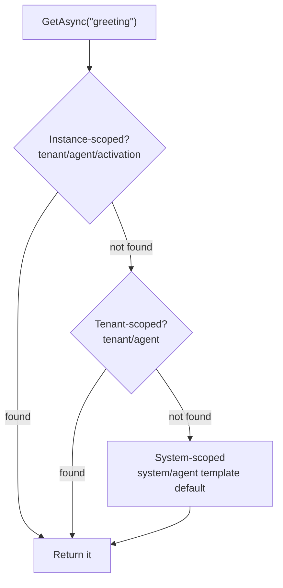

# Knowledge

## Why Knowledge?

LLMs are smart, but they don't know **your** business — your products, policies, or tone. And if you hard-code prompts into your source, every wording tweak requires a redeploy. **Knowledge** solves both problems: it's a per-agent key-value store for prompts, instructions, and configuration that can be read at runtime and edited from the Studio UI without touching code.

Typical contents:

| Knowledge | Example |
|-----------|---------|
| System instructions | The agent's persona and rules |
| Business content | Product catalogs, company policies |
| Configuration | API settings, feature toggles (as JSON) |
| Workflow instructions | Step-by-step guidance for complex processes |

Knowledge is **automatically scoped to each agent** — Agent A can never read Agent B's knowledge, even if they use the same names.

## Shipping Knowledge with Your Code

Keep prompts in version control by embedding them in your assembly and uploading them when the agent starts:

```xml
<ItemGroup>
  <EmbeddedResource Include="**\*.md" />
  <EmbeddedResource Include="**\*.json" />
</ItemGroup>
```

```csharp
await agent.Knowledge.UploadEmbeddedResourceAsync(
    resourcePath: "Supervisor/supervisor-agent-prompt.md",
    knowledgeName: "Supervisor Agent Prompt",
    knowledgeType: "markdown");
```

Supported types: `"text"`, `"markdown"`, and `"json"`.

## Retrieving Knowledge

```csharp
var agent = XiansContext.CurrentAgent;   // or XiansContext.GetAgent(name)

var knowledge = await agent.Knowledge.GetAsync("welcome-message");
Console.WriteLine(knowledge?.Content);

var allKnowledge = await agent.Knowledge.ListAsync();
```

Retrieval works the same inside workflows — the SDK automatically routes the call through a Temporal activity, so you don't need to think about workflow determinism.

## Progressive Fallback: Defaults with Overrides

Why does one `GetAsync("greeting")` call sometimes return different content? Because knowledge can be **overridden at three levels**, and the server returns the most specific match:



This is the mechanism behind multi-tenant customization:

- **System-scoped** knowledge (uploaded by a template agent) provides the baseline for everyone.
- Each **tenant** can override it with their own branding and rules.
- Individual **activations** can override further for per-instance personalization.

You only store the overrides — never duplicated defaults. See [Multitenancy](multitenancy.md) for how scopes are created.

## Common Patterns

### System instructions for an LLM

```csharp
conversationalWorkflow.OnUserChatMessage(async (context) =>
{
    var instructions = await XiansContext.CurrentAgent.Knowledge.GetAsync("system-instructions");

    var messages = new List<ChatMessage>
    {
        new SystemMessage(instructions?.Content ?? "Default instructions"),
        new UserMessage(context.Message.Text)
    };

    var response = await llm.GetCompletionAsync(messages);
    await context.ReplyAsync(response);
});
```

### Runtime configuration

```csharp
var config = await agent.Knowledge.GetAsync("api-config");
if (config?.Type == "json")
{
    var settings = JsonSerializer.Deserialize<ApiSettings>(config.Content);
}
```

## Caching

Knowledge reads are cached and the cache is invalidated automatically on update/delete. Configure the TTL if needed:

```csharp
var platform = await XiansPlatform.InitializeAsync(new XiansOptions
{
    ApiKey = yourApiKey,
    Cache = new CacheOptions
    {
        Knowledge = new CacheAspectOptions { Enabled = true, TtlMinutes = 10 } // default 10
    }
});
```

## See Also

- [Multitenancy](multitenancy.md) — how system/tenant knowledge scopes are created
- [Document DB](document-db.md) — for structured *data* rather than prompts and instructions
