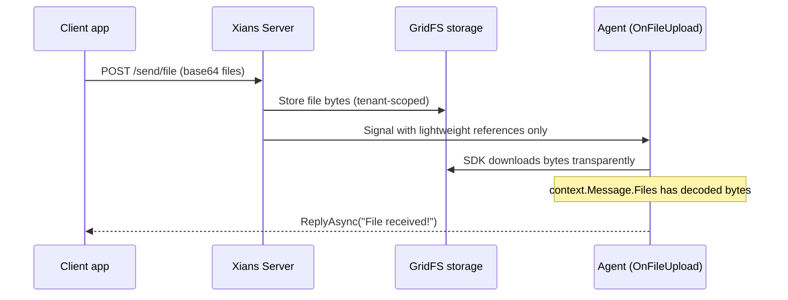

# File Upload Messaging

## Why a Dedicated File Type?

Users often need to send documents, images, or other files to an agent — an invoice to process, a photo to analyze. Files don't fit the chat or data message model: they are large binary payloads that would blow past Temporal's ~2 MB signal limit if sent inline. So Xians treats files as a **first-class message type (`File`)** with its own handler, storage, and delivery pipeline:



The key idea: **clients send base64, the server stores bytes in MongoDB GridFS, and only tiny references travel through Temporal**. Your handler still sees the full file content — the SDK downloads it for you before the handler runs.

## Handling File Uploads in Your Agent

Register `OnFileUpload` on a built-in workflow. Files arrive as typed `UploadedFile` objects via `context.Message.Files` — no JSON parsing or manual downloads needed:

```csharp
var conversationalWorkflow = xiansAgent.Workflows.DefineSupervisor();

conversationalWorkflow.OnFileUpload(async (context) =>
{
    var files = context.Message.Files;

    if (files.Count == 0)
    {
        await context.ReplyAsync("No file data received.");
        return;
    }

    foreach (var file in files)
    {
        if (!file.TryGetBytes(out var fileBytes))
        {
            await context.ReplyAsync($"Invalid file format for '{file.FileName}'.");
            return;
        }

        // Process fileBytes using file.FileName, file.ContentType...
        await context.ReplyAsync($"Received {file.FileName} ({fileBytes!.Length} bytes)");
    }
});
```

The handler receives the same `UserMessageContext` as chat handlers, so `ReplyAsync`, `SendDataAsync`, and `GetChatHistoryAsync` all work as usual. An optional caption sent by the client is in `context.Message.Text`.

### The `UploadedFile` Type

| Member | Type | Description |
|--------|------|-------------|
| `Content` | `string` | Base64 content (resolved automatically for GridFS-backed files) |
| `FileName` | `string?` | File name, if provided |
| `ContentType` | `string?` | MIME type, e.g. `application/pdf` |
| `FileSize` | `long?` | Size in bytes, if provided |
| `FileId` | `string?` | Server storage ID (GridFS); `null` for inline files |
| `GetBytes()` | `byte[]` | Decode to raw bytes (throws on invalid base64) |
| `TryGetBytes(out byte[]?)` | `bool` | Decode without throwing |

### Accepted Payload Formats

`context.Message.Files` decodes every wire format a `File` message can arrive in. You normally don't care which one was used — the result is always a list of `UploadedFile`:

| Format | `data` payload | Notes |
|--------|----------------|-------|
| **Reference** | `{ "files": [{ "fileId", "fileName", ... }] }` | What the server stores/delivers; bytes fetched automatically |
| Multi-file inline | `{ "files": [{ "content", "fileName", ... }] }` | Backward compatibility / direct calls |
| Single file object | `{ "content", "fileName", ... }` | Backward compatibility |
| Raw base64 string | `"JVBERi0x..."` | `context.Message.Text` becomes the file name |

Unrecognizable data yields an empty list — it never throws.

## Sending Files from Client Applications

Use the specialized file endpoint of the Messaging Admin API:

```text
POST /api/v1/admin/tenants/{tenantId}/messaging/send/file
```

### Request Fields

| Field | Required | Description |
|-------|----------|-------------|
| `agentName` | Yes | Target agent |
| `activationName` | Yes | Workflow instance name |
| `participantId` | Yes | User sending the file |
| `files` | Yes | Array of `{ content (base64), fileName, contentType, fileSize? }` |
| `text` | No | Caption to accompany the files |
| `workflowType` | No | Defaults to `"Supervisor Workflow"` |
| `topic` | No | Scope for the message thread |
| `requestId`, `hint`, `origin`, `authorization` | No | Standard messaging options |

### Limits

| Limit | Value |
|-------|-------|
| Files per message | 5 |
| Size per file (decoded) | 10 MB |
| Combined size per message | 20 MB |

Violations are rejected with `400 Bad Request`.

### Example

```bash
curl -X POST "https://your-server/api/v1/admin/tenants/default/messaging/send/file" \
  -H "Authorization: Bearer YOUR_API_KEY" \
  -H "Content-Type: application/json" \
  -d '{
    "agentName": "DocumentAgent",
    "activationName": "DocumentAgent - Default",
    "participantId": "user@example.com",
    "text": "Here are the invoice and the receipt.",
    "files": [
      { "content": "JVBERi0x...", "fileName": "invoice.pdf", "contentType": "application/pdf" },
      { "content": "iVBORw0K...", "fileName": "receipt.png", "contentType": "image/png" }
    ],
    "topic": "document-uploads"
  }'
```

The tenant can be given in the URL path or via the `X-Tenant-Id` header.

!!! note "Legacy generic endpoint"
    The generic `POST .../messaging/send` endpoint still accepts `type: "File"` with files nested under `data` (including the raw-base64-string form). New integrations should use `/send/file` — it has a validated, self-documenting schema.

## Downloading Stored Files

Stored messages carry references, not bytes, so message history and SSE streams stay lightweight. Fetch content on demand — both endpoints enforce tenant isolation:

| Consumer | Endpoint | Auth |
|----------|----------|------|
| Client / browser | `GET /api/v1/admin/tenants/{tenantId}/messaging/files/{fileId}` | Admin API key (Bearer) |
| Agent SDK | `GET /api/agent/files/{fileId}` | Client certificate |

Agents rarely call the download endpoint directly — `context.Message.Files` already resolves bytes for you. Agent Studio renders file attachments as download links automatically.

## Summary

| Aspect | Detail |
|--------|--------|
| Agent handler | `workflow.OnFileUpload(async context => { ... })` |
| Typed access | `context.Message.Files` → list of `UploadedFile` |
| Storage | Bytes in MongoDB GridFS; messages carry references |
| Send endpoint | `POST .../messaging/send/file` |
| Limits | 5 files, 10 MB each, 20 MB combined |
