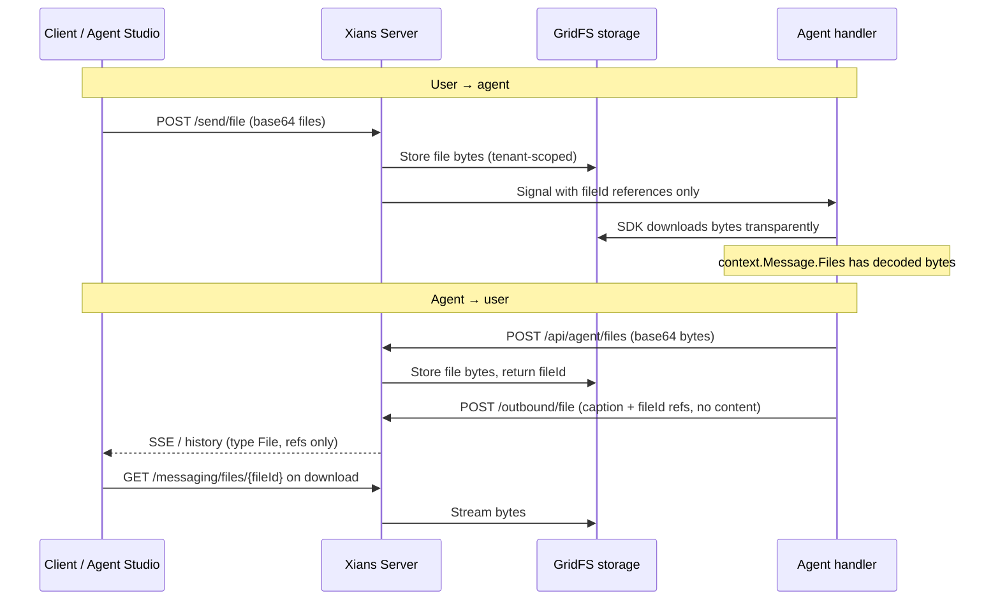

# File Messaging

## Why a Dedicated File Type?

Users often need to send documents, images, or other files to an agent — an invoice to process, a photo to analyze. Agents also need to send files back — a generated PDF, a processed copy, a receipt. Files don't fit the chat or data message model: they are large binary payloads that would blow past Temporal's ~2 MB signal limit if sent inline. So Xians treats files as a **first-class message type (`File`)** with its own handler, storage, and delivery pipeline.

The key idea is the same in both directions: **bytes live in MongoDB GridFS; conversation history, SSE, and Temporal carry only tiny `fileId` references.** Agent Studio shows a caption plus a filename and download icon. Clicking download is the first time those bytes reach the browser.


```mermaid
sequenceDiagram
    participant C as Client / Agent Studio
    participant S as Xians Server
    participant G as GridFS storage
    participant A as Agent handler

    Note over C,A: User → agent
    C->>S: POST /send/file (base64 files)
    S->>G: Store file bytes (tenant-scoped)
    S->>A: Signal with fileId references only
    A->>G: SDK downloads bytes transparently
    Note over A: context.Message.Files has decoded bytes

    Note over C,A: Agent → user
    A->>S: POST /api/agent/files (base64 bytes)
    S->>G: Store file bytes, return fileId
    A->>S: POST /outbound/file (caption + fileId refs, no content)
    S-->>C: SSE / history (type File, refs only)
    C->>S: GET /messaging/files/{fileId} on download
    S->>G: Stream bytes
```

## Handling File Uploads in Your Agent

Register `OnFileUpload` on a built-in workflow. Files arrive as typed `UploadedFile` objects via `context.Message.Files` — no JSON parsing or manual downloads needed:

```csharp
var conversationalWorkflow = xiansAgent.Workflows.DefineSupervisor();

conversationalWorkflow.OnFileUpload(async (context) =>
{
    var files = context.Message.Files;

    if (files.Count == 0)
    {
        await context.ReplyAsync("No file data received.");
        return;
    }

    foreach (var file in files)
    {
        if (!file.TryGetBytes(out var fileBytes))
        {
            await context.ReplyAsync($"Invalid file format for '{file.FileName}'.");
            return;
        }

        // Process fileBytes using file.FileName, file.ContentType...
        await context.ReplyAsync($"Received {file.FileName} ({fileBytes!.Length} bytes)");
    }
});
```

The handler receives the same `UserMessageContext` as chat handlers, so `ReplyAsync`, `SendFileAsync`, `SendDataAsync`, and `GetChatHistoryAsync` all work as usual. An optional caption sent by the client is in `context.Message.Text`.

### The `UploadedFile` Type

| Member | Type | Description |
|--------|------|-------------|
| `Content` | `string` | Base64 content (resolved automatically for GridFS-backed files) |
| `FileName` | `string?` | File name, if provided |
| `ContentType` | `string?` | MIME type, e.g. `application/pdf` |
| `FileSize` | `long?` | Size in bytes, if provided |
| `FileId` | `string?` | Server storage ID (GridFS); `null` until uploaded, or set when forwarding |
| `FromBytes(byte[], fileName, contentType?)` | `UploadedFile` | Build a file from agent-generated bytes (`FileId` is null so the SDK uploads) |
| `GetBytes()` | `byte[]` | Decode to raw bytes (throws on invalid base64) |
| `TryGetBytes(out byte[]?)` | `bool` | Decode without throwing |

### Accepted Payload Formats

`context.Message.Files` decodes every wire format a `File` message can arrive in. You normally don't care which one was used — the result is always a list of `UploadedFile`:

| Format | `data` payload | Notes |
|--------|----------------|-------|
| **Reference** | `{ "files": [{ "fileId", "fileName", ... }] }` | What the server stores/delivers; bytes fetched automatically |
| Multi-file inline | `{ "files": [{ "content", "fileName", ... }] }` | Backward compatibility / direct calls |
| Single file object | `{ "content", "fileName", ... }` | Backward compatibility |
| Raw base64 string | `"JVBERi0x..."` | `context.Message.Text` becomes the file name |

Unrecognizable data yields an empty list — it never throws.

## Sending Files from the Agent

Call `SendFileAsync` (or `ReplyWithFileAsync`) from a **message handler or activity** — `OnUserChatMessage`, `OnFileUpload`, and so on. Handlers run inside an activity, so the bytes go straight to the platform over HTTP and the full limits below apply.

Sending from deterministic **workflow code** works too, through `XiansContext.Messaging` — see [From workflow code](#from-workflow-code). There the send runs as a Temporal activity, so newly generated bytes pass through workflow history and a much tighter limit applies.

The SDK uploads bytes over HTTP (`POST /api/agent/files`), then posts an outbound `File` message with **references only** (`POST /api/agent/conversation/outbound/file`). History and SSE never include `content`.

```csharp
using Xians.Lib.Agents.Messaging;

// Reply + file in one Agent Studio bubble (caption, then filename + download icon)
await context.ReplyWithFileAsync(
    "Here is your report.",
    UploadedFile.FromBytes(pdfBytes, "report.pdf", "application/pdf"));

// Same thing via SendFileAsync
await context.SendFileAsync(
    content: pdfBytes,
    fileName: "report.pdf",
    contentType: "application/pdf",
    text: "Here is your report.");

// Several files (maximum 5)
await context.SendFileAsync(files, text: "Here are the exports.");

// A caption plus several files, in one bubble
await context.ReplyWithFilesAsync("Here are the exports.", files);

// Forward a file the user just uploaded (has FileId after hydrate — not re-uploaded)
await context.SendFileAsync(context.Message.Files, text: "Echoing your upload");
```

| Method | Result in Agent Studio |
|--------|------------------------|
| `ReplyWithFileAsync(text, file)` or `SendFileAsync(..., text: "...")` | **One** agent bubble: caption + filename + download icon |
| `ReplyAsync(text)` **then** `SendFileAsync(...)` | **Two** bubbles: Chat, then File |
| `SendFileAsync` with empty `text` | Caption falls back to “Your file is ready.” |

The file variants are named `ReplyWithFileAsync` / `ReplyWithFilesAsync` rather than being overloads of `ReplyAsync`, which is already overloaded for data replies (`ReplyAsync(text, data)`).

`SkipResponse` suppresses the upload and the outbound message, same as `ReplyAsync`.

Requires a server version that exposes `POST /api/agent/files` and `POST /api/agent/conversation/outbound/file`.

### From workflow code

Handlers hand you a `UserMessageContext`, but custom workflow code has none, so use `XiansContext.Messaging`. `SendFileAsSupervisorAsync` puts the files in the user's chat conversation; `SendFileAsync` puts them in the current workflow's own conversation.

Because the send is a Temporal activity, the request is serialized into workflow history. That splits the two cases apart:

- **Files the agent generates here** carry their bytes in the activity argument, so keep them under **~1 MB combined**. Larger files belong in a handler or in your own activity.
- **Files the platform already stores** carry only a `FileId`, so they are forwarded by reference: nothing lands in history, no second upload, and the normal limits apply unchanged.

```csharp
[Workflow("My Agent:Report Workflow")]
public class ReportWorkflow
{
    [WorkflowRun]
    public async Task RunAsync(string participantId, IReadOnlyList<UploadedFile> uploads)
    {
        // Generated bytes pass through workflow history — keep them small.
        var report = Encoding.UTF8.GetBytes("...");
        await XiansContext.Messaging.SendFileAsSupervisorAsync(
            [UploadedFile.FromBytes(report, "report.txt", "text/plain")],
            text: "Here is your report.",
            participantId: participantId);

        // Files with a FileId are forwarded by reference: nothing lands in history.
        await XiansContext.Messaging.SendFileAsSupervisorAsync(
            uploads, text: "Echoing your uploads", participantId: participantId);
    }
}
```

Pass uploads *into* a workflow as references only, so the workflow argument itself stays small:

```csharp
var storedFiles = context.Message.Files
    .Where(file => !string.IsNullOrEmpty(file.FileId))
    .Select(file => new UploadedFile(null, file.FileName, file.ContentType, file.FileSize, file.FileId))
    .ToList();
```

Exceeding the inline limit fails the workflow with a non-retryable error naming the offending size, rather than retrying a send that can never succeed.

!!! warning "Slack and Teams"
    Outbound `File` messages are persisted and shown in Agent Studio. App-channel routers skip them in v1 — Slack/Teams do not receive the attachment.

## Sending Files from Client Applications

Use the specialized file endpoint of the Messaging Admin API:

```text
POST /api/v1/admin/tenants/{tenantId}/messaging/send/file
```

### Request Fields

| Field | Required | Description |
|-------|----------|-------------|
| `agentName` | Yes | Target agent |
| `activationName` | Yes | Workflow instance name |
| `participantId` | Yes | User sending the file |
| `files` | Yes | Array of `{ content (base64), fileName, contentType, fileSize? }` |
| `text` | No | Caption to accompany the files |
| `workflowType` | No | Defaults to `"Supervisor Workflow"` |
| `topic` | No | Scope for the message thread |
| `requestId`, `hint`, `origin`, `authorization` | No | Standard messaging options |

### Limits

Same limits apply to user uploads and agent sends:

| Limit | Value |
|-------|-------|
| Files per message | 5 |
| Size per file (decoded) | 10 MB |
| Combined size per message | 20 MB |
| GridFS retention | 180 days (`metadata.expires_at`) |

Violations are rejected with `400 Bad Request`. After 180 days the GridFS object is deleted; history may still show the filename, but download returns `404`.

One extra limit applies only to the SDK: newly generated files sent from **workflow code** are capped at roughly **1 MB combined**, because the bytes travel through workflow history. Files forwarded by reference are exempt. See [From workflow code](#from-workflow-code).

### Example

```bash
curl -X POST "https://your-server/api/v1/admin/tenants/default/messaging/send/file" \
  -H "Authorization: Bearer YOUR_API_KEY" \
  -H "Content-Type: application/json" \
  -d '{
    "agentName": "DocumentAgent",
    "activationName": "DocumentAgent - Default",
    "participantId": "user@example.com",
    "text": "Here are the invoice and the receipt.",
    "files": [
      { "content": "JVBERi0x...", "fileName": "invoice.pdf", "contentType": "application/pdf" },
      { "content": "iVBORw0K...", "fileName": "receipt.png", "contentType": "image/png" }
    ],
    "topic": "document-uploads"
  }'
```

The tenant can be given in the URL path or via the `X-Tenant-Id` header.

!!! note "Legacy generic endpoint"
    The generic `POST .../messaging/send` endpoint still accepts `type: "File"` with files nested under `data` (including the raw-base64-string form). New integrations should use `/send/file` — it has a validated, self-documenting schema.

## Downloading Stored Files

Stored messages carry references, not bytes, so message history and SSE streams stay lightweight. Fetch content on demand — all of these enforce tenant isolation:

| Consumer | Endpoint | Auth |
|----------|----------|------|
| Agent Studio (browser) | `GET /api/messaging/files/{fileId}` | Session cookie (BFF → Admin GET) |
| Client / Admin API | `GET /api/v1/admin/tenants/{tenantId}/messaging/files/{fileId}` | Admin API key (Bearer) |
| Agent SDK | `GET /api/agent/files/{fileId}` | Client certificate |

Agents rarely call the download endpoint directly — `context.Message.Files` already resolves inbound bytes for you. Agent Studio renders outbound and inbound file attachments automatically: caption text, then a compact filename row whose **download icon** (not the filename) starts the download. No extra Studio setup is required.

## Summary

| Aspect | Detail |
|--------|--------|
| Receive (user → agent) | `workflow.OnFileUpload(async context => { ... })` |
| Send (agent → user) | `context.SendFileAsync(...)` or `context.ReplyWithFileAsync(text, file)` from a handler/activity |
| Send from workflow code | `XiansContext.Messaging.SendFileAsSupervisorAsync(files, text, participantId)` |
| Typed access | `UploadedFile` / `UploadedFile.FromBytes` / `context.Message.Files` |
| Storage | Bytes in MongoDB GridFS; messages carry `{ fileId, fileName, contentType, fileSize }` |
| User send endpoint | `POST .../messaging/send/file` |
| Agent upload then message | `POST /api/agent/files` then `POST /api/agent/conversation/outbound/file` |
| Studio download | `GET /api/messaging/files/{fileId}` |
| Limits | 5 files, 10 MB each, 20 MB combined, 180-day retention |
