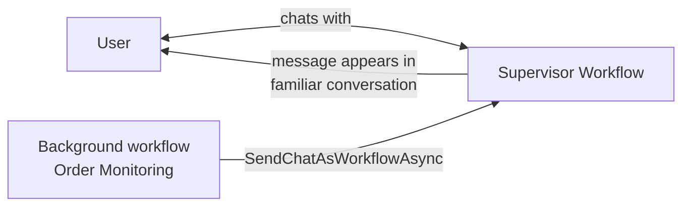

# Proactive Messaging

## Why Proactive Messaging?

Replying only works when the user speaks first. But agents often need to reach out on their own — an order shipped, a schedule fired, a background job finished. **Proactive messaging** lets any workflow or activity send a message to any user at any time via `XiansContext.Messaging`, no incoming message required.

| | Replying | Proactive |
|---|---|---|
| **Initiator** | User | Agent |
| **Access** | `context.ReplyAsync()` in message handlers | `XiansContext.Messaging.*` anywhere |
| **Participant** | Automatic from incoming message | You specify (or current context) |
| **Scope** | Inherited from incoming message | You set explicitly |
| **Typical use** | Conversation | Notifications, reminders, background results |

See [Replying to User Messages](messaging-replying.md) for the conversational side.

## Sending Messages

```csharp
// Chat message — text is the primary content
await XiansContext.Messaging.SendChatAsync(
    text: "Your order has shipped!",
    participantId: "user-123");

// If called where a participant is already in context, participantId can be omitted
await XiansContext.Messaging.SendChatAsync(text: "Your order has shipped!");

// Data message — data is the primary content, text describes it
await XiansContext.Messaging.SendDataAsync(
    text: "Your monthly analytics report is ready",
    data: analyticsReport,
    participantId: "user-123");
```

### Optional Parameters

All send methods share the same optional parameters:

| Parameter | Purpose |
|-----------|---------|
| `data` | Structured payload attached to a chat message |
| `scope` | Topic within the thread (e.g. `"Order #12345 - Delivery Updates"`) — keeps related messages grouped and isolated |
| `hint` | Processing hint: UIs can apply styling/routing; can also be passed to LLMs as extra context |
| `taskId` | Links the message to a [HITL task](hitl-tasks.md) so the UI can offer navigation to it |
| `participantId` | Target user; falls back to the current workflow's participant if omitted |

```csharp
await XiansContext.Messaging.SendChatAsync(
    text: "Your analysis task has completed",
    scope: "Data Analysis",
    hint: "task-complete",
    taskId: "task-789",
    participantId: "user-123");
```

## Workflow Impersonation

### The problem it solves

Imagine a user chatting with your "Supervisor Workflow" while a background "Order Monitoring" workflow tracks their order. When the order ships, the notification should appear **in the user's existing conversation** — not from some unfamiliar background workflow name.



### Sending as another workflow

```csharp
// In a background workflow — message appears from "Supervisor Workflow"
await XiansContext.Messaging.SendChatAsWorkflowAsync(
    builtinWorkflowName: "Supervisor Workflow",
    text: "Great news! Your order has shipped.",
    participantId: "user-123");

await XiansContext.Messaging.SendDataAsWorkflowAsync(
    builtinWorkflowName: "Dashboard",
    text: "Your weekly dashboard has been updated",
    data: dashboardData,
    participantId: "user-123");
```

!!! warning "Use the workflow *name*, not the full type"
    `builtinWorkflowName` is the name given in `DefineBuiltIn(name: ...)` or `DefineSupervisor()` (i.e. `"Supervisor Workflow"`) — **not** the full type like `"MyAgent:Supervisor Workflow"`. Names are case-sensitive.

### Supervisor shortcuts

Because messaging as the Supervisor is the most common case, there are shorthands:

```csharp
await XiansContext.Messaging.SendChatAsSupervisorAsync(
    text: "Task completed successfully",
    participantId: "user-123");

await XiansContext.Messaging.SendDataAsSupervisorAsync(
    text: "Task execution report",
    data: new { TaskId = "task-456", Result = "Success" },
    participantId: "user-123");
```

## Method Summary

All six methods take the same optional `data`, `scope`, `hint`, `taskId`, and `participantId` parameters:

| Method | Sends as | Primary content |
|--------|----------|-----------------|
| `SendChatAsync(text, ...)` | Current workflow | Text |
| `SendDataAsync(text, data, ...)` | Current workflow | Data |
| `SendChatAsWorkflowAsync(name, text, ...)` | Named built-in workflow | Text |
| `SendDataAsWorkflowAsync(name, text, data, ...)` | Named built-in workflow | Data |
| `SendChatAsSupervisorAsync(text, ...)` | Supervisor Workflow | Text |
| `SendDataAsSupervisorAsync(text, data, ...)` | Supervisor Workflow | Data |

## Best Practices

- **Pick the right method** — text-first content goes in `SendChatAsync`; if the payload is the point, use `SendDataAsync`.
- **Impersonate for continuity** — background workflows should message as the workflow the user already talks to, not as themselves.
- **Be specific** — "Order #12345 shipped, arriving Friday Jan 24th" beats "Update".
- **Set a scope** for related message streams so topics don't mix in the user's thread.
- **Handle send failures** — log and consider retrying; unnoticed notification failures are hard to debug later.
- **Link tasks with `taskId`** — if a message refers to a task, include the ID so the UI can link to it.

## Troubleshooting

| Symptom | Check |
|---------|-------|
| Messages not received | Participant ID correct? Tenant ID right for the environment? HTTP errors in logs? |
| Message appears from wrong workflow | Using the workflow *name* (not full type)? Exact case-sensitive match? Target workflow defined? |
| Messages in wrong topic | Scope set explicitly and consistently? Remember `null` scope is its own isolated area |

## Next Steps

- [Replying to User Messages](messaging-replying.md) — the conversational counterpart
- [Scheduling](scheduling.md) — trigger proactive messages on a timer
