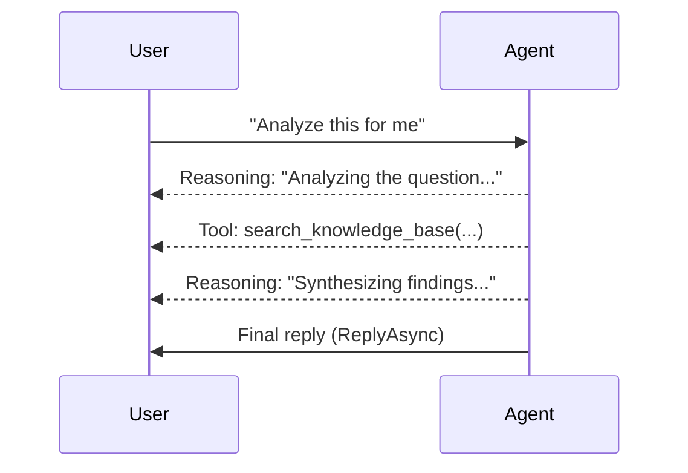

# Message Progress

## Why Progress Messages?

An agent that thinks, searches knowledge, and calls tools can take many seconds to produce a final reply. A silent UI during that time feels broken. **Progress messages** let you stream intermediate updates — reasoning steps and tool calls — so the user sees the agent working, the same way modern AI chat UIs show "thinking..." indicators.



Both methods are on the `UserMessageContext` inside message handlers:

| Method | Shows | Rendered as |
|--------|-------|-------------|
| `SendReasoningAsync(data, content?)` | Internal thinking / planning steps | "Thinking" indicators |
| `SendToolExecAsync(data, content?)` | Tool invocations and their arguments | "Calling..." / tool execution logs |

## Example

```csharp
conversationalWorkflow.OnUserChatMessage(async (context) =>
{
    await context.SendReasoningAsync("Analyzing the user's question...");
    await context.SendToolExecAsync("search_knowledge_base(query=\"best practices\")");
    await context.SendReasoningAsync("Synthesizing findings...");

    await context.ReplyAsync("Here's my answer.");
});
```

Progress messages are intermediate — they appear before the final `ReplyAsync` and don't replace it. Both methods take `(object data, string? content = null)`: pass a string or object as `data`; use optional `content` for accompanying text.

## Related

- [Replying to User Messages](messaging-replying.md) — `ReplyAsync`, `SendDataAsync`, and the rest of the response API
- [Tool & Reasoning Logs in Studio](../studio/tool-reasoning-logs.md) — how these render in the Agent Studio UI
