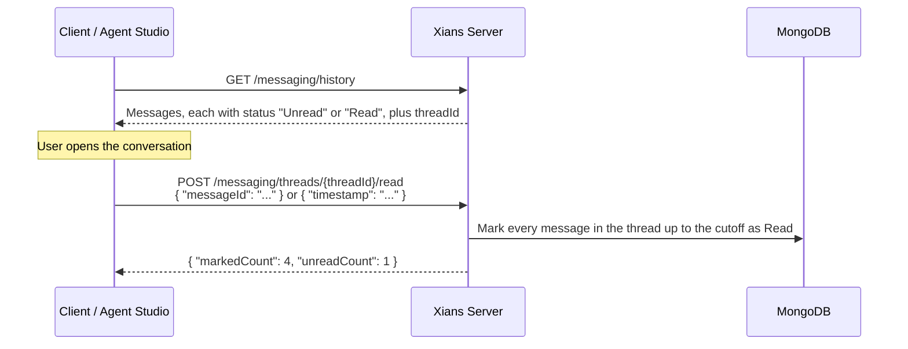

# Message Read Status

## Why Read Status?

Any inbox-style UI needs to answer "what haven't I looked at yet?". A counter held in browser memory forgets everything on reload and can't follow a user from one device to another. Xians instead stores a **read status on every conversation message**, and the Admin API lets a client mark everything up to a chosen point in a thread as read.

The server does the bulk update and replies with the number of messages it marked and how many are still unread in the thread, so a client can refresh its badge from a single response.



## How Read Status Works

Every message returned by the history endpoint carries a `status` field:

| `status` | Meaning |
|----------|---------|
| `Unread` | Not yet marked as read. Every new message starts here, whether the user or the agent sent it. |
| `Read` | Marked as read through the mark-as-read endpoint. |
| `null` | Stored before read status existed. Counted as unread. |

A few rules follow from how it is implemented:

- **All messages count**, in both directions and of every message type stored in the thread (chat, data, file, handoff, reasoning, tool). There is no per-direction or per-type filter. Heartbeat messages are stored too, so they raise `unreadCount` until the server deletes them after one hour.
- **Status is per thread, not per topic.** A thread holds every topic (scope) for one participant and one activation, so marking a thread read marks messages in all of its topics.
- **Nothing is marked automatically.** Fetching history or streaming messages does not change `status`; only a call to the endpoint below does.
- **Marking only moves forward.** There is no endpoint to set a message back to `Unread`.

!!! note "Where the old `status` values went"
    Earlier server versions declared `status` values named `DeliveredToWorkflow` and `FailedToDeliverToWorkflow`, but nothing ever wrote them, so stored messages carry `null`. Those values were removed and the field now holds read status. Clients should not expect the old names.

## Marking a Thread as Read

```text
POST /api/v1/admin/tenants/{tenantId}/messaging/threads/{threadId}/read
```

`threadId` is the `threadId` field on any message returned by the [history endpoint](#finding-the-thread-id). The tenant comes from the URL path and must match the tenant your API key resolves to.

### Request Fields

Send **exactly one** of the two fields. Both give the same result: every message in the thread whose `createdAt` is at or before the cutoff is marked `Read`.

| Field | Description |
|-------|-------------|
| `messageId` | Mark this message and everything before it. The cutoff is that message's `createdAt`. The message must belong to the thread. |
| `timestamp` | Mark everything created at or before this instant. Use ISO 8601 in UTC, for example `2026-09-21T10:30:00Z`. |

The cutoff is inclusive. Messages created after it are left as they are.

### Response

```json
{ "markedCount": 4, "unreadCount": 1 }
```

| Field | Description |
|-------|-------------|
| `markedCount` | Messages changed by this call. Messages that were already `Read` are not counted, so repeating a call returns `0`. |
| `unreadCount` | Messages in the **whole thread** (all topics) that are still not `Read`, counted after the update. |

`unreadCount` is a snapshot from a separate query that runs right after the update, so the two are not atomic. A message that arrives in that gap is included, but one that arrives after the count is not, and a concurrent mark-as-read call can also change the figure. Treat it as the count at that moment and keep the badge current from history or the message stream.

There is no separate endpoint that returns the unread count without changing anything. To show a count without marking, count `status != "Read"` in the history you already loaded.

### Examples

Mark up to a message you have on screen, typically the newest one:

```bash
curl -X POST "https://your-server/api/v1/admin/tenants/default/messaging/threads/665f1c2e9a3b4d0012ab34cd/read" \
  -H "Authorization: Bearer YOUR_API_KEY" \
  -H "Content-Type: application/json" \
  -d '{ "messageId": "665f1c9d9a3b4d0012ab34f2" }'
```

Or mark everything up to a point in time:

```bash
curl -X POST "https://your-server/api/v1/admin/tenants/default/messaging/threads/665f1c2e9a3b4d0012ab34cd/read" \
  -H "Authorization: Bearer YOUR_API_KEY" \
  -H "Content-Type: application/json" \
  -d '{ "timestamp": "2026-09-21T10:30:00Z" }'
```

Marking up to the message the user has actually seen, instead of "now", avoids marking a reply that arrived while the request was in flight.

### Errors

| Situation | Response |
|-----------|----------|
| Neither `messageId` nor `timestamp` in the body | `400 Bad Request` |
| Both `messageId` and `timestamp` in the body | `400 Bad Request` |
| `messageId` does not exist, or belongs to a different thread | `404 Not Found` |
| `tenantId` in the path differs from the tenant your API key resolves to | `403 Forbidden` |

An unknown `threadId` is **not** an error: with a `timestamp` the call succeeds with `markedCount` and `unreadCount` both `0`, and nothing is changed. Lookups always include the tenant, so a thread that belongs to another tenant behaves the same way.

### Finding the Thread ID

Read history for the activation and participant; each message carries its `threadId`, `id`, `createdAt` and `status`:

```bash
curl "https://your-server/api/v1/admin/tenants/default/messaging/history?agentName=DocumentAgent&activationName=DocumentAgent%20-%20Default&participantId=user@example.com&sortOrder=asc" \
  -H "Authorization: Bearer YOUR_API_KEY"
```

## Read Status in Agent Studio

Agent Studio uses the endpoint for its **Mark read** button in the conversation header:

- An **"N unread"** badge counts the messages loaded for the selected topic whose `status` is not `Read`.
- **Mark read** sends the current time as `timestamp`. A toast reports how many messages were marked and how many remain unread in the thread.
- After a reload the badge stays cleared, because the status is stored on the server.

This is separate from the live "new message" counter in the topic sidebar, which is kept in browser memory and resets on reload. The header badge only looks at the topic you have open, while the toast's "remaining" figure covers the whole thread, so the two numbers can differ when a thread has several topics.

## Summary

| Aspect | Detail |
|--------|--------|
| Field | `status` on each message: `Unread`, `Read`, or `null` (legacy, counts as unread) |
| Initial value | `Unread` for every new message, in both directions |
| Scope | Whole thread, all topics, all message types |
| Endpoint | `POST /api/v1/admin/tenants/{tenantId}/messaging/threads/{threadId}/read` |
| Cutoff | Body has exactly one of `messageId` or `timestamp`; inclusive |
| Response | `{ markedCount, unreadCount }`, with `unreadCount` covering the whole thread |
| Idempotent | Yes; already-read messages are not counted again |
| Automatic marking | None |
| Studio | Header badge and **Mark read** button |

## Related

- [Messaging – Reply](messaging-replying.md) — threads and scopes (topics), which read status spans
- [Messaging – File Upload](messaging-fileupload.md) — another Messaging Admin API endpoint, with the same tenant and API-key conventions
- [Agent Studio](../studio/overview.md) — the UI that surfaces read status
