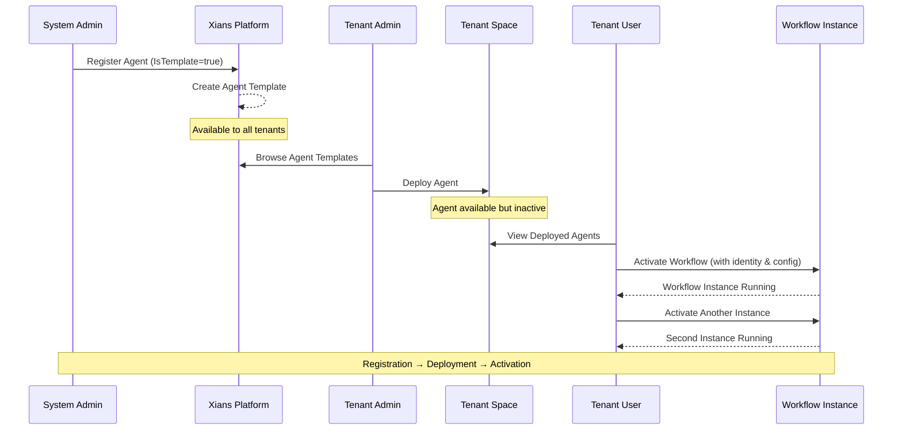

# Agents & Multitenancy

The Xians platform supports a comprehensive multitenancy model that enables system administrators, tenant administrators, and end users to work with agents at different levels of control and customization.

## Agent Lifecycle in a Multitenant Environment

The agent lifecycle in Xians consists of three distinct phases: **Registration**, **Deployment**, and **Activation**. Each phase is controlled by different user roles and serves a specific purpose in the multitenant architecture.



### Lifecycle Phase Overview

| Phase | Role | Action | Scope | Output |
|-------|------|--------|-------|--------|
| **1. Registration** | System Administrator | Create agent template with `IsTemplate=true` | Platform-wide | Reusable agent template available to all tenants |
| **2. Deployment** | Tenant Administrator | Deploy agent template to tenant | Tenant-specific | Agent visible and configurable within tenant |
| **3. Activation** | Tenant Users | Activate workflow with unique identity | Workflow-specific | Running workflow instance with custom configuration |

### 1. Agent Registration (System-Scoped)

**Who:** System Administrators

**What:** System administrators can register agents as **IsTemplate** through agent code. These agents become reusable templates that are available across all tenants in the platform.

**How:** Agents are registered programmatically using the agent registration API:

```csharp
var agent = xiansPlatform.Agents.Register(new XiansAgentRegistration
{
    Name = "LeadDiscoveryAgent",
    Description = "A lead discovery agent that can discover leads from a given company",
    Version = "1.0.0",
    Author = "99x",
    IsTemplate = true  // Makes this agent available as a template for all tenants
});
```

When an agent is registered with `IsTemplate = true`, it becomes an **agent template** that can be deployed to any tenant without needing to duplicate the agent code.

### 2. Agent Deployment

**Who:** Tenant Administrators

**What:** Tenant administrators can deploy system-scoped agent templates to their specific tenant, making the agent available for users within that tenant.

**How:** Deployment can be performed through:

- **UI Portal**: A visual interface where tenant admins can browse available agent templates and deploy them to their tenant
- **API**: Programmatic deployment for automation and integration scenarios

Once deployed, the agent becomes available in the tenant's context but is not yet active. Deployment is a tenant-level operation that makes the agent visible and configurable within the tenant.

### 3. Agent Activation

**Who:** Tenant Users

**What:** Users within a tenant can activate deployed agents. Activation occurs at the **individual workflow level**, not at the agent level. A single deployed agent can be activated multiple times, with each activation having a unique identity.

**How:** When activating an agent workflow, users can:

- Provide a unique identity for the activation
- Supply necessary input parameters required by the workflow
- Configure workflow-specific settings

**Multiple Activations:** The same deployed agent can be activated multiple times by different users or for different purposes, each with its own unique configuration and identity.

## Knowledge and Multi-Tenancy

Knowledge in Xians follows the same multi-tenancy principles as agents, with automatic scoping based on the agent's configuration.

### System-Scoped Knowledge

When knowledge is uploaded with a **system-scoped agent** (during registration), it is automatically created as **system-scoped knowledge**:

```csharp
// Register system-scoped agent
var agent = xiansPlatform.Agents.Register(new XiansAgentRegistration
{
    Name = "LeadDiscoveryAgent",
    IsTemplate = true  // Agent is system-scoped
});

// Upload knowledge - automatically becomes system-scoped
await agent.Knowledge.UploadEmbeddedResourceAsync(
    resourcePath: "prompts/system-prompt.md",
    knowledgeName: "default-prompt"
);
// ✅ Knowledge is stored with IsTemplate = true
```

!!! info "Learn More About Knowledge"
    For detailed information on embedding knowledge files, configuring your project, and managing knowledge resources, see the [Knowledge documentation](knowledge.md).

**Characteristics of system-scoped knowledge:**

- Shared across all tenants as default/template knowledge
- Visible to all tenants that deploy the agent
- Can only be edited by system administrators
- Serves as the baseline knowledge for the agent

### Tenant-Scoped Knowledge

When a system-scoped agent is **deployed to a tenant**, the associated system-scoped knowledge is **automatically duplicated** and attached to the deployed agent under **tenant scope**:

## Workflow Types and Activation

Agents in the Xians platform can contain multiple workflows, and these workflows are categorized into two types based on their activation behavior:

| Feature | Built-In Workflows | Custom Workflows |
|---------|-------------------|------------------|
| **Input Requirements** | No user input needed | Requires user-provided parameters |
| **Activation Timing** | Automatic upon invocation | Manual with configuration |
| **Primary Use Case** | Event-driven operations | Scheduled & business processes |

### Built-In Workflows

**Characteristics:**

- Do not require input parameters from users
- Automatically activated upon invocation
- Typically handle standard, event-driven operations

**Examples:**

- **Webhook Handling**: Automatically processes incoming webhook requests
- **Conversation Handling**: Responds to user conversations without manual configuration

Built-in workflows are designed for immediate use and require no additional setup beyond deployment.

### Custom Workflows

**Characteristics:**

- Require user-provided input parameters during activation
- Support scheduled and business-specific processes
- Allow for customization and configuration per activation

**Examples:**

- **Scheduled Business Processes**: Periodic data processing, report generation, or batch operations
- **Custom Integrations**: Workflows that need API keys, endpoints, or business-specific parameters

Custom workflows enable users to tailor agent behavior to their specific needs while maintaining the reusability of the agent template.

## Benefits of This Model

1. **Reusability**: System-scoped agents can be deployed across multiple tenants without code duplication
2. **Isolation**: Each tenant's deployed agents operate independently
3. **Flexibility**: Multiple activations allow different teams or use cases within a tenant
4. **Governance**: Clear separation of responsibilities between system admins, tenant admins, and users
5. **Scalability**: Agents can be updated centrally while maintaining tenant-specific configurations
