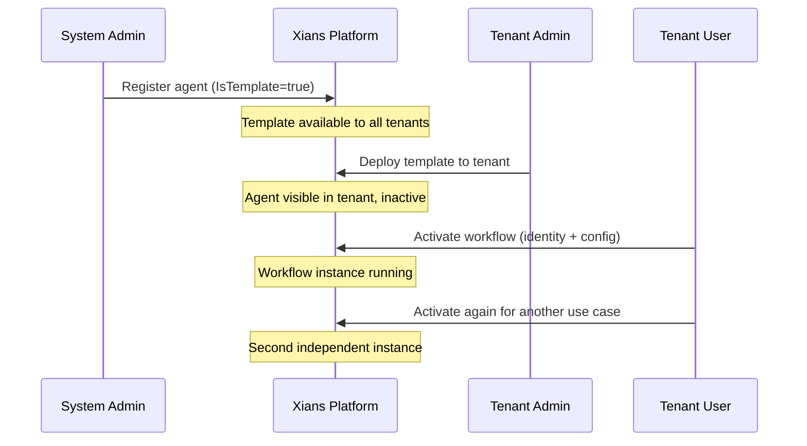

# Multitenancy

## Why Multitenancy?

You typically build an agent once but need to serve many customers (tenants), each with their own data, users, and configuration. Xians bakes tenant isolation into the platform so you don't have to: write the agent as a **template**, and the platform handles deploying it per tenant, keeping each tenant's conversations, documents, and knowledge fully separated.

## The Three-Phase Lifecycle

An agent goes from code to a running, tenant-specific instance in three phases, each owned by a different role:

| Phase | Who | What happens | Result |
|-------|-----|--------------|--------|
| **1. Registration** | System Admin (via agent code) | Agent registered with `IsTemplate = true` | A reusable template visible to all tenants |
| **2. Deployment** | Tenant Admin (via UI or API) | Template deployed into a tenant | Agent available in that tenant, not yet running |
| **3. Activation** | Tenant Users | A workflow is activated with its own identity and config | A running workflow instance |


```mermaid
sequenceDiagram
    participant SA as System Admin
    participant P as Xians Platform
    participant TA as Tenant Admin
    participant U as Tenant User

    SA->>P: Register agent (IsTemplate=true)
    Note over P: Template available to all tenants
    TA->>P: Deploy template to tenant
    Note over P: Agent visible in tenant, inactive
    U->>P: Activate workflow (identity + config)
    Note over P: Workflow instance running
    U->>P: Activate again for another use case
    Note over P: Second independent instance
```

Why three phases? It separates concerns: the **developer** ships one codebase, the **tenant admin** decides which agents their tenant gets, and **users** run as many configured instances as they need — without anyone touching code.

### Registration

Agents become templates by setting `IsTemplate = true` at registration:

```csharp
var agent = xiansPlatform.Agents.Register(new XiansAgentRegistration
{
    Name = "LeadDiscoveryAgent",
    Description = "Discovers leads for a given company",
    Version = "1.0.0",
    IsTemplate = true  // reusable across all tenants
});
```

Set `IsTemplate = false` (or omit it) for an agent that lives only in your own tenant — useful during development or for internal tools.

### Deployment

Tenant admins browse available templates in the UI portal (or use the API) and deploy them to their tenant. Deployment makes the agent *visible and configurable* within the tenant; nothing runs yet.

### Activation

Users activate **individual workflows**, not the whole agent. Each activation gets a unique identity and its own input parameters, so the same deployed agent can run many independent instances — different teams, different configurations, same code.

## Which Workflows Need Activation Input?

| | Built-in workflows | Custom workflows |
|---|---|---|
| **Input at activation** | None needed | User-provided parameters |
| **Activation** | Automatic upon invocation | Manual, with configuration |
| **Typical use** | Chat, webhooks — event-driven | Scheduled jobs, business processes |

## Knowledge Scoping

[Knowledge](knowledge.md) follows the agent's scope automatically:

- **System-scoped knowledge**: uploaded by a template agent at registration. Shared with all tenants as the baseline; only system admins can edit it.
- **Tenant-scoped knowledge**: when a template is deployed to a tenant, its system-scoped knowledge is **duplicated into the tenant**. The tenant can then customize its copy without affecting other tenants or the template.

```csharp
// Uploaded by a template agent → automatically system-scoped
await agent.Knowledge.UploadEmbeddedResourceAsync(
    resourcePath: "prompts/system-prompt.md",
    knowledgeName: "default-prompt");
```

This gives every tenant a working default they can override — the template stays the single source of truth for new deployments.

## What You Get from This Model

- **Reusability** — one codebase serves every tenant; no duplication.
- **Isolation** — each tenant's data, conversations, and customizations are separate.
- **Flexibility** — multiple activations per tenant for different teams or use cases.
- **Governance** — clear division: system admins own templates, tenant admins own deployments, users own activations.
- **Central updates** — update the template code once; tenant-specific configuration survives.
