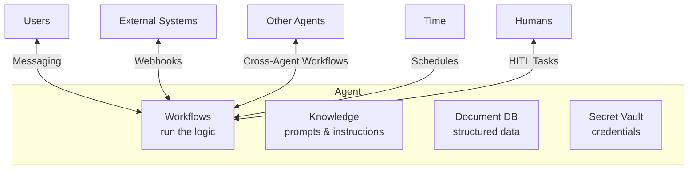
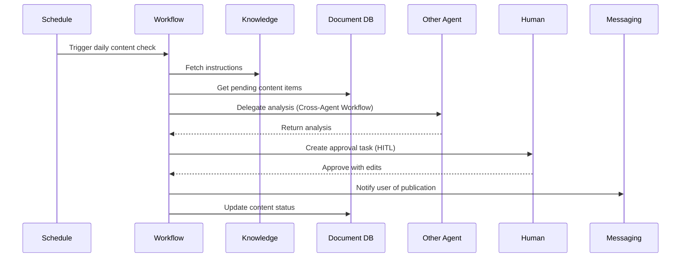

# Concepts

This section explains the building blocks of the Xians Agent SDK — what each feature does, **why it exists**, and how to use it. Each page is written to be readable on its own, so you can jump straight to the feature you need.

## How the Pieces Fit Together

A Xians **Agent** is a deployable unit that owns everything it needs to operate: workflows that run its logic, knowledge that guides its behavior, documents that store its data, and messaging channels that connect it to users and other agents.

```mermaid
graph TB
    subgraph Agent
        W[Workflows<br/>run the logic]
        K[Knowledge<br/>prompts & instructions]
        D[Document DB<br/>structured data]
        S[Secret Vault<br/>credentials]
    end
    U[Users] <-->|Messaging| W
    E[External Systems] <-->|Webhooks| W
    O[Other Agents] <-->|Cross-Agent Workflows| W
    T[Time] -->|Schedules| W
    H[Humans] <-->|HITL Tasks| W
```

## Page Guide

### Foundations

| Page | What you'll learn |
| ---- | ----------------- |
| [SDK Patterns](sdk-patterns.md) | The four access patterns that organize the whole SDK |
| [Agents](agents.md) | What an agent is, how to register one, and how workflows attach to it |
| [Operating Context](context.md) | How `XiansContext` gives your code access to the current agent, workflow, and tenant |
| [Multitenancy](multitenancy.md) | How one agent codebase serves many isolated tenants |

### Talking to Users

| Page | What you'll learn |
| ---- | ----------------- |
| [Messaging – Reply](messaging-replying.md) | Responding to user messages: chat, data, threads, and scopes |
| [Messaging – File Upload](messaging-fileupload.md) | Receiving and processing files sent by users |
| [Messaging – Proactive](messaging-proactive.md) | Starting conversations from your agent (notifications, alerts) |
| [Messaging – Progress](messaging-progress.md) | Showing "working on it..." updates during long operations |
| [Messaging – Webhooks](webhook.md) | Connecting external systems via HTTP callbacks |

### Agent Capabilities

| Page | What you'll learn |
| ---- | ----------------- |
| [Knowledge](knowledge.md) | Managing prompts and instructions outside your code |
| [Document DB](document-db.md) | Storing structured JSON data with semantic keys |
| [Secret Vault](secret-vault.md) | Keeping API keys and credentials out of source code |
| [Scheduling](scheduling.md) | Running workflows on cron expressions and intervals |
| [Human-in-the-Loop](hitl-tasks.md) | Pausing workflows for human review and approval |

### Orchestration

| Page | What you'll learn |
| ---- | ----------------- |
| [Workflows](workflows.md) | Starting and communicating with Temporal workflows |
| [Cross-Agent Workflows](cross-agent-workflows.md) | Calling workflows that belong to other agents |

### Operations

| Page | What you'll learn |
| ---- | ----------------- |
| [Metrics](metrics.md) | Recording usage and performance data |
| [Logging](logging.md) | Writing logs from workflows and activities |
| [Unit Testing](unit-tests.md) | Testing agent logic without a live server |

## A Typical Agent in Action

Here's how the features combine in a real scenario — an autonomous content agent:

```mermaid
sequenceDiagram
    participant S as Schedule
    participant W as Workflow
    participant K as Knowledge
    participant D as Document DB
    participant O as Other Agent
    participant H as Human
    participant M as Messaging

    S->>W: Trigger daily content check
    W->>K: Fetch instructions
    W->>D: Get pending content items
    W->>O: Delegate analysis (Cross-Agent Workflow)
    O-->>W: Return analysis
    W->>H: Create approval task (HITL)
    H-->>W: Approve with edits
    W->>M: Notify user of publication
    W->>D: Update content status
```

1. **Schedule** triggers the workflow every morning — no human needed to start it.
2. **Knowledge** provides instructions that can be updated without redeploying code.
3. **Document DB** holds the content items being processed.
4. **Cross-Agent Workflows** delegates analysis to a specialized agent.
5. **HITL** pauses for human approval before anything is published.
6. **Messaging** notifies stakeholders of the outcome.
