# Concepts

Deep dive into Xians' core concepts and patterns for building production-ready AI agents. This section covers the architectural patterns, workflows, and capabilities that power enterprise agent systems.

| Page | Description |
| ---- | ----------- |
| [SDK Patterns](sdk-patterns.md) | Understand key SDK design patterns for working with agents and workflows |
| [Agents](agents.md) | Learn about agent registration, workflows, and multi-tenancy architecture |
| [Multitenancy](multitenancy.md) | Explore strategies for securely isolating and serving multiple tenants |
| [Temporal Workflows](workflows.md) | Start, execute, and communicate with Temporal-based workflows |
| [Messaging](replying.md) | Master message handling, replies, threads, scopes, and conversational patterns |
| [Web SDK](https://github.com/XiansAiPlatform/sdk-web-typescript) | Build web-based conversational UIs with the official TypeScript client |
| [Knowledge](knowledge.md) | Manage prompts, instructions, and configuration shared between code and UI |
| [Document DB](document-db.md) | Store and query structured JSON data with semantic keys and metadata |
| [Scheduling](scheduling.md) | Create time-based workflow automation with cron expressions and intervals |
| [Agent-to-Agent (A2A)](A2A.md) | Enable workflow communication through messages, signals, queries, and updates |
| [Human-in-the-Loop](hitl-tasks.md) | Implement approval workflows where agents pause for human review |
| [Webhooks](webhook.md) | Integrate external systems using incoming and outgoing HTTP callbacks |

---

## A Typical Agent Flow

Here's how features combine in a real-world scenario—an autonomous content agent:

```mermaid
sequenceDiagram
    participant S as ⏰ Schedule
    participant W as 🔄 Workflow
    participant K as 💡 Knowledge
    participant D as 📦 Document DB
    participant A2A as 🔗 A2A
    participant H as 👤 Human
    participant M as 💬 Messaging
    
    S->>W: Trigger daily content check
    W->>K: Fetch system instructions
    W->>D: Get pending content items
    W->>A2A: Send to analyzer agent
    A2A-->>W: Return analysis
    W->>H: Create HITL approval task
    H-->>W: Approve with edits
    W->>M: Notify user of publication
    W->>D: Update content status
    W->>S: Schedule next run
```

example: "What's happening here?"

    1. **Schedule** triggers the workflow every morning
    2. **Knowledge** provides the agent's instructions and policies
    3. **Document DB** stores the content items being processed
    4. **A2A** delegates analysis to a specialized agent
    5. **HITL** pauses for human approval before publishing
    6. **Messaging** notifies stakeholders of the outcome
    7. **Schedule** ensures the cycle continues autonomously

---
