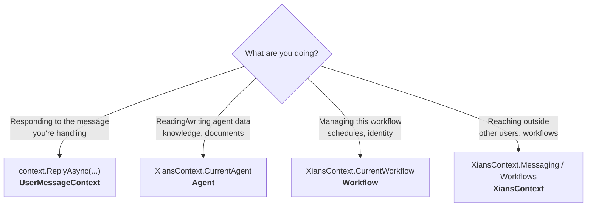

# SDK Access Patterns

## Why This Matters

A common frustration with large SDKs is not knowing *where* to find an operation — is replying to a message on the agent? The workflow? Some global helper? Xians avoids this by following one rule: **every operation lives on its logical owner**.

- A *reply* belongs to the **message** being handled.
- *Knowledge* and *documents* belong to the **agent**.
- *Schedules* belong to the **workflow**.
- Anything that crosses these boundaries (messaging any user, starting workflows) lives on the global **`XiansContext`**.

Once you internalize this rule, you can guess where any API lives without reading docs.

## Choosing the Right Pattern



## Quick Reference

| Pattern | Owns | Available In | Examples |
|---------|------|--------------|----------|
| `UserMessageContext` | The message being handled | Message handlers only | `context.ReplyAsync()`, `context.GetChatHistoryAsync()` |
| `XiansContext.CurrentAgent` | Agent-level data | All workflows | `Knowledge.SearchAsync()`, `Documents.SaveAsync()` |
| `XiansContext.CurrentWorkflow` | Workflow-level operations | All workflows | `Schedules.Create()`, `WorkflowId` |
| `XiansContext` (static) | Cross-cutting orchestration | All workflows | `Messaging.SendChatAsync()`, `Workflows.StartAsync<T>()` |

## The Four Patterns in Code

### 1. UserMessageContext — respond to *this* message

Passed into every message handler. Use it for anything tied to the current conversation.

```csharp
conversationalWorkflow.OnUserChatMessage(async (context) =>
{
    var userId = context.Message.ParticipantId;

    await context.ReplyAsync("Response");                 // reply to THIS message
    var history = await context.GetChatHistoryAsync();    // THIS conversation's history
});
```

### 2. CurrentAgent — the agent's data

Knowledge and documents belong to the agent as a whole, shared across all its workflows.

```csharp
var results = await XiansContext.CurrentAgent.Knowledge.SearchAsync("query");

await XiansContext.CurrentAgent.Documents.SaveAsync(new Document
{
    Type = "user-preferences",
    Key = "user-123",
    Content = JsonSerializer.SerializeToElement(data)
});
```

### 3. CurrentWorkflow — this workflow's operations

Schedules and identity are per-workflow concerns.

```csharp
await XiansContext.CurrentWorkflow.Schedules!
    .Create("daily-report")
    .Daily(hour: 9, minute: 0)
    .StartAsync();

var workflowId = XiansContext.CurrentWorkflow.WorkflowId;
```

### 4. XiansContext — reaching beyond your boundary

Anything that touches *other* users or workflows.

```csharp
// Message any user (not just the one you're replying to)
await XiansContext.Messaging.SendChatAsync(
    participantId: "user-456",
    text: "Your order shipped!");

// Start a sub-workflow
await XiansContext.Workflows.StartAsync<NotificationWorkflow>(
    idPostfix: "notify-123",
    args: new object[] { "user-123", "message" });
```

## Rule of Thumb

> If the operation is about the **message**, use the handler's `context`. If it's about **your agent's data**, use `CurrentAgent`. If it's about **this workflow**, use `CurrentWorkflow`. Everything else is `XiansContext`.
