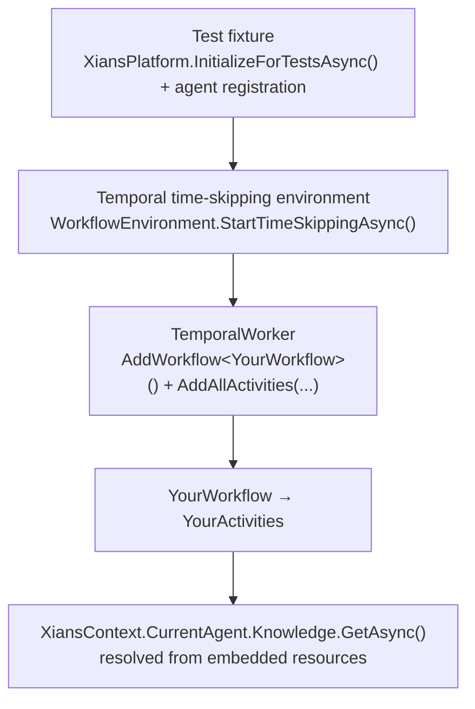

# Unit Testing Workflows

## Why Unit Test This Way?

Workflows orchestrate activities, retries, and long-running logic — exactly the code you most want tested. But testing against a real Temporal server and Xians server is slow, flaky, and awkward in CI. The combination of **Temporal's time-skipping test environment** and **Xians Local Mode** removes both dependencies:

- Workflows execute **in-process** with mocked time — a "wait 24 hours" workflow finishes in milliseconds.
- **Knowledge** resolves from embedded resources — no server calls.
- Tests run in CI with **no Docker or external services**.

!!! note "What Local Mode covers"
    Local Mode supports **Logging** and **Knowledge** out of the box. If your workflows use other Xians features (Document DB, Tasks, Messaging), abstract them behind interfaces injected into your activities, and supply fakes in tests.

## Architecture at a Glance



## Step 1: Embed Knowledge in Your Agent Project

In Local Mode, knowledge is found by **scanning embedded resources in loaded assemblies**. Embed your knowledge files in the *agent* project so they travel with its DLL:

```xml
<ItemGroup>
  <EmbeddedResource Include="**\*.json" />
  <EmbeddedResource Include="**\*.md" />
</ItemGroup>
```

Place a file like `Knowledge/greeting-config.json`:

```json
{
  "greeting": "Hello",
  "punctuation": "!"
}
```

### How names are matched

Knowledge names are normalized (lowercased, spaces → hyphens) and matched against resource names:

| Rule | Pattern | Example |
|------|---------|---------|
| Strict | `{AgentName}.Knowledge.{KnowledgeName}.{ext}` | `MyAgent.Knowledge.greeting-config.json` |
| Fallback | anything ending in `.{normalized-name}.{ext}` | `my_agent.Knowledge.greeting-config.json` |

So `GetAsync("Greeting Config")` finds `greeting-config.json` as long as the file name matches the normalized knowledge name.

## Step 2: The Code Under Test

```csharp
[Workflow("MyAgent:Greeting Workflow")]
public class GreetingWorkflow
{
    private static readonly ActivityOptions Options = new()
    {
        StartToCloseTimeout = TimeSpan.FromMinutes(1),
    };

    [WorkflowRun]
    public async Task<string> RunAsync(string userName)
    {
        var template = await Workflow.ExecuteActivityAsync(
            (GreetingActivities a) => a.GetGreetingTemplateAsync(),
            Options);

        return $"{template} {userName}!";
    }
}

public class GreetingActivities
{
    [Activity]
    public async Task<string> GetGreetingTemplateAsync()
    {
        var knowledge = await XiansContext.CurrentAgent.Knowledge.GetAsync("Greeting Config");
        if (knowledge == null)
            throw new ApplicationFailureException("Greeting Config not found in knowledge base.");

        var config = JsonSerializer.Deserialize<GreetingConfig>(knowledge.Content);
        return config?.Greeting ?? "Hello";
    }
}

public record GreetingConfig(string Greeting, string Punctuation);
```

## Step 3: The Test Fixture

The fixture initializes Xians in Local Mode once and is shared across test classes. Prefer `XiansTestFixture` (or call `TestCleanup.ResetAllStaticState()`) so static registries don't leak between tests:

```csharp
using Temporalio.Testing;
using Xians.Lib.Agents.Core;
using Xians.Lib.Common.Testing;

public class EnvFixture : XiansTestFixture, Xunit.IAsyncLifetime
{
    public async Task InitializeAsync()
    {
        var xiansPlatform = await XiansPlatform.InitializeForTestsAsync(); // LocalMode = true
        var agent = xiansPlatform.Agents.Register(new XiansAgentRegistration
        {
            Name = "MyAgent",
            IsTemplate = false,
        });
        await agent.UploadWorkflowDefinitionsAsync();
    }

    public async Task<(WorkflowEnvironment Env, string TaskQueue)> CreateTemporalEnvAsync()
    {
        var env = await WorkflowEnvironment.StartTimeSkippingAsync();
        return (env, $"task-queue-{Guid.NewGuid()}");
    }

    public Task DisposeAsync() => Task.CompletedTask;
}
```

## Step 4: The Test

```csharp
using Temporalio.Client;
using Temporalio.Testing;
using Temporalio.Worker;
using Xians.Lib.Common.Infrastructure;
using Xunit;

[Trait("Category", "Workflow")]
public class GreetingWorkflowTests : IClassFixture<EnvFixture>, IDisposable
{
    private readonly WorkflowEnvironment _env;
    private readonly string _taskQueue;
    private readonly TemporalWorker _worker;

    public GreetingWorkflowTests(EnvFixture fixture)
    {
        var (env, taskQueue) = fixture.CreateTemporalEnvAsync().GetAwaiter().GetResult();
        _env = env;
        _taskQueue = taskQueue;
        _worker = new TemporalWorker(
            env.Client,
            new TemporalWorkerOptions(taskQueue)
            {
                LoggerFactory = LoggerFactory.CreateLoggerFactoryWithApiLogging(enableApiLogging: false),
            }
                .AddWorkflow<GreetingWorkflow>()
                .AddAllActivities(new GreetingActivities()));
        // LoggerFactory above is Xians.Lib.Common.Infrastructure.LoggerFactory
    }

    [Fact]
    public async Task RunAsync_WithUserName_ReturnsGreeting()
    {
        await _worker.ExecuteAsync(async () =>
        {
            var result = await _env.Client.ExecuteWorkflowAsync(
                (GreetingWorkflow wf) => wf.RunAsync("Alice"),
                new(id: $"wf-{Guid.NewGuid()}", taskQueue: _taskQueue));

            Assert.Equal("Hello Alice!", result);
        });
    }

    public void Dispose()
    {
        _worker.Dispose();
        _env.DisposeAsync().AsTask().GetAwaiter().GetResult();
        GC.SuppressFinalize(this);
    }
}
```

## How Knowledge Resolution Works in Local Mode

When an activity calls `Knowledge.GetAsync(...)` under `InitializeForTestsAsync()`:

1. No HTTP or Temporal server is contacted (`LocalMode = true`).
2. The local provider checks the **in-memory store** first (knowledge uploaded via `UploadEmbeddedResourceAsync` during setup).
3. It then scans `Assembly.GetManifestResourceNames()` of every non-system loaded assembly, matching by the strict and fallback rules above.

Your test project references the agent project, so the agent DLL — and its embedded knowledge — is loaded and searchable.

## Checklist

- [ ] `<EmbeddedResource>` entries for knowledge files in the **agent** `.csproj`
- [ ] `XiansPlatform.InitializeForTestsAsync()` in the fixture (prefer `XiansTestFixture` for static cleanup)
- [ ] Agent registered and `UploadWorkflowDefinitionsAsync()` called
- [ ] Time-skipping env via `WorkflowEnvironment.StartTimeSkippingAsync()`
- [ ] `TemporalWorker` with your workflow + activities
- [ ] `ExecuteWorkflowAsync` inside `_worker.ExecuteAsync`
- [ ] Worker and environment disposed in `Dispose`

## Running Tests

```bash
dotnet test --filter "Category=Workflow"
dotnet test --filter "FullyQualifiedName~GreetingWorkflowTests"
```

## See Also

- [Knowledge](knowledge.md) — knowledge management in production
