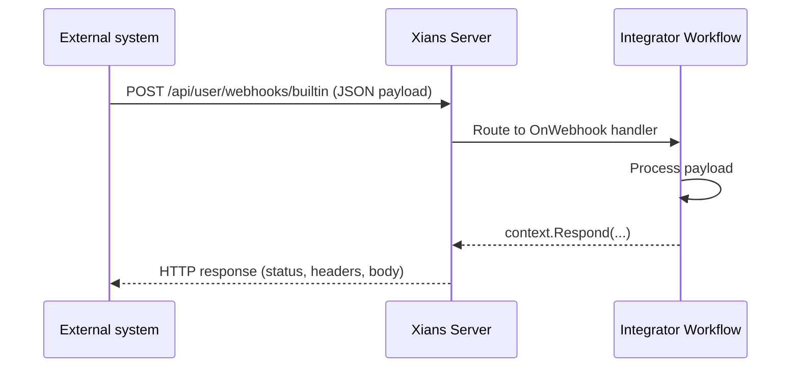
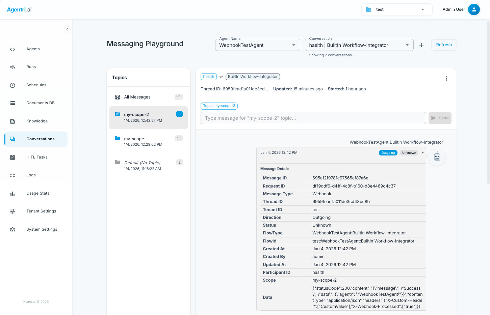

# Webhooks

## Why Webhooks?

Users aren't the only ones who need to talk to your agent. Payment processors, CRMs, email services, and monitoring systems push events over HTTP. **Webhooks** give every agent an HTTP entry point: an external system POSTs to the Xians server, the server routes the request to your workflow's handler, and your handler's response travels back as the HTTP response.



## Handling Webhooks

Register an `OnWebhook` handler on a built-in workflow. `DefineIntegrator()` creates the conventionally-named **`Integrator Workflow`** — the name Agent Studio's default webhook endpoint targets (see [Workflow Naming Conventions](../studio/workflow-conventions.md)):

```csharp
var integratorWorkflow = xiansAgent.Workflows.DefineIntegrator();

// Synchronous handler
integratorWorkflow.OnWebhook((context) =>
{
    Console.WriteLine($"Received: {context.Webhook.Name}");
    context.Respond(new { status = "success" });
});

// Async handler — for database calls, HTTP requests, etc.
integratorWorkflow.OnWebhook(async (context) =>
{
    var result = await ProcessWebhookAsync(context.Webhook.Payload);
    context.Respond(new { status = "success", result });
});
```

### Reading the Webhook

Everything about the incoming request is on `context.Webhook`:

| Property | Type | Description |
|----------|------|-------------|
| `Name` | `string` | Webhook name from the query parameter |
| `ParticipantId` | `string` | Participant identifier |
| `Payload` | `string?` | Request body as a JSON string — deserialize it yourself |
| `Scope` | `string?` | Optional scope context |
| `Authorization` | `string?` | Optional auth token for your own validation |
| `RequestId` | `string` | Unique request ID (useful for logging) |
| `TenantId` | `string` | Tenant context |

```csharp
integratorWorkflow.OnWebhook((context) =>
{
    if (context.Webhook.Payload is not string jsonString)
    {
        context.Response = WebhookResponse.BadRequest("Invalid payload format");
        return;
    }

    var payload = JsonSerializer.Deserialize<OrderPayload>(jsonString);
    Console.WriteLine($"Processing order {payload.OrderId} for ${payload.Amount}");
    context.Respond(new { accepted = true });
});
```

## Responding

Three styles, from simplest to most control:

```csharp
// 1. Object — auto-serialized to JSON, 200 OK
context.Respond(new { message = "Success", processedAt = DateTime.UtcNow });

// 2. Factory methods — common statuses without boilerplate
context.Response = WebhookResponse.Ok(new { success = true });
context.Response = WebhookResponse.BadRequest("Missing required field: orderId");
context.Response = WebhookResponse.NotFound("Order not found");
context.Response = WebhookResponse.InternalServerError("Processing failed");
context.Response = WebhookResponse.Error(HttpStatusCode.Unauthorized, "Invalid token");

// 3. Full control — custom status, headers, content type
context.Response = new WebhookResponse
{
    StatusCode = HttpStatusCode.OK,
    Content = "{\"message\": \"Success\"}",
    ContentType = "application/json",
    Headers = new Dictionary<string, string[]>
    {
        ["X-Request-Id"] = new[] { context.Webhook.RequestId }
    }
};
```

## Calling Your Webhook

External systems POST to:

```text
POST {SERVER_URL}/api/user/webhooks/builtin
```

### Query Parameters

| Parameter | Required | Description |
|-----------|----------|-------------|
| `apikey` | Yes | Your Xians API key |
| `agentName` | Yes | Target agent name |
| `workflowName` | Yes | Target workflow name (e.g. `Integrator Workflow`) |
| `webhookName` | Yes | Your identifier for this event (e.g. `OrderCompleted`) |
| `participantId` | Yes | User/participant identifier |
| `activationName` | No | Target a specific workflow instance |
| `timeoutSeconds` | No | Request timeout (default 30s) |
| `scope` | No | Scope context, same semantics as chat messages |
| `authorization` | No | Token your handler can validate |

The JSON request body becomes `context.Webhook.Payload`.

### Example

```bash
curl -X POST "http://localhost:5005/api/user/webhooks/builtin?apikey=sk-Xnai-abc123&agentName=WebhookTestAgent&workflowName=Integrator%20Workflow&webhookName=OrderCompleted&participantId=customer@example.com" \
  -H "Content-Type: application/json" \
  -d '{"orderId": "12345", "amount": 99.99, "status": "completed"}'
```

## Common Patterns

### Validate authorization

The platform authenticates the API key, but the optional `authorization` token is yours to validate:

```csharp
integratorWorkflow.OnWebhook(async (context) =>
{
    var authToken = context.Webhook.Authorization;
    if (string.IsNullOrEmpty(authToken) || !await ValidateTokenAsync(authToken))
    {
        context.Response = WebhookResponse.Error(
            HttpStatusCode.Unauthorized, "Invalid or missing authorization token");
        return;
    }
    // ... process
});
```

### Respond fast, process in the background

Webhook callers usually expect a quick acknowledgment. For long-running work, accept immediately and process asynchronously:

```csharp
integratorWorkflow.OnWebhook(async (context) =>
{
    var payloadJson = context.Webhook.Payload as string;

    _ = Task.Run(() => ProcessLongRunningTaskAsync(payloadJson));

    context.Respond(new
    {
        status = "accepted",
        requestId = context.Webhook.RequestId
    });
});
```

### Handle errors with meaningful status codes

```csharp
integratorWorkflow.OnWebhook(async (context) =>
{
    try
    {
        var result = await ProcessOrderAsync(context.Webhook.Payload);
        context.Response = WebhookResponse.Ok(new { success = true, orderId = result.OrderId });
    }
    catch (ValidationException ex)
    {
        context.Response = WebhookResponse.BadRequest(ex.Message);
    }
    catch (Exception ex)
    {
        context.Response = WebhookResponse.InternalServerError($"Failed: {ex.Message}");
    }
});
```

## Monitoring

Webhook messages appear in the **Messaging Playground** in the Xians UI alongside chat and data messages — including the payload, request ID, scope, and execution timing. This gives you debugging and auditing for free, with no custom logging.



## Next Steps

- [Agents & Workflows](agents.md) — built-in workflows and system-scoped agents
- [Replying to Users](messaging-replying.md) — the conversational messaging side
