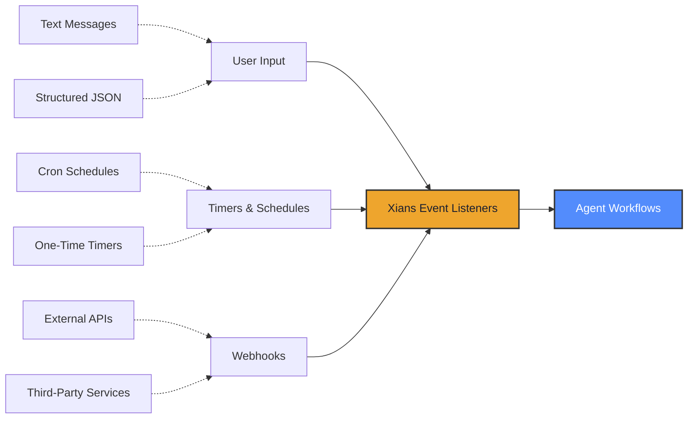
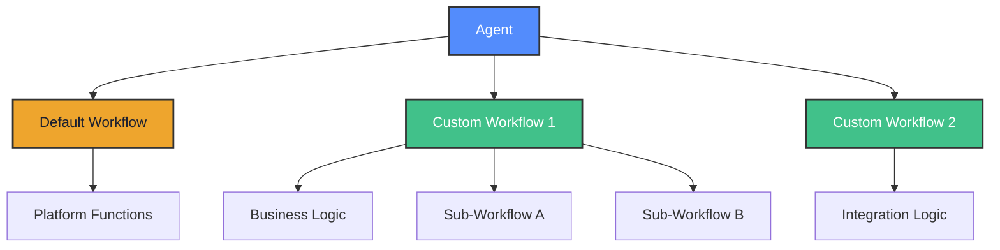
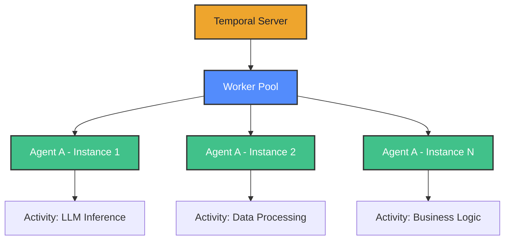
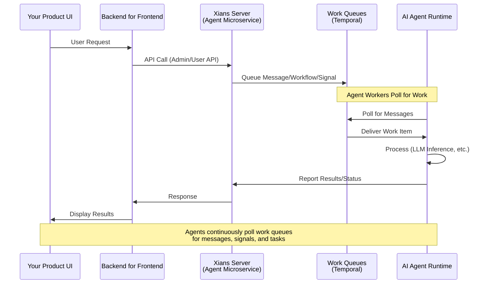

# Introduction

**Xians** is a **control plane** for AI agents. It sits *alongside* your agent framework - not replacing it.

Build agents with whatever framework you like: **Azure AI Projects, Amazon Bedrock, Semantic Kernel, LangGraph, or your own custom runtime**. Xians doesn't care how your agents think. It handles everything that becomes painful once agents graduate from demos to production.

## What It Does

Register an agent (say, one built with Azure AI Projects) with Xians and it immediately gets:

- **Multi-tenancy** - Isolation, permissions, lifecycle management
- **Event triggers** - Messages, timers, webhooks
- **Access control** - Tenant isolation, API keys, OIDC, token passthrough
- **Communication** - WebSockets, REST, SSE, agent-to-agent
- **Data storage** - Document DB for structured data, Knowledge for RAG
- **Human-in-the-loop** - Task creation, draft approvals
- **Long-running workflows** - Days, weeks, or months
- **Business integrations** - Webhooks, schedules
- **Scale & reliability** - Distributed workers, fault tolerance
- **Observability** - Logging, metrics, audit trails

No changes to your agent's code. Because Xians is framework-agnostic, you can mix agents built on different stacks in the same system.

---

## What Xians Handles

The plumbing your agents need but you don't want to build.

### Multi-Tenancy

Complete isolation of agents, workflows, data, and conversations—while sharing infrastructure. Two flavors:

| Deployment Model  | What It Means                  | When to Use                                         |
|-------------------|--------------------------------|-----------------------------------------------------|
| **System-Scoped** | One runtime serves all tenants | Shared utilities, common services                   |
| **Tenant-Scoped** | Dedicated runtime per tenant   | Custom logic, sensitive data, tenant-specific needs |

Mix and match as needed. Deploy system agents for the basics, create tenant-scoped agents for the special stuff.

### Communication

Async message passing from users to agents with:

- **Security**: E2E encryption, EU AI Act compliant
- **Transports**: WebSocket, SSE, REST - take your pick
- **Auth**: API keys or OIDC/OAuth 2.0
- **Multi-conversation**: Users can chat with agents across different threads
- **Topic-based**: Messages organized by topic for better context

### Event-Driven Execution

Agents respond to triggers without you writing infrastructure code:

Trigger with user messages, cron schedules, timers, or webhooks. Xians handles routing and retries.

### Workflows

Built on [Temporal](https://temporal.io), so your workflows can:

- **Run for years**: Days, months, or longer—we've seen some things
- **Survive failures**: Auto-retry, recovery, resumption
- **Compose**: Orchestrate workflows and sub-workflows
- **Stay stateful**: Maintain state across distributed operations

Each agent can have multiple workflows for conversations, events, or custom business processes. The "Default Workflow" gives you all platform functions out-of-the-box.

### Distributed Execution

Agent operations (LLM calls, business logic, integrations) run as Temporal activities in a distributed worker pool:

**Scale**: Stateless activities, automatic load balancing. Need more capacity? Spin up more workers.

**Reliability**: Activities tracked and retried by Temporal. Your system keeps running even when infrastructure doesn't.

### Scheduling

Agents can create schedules via SDK methods - either in code or dynamically based on conversations:

| Approach              | When to Use                                       |
|-----------------------|---------------------------------------------------|
| **Developer-defined** | Periodic reports, maintenance, data syncs         |
| **Agent-created**     | Reminders from conversations, adaptive workflows  |

Built on Temporal's durable execution, so schedules survive restarts. Manage everything from the UI.

### Document DB

Schema-less, queryable data storage for agents. Store customer profiles, session state, business records—any structured data.

- **Flexible**: JSON documents, no migrations
- **Fast**: Indexed queries, aggregations
- **Isolated**: Automatic tenant separation
- **AI-native**: Perfect for dynamic agent memory

Agents use it for context lookups, workflow state, and business logic. Think MongoDB for your AI system.

### Knowledge Store

Retrieval-Augmented Generation (RAG) for grounding agents in your content. Upload docs, manuals, policies—agents search and cite sources.

- **Semantic search**: Find by meaning, not keywords
- **Always current**: Update docs, agents know instantly
- **Source citations**: See what the agent used
- **Multi-source**: Connect multiple knowledge bases

Transforms generic LLMs into domain experts that answer with your truth, not hallucinations.

### Human-in-the-Loop

Workflows can pause for hours, days, or weeks waiting for human input, then automatically resume.

```mermaid
graph LR
    A[Agent Workflow] -->|Creates Task| B[Task Queue]
    B -->|Assigns| C[Human Reviewer]
    C -->|Reviews & Edits| D[Draft Content]
    D -->|Approves/Rejects| E[Agent Workflow]
    E -->|Continues| F[Next Steps]
    
    style A fill:#538cfc,stroke:#333,stroke-width:2px,color:#fff
    style C fill:#eea52d,stroke:#333,stroke-width:2px,color:#1b1f2f
    style E fill:#538cfc,stroke:#333,stroke-width:2px,color:#fff
```

Agents create tasks, attach drafts, and wait for approval. Humans review, edit, approve, or reject. Workflow continues with the feedback. Everything tracked in the audit trail.

Perfect for agent-drafted content that needs human polish, approval chains, QA gates, or when the agent encounters something genuinely confusing.

### Observability

Built-in logging, metrics, and audit trails so you can actually see what your agents are doing.

#### Logs & Exceptions

Auto-captured with stack traces. View in the UI, search by agent/tenant/workflow/time. Real-time alerts when things explode.

#### Metrics

| What We Track                | Why              |
|------------------------------|------------------|
| Response times, latency      | Find bottlenecks |
| Token usage, API calls       | Control costs    |
| Job counts, message volumes  | Monitor load     |
| Success/failure rates        | Catch issues     |

#### OpenTelemetry Support

Distributed tracing, structured logs, correlation IDs. Works with Datadog, New Relic, Grafana, and friends.

#### Audit Trails

Immutable execution history for compliance. Every workflow, every action, every decision—timestamped and logged.

### Use as a Microservice

Everything in the UI is also available via Admin APIs. Use Xians headless as a backend microservice:

Build your own UI, white-label the whole thing, or embed agents into existing products. Xians handles the orchestration infrastructure while you focus on your product.

---

## In Short

Xians is the infrastructure layer for agents. Keep your agent code focused on AI logic. Let Xians handle the production plumbing: multi-tenancy, communication, workflows, data storage, scheduling, observability, and human collaboration.

Not another agent framework. The control plane that makes your agents production-ready.
