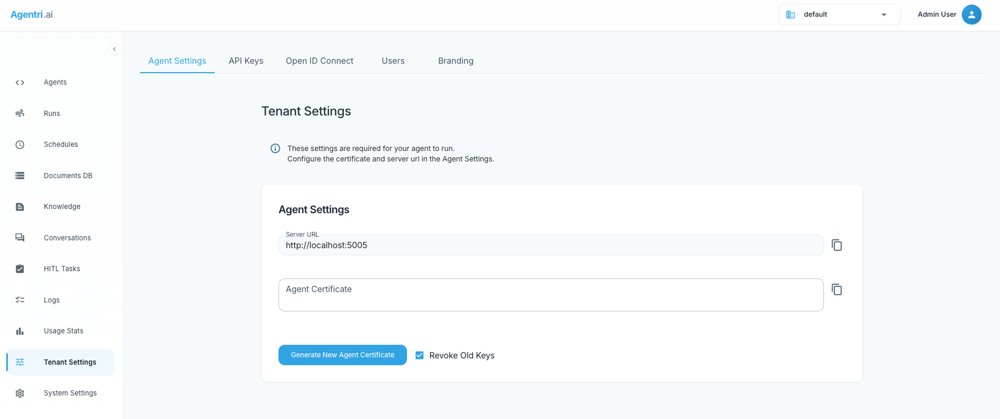
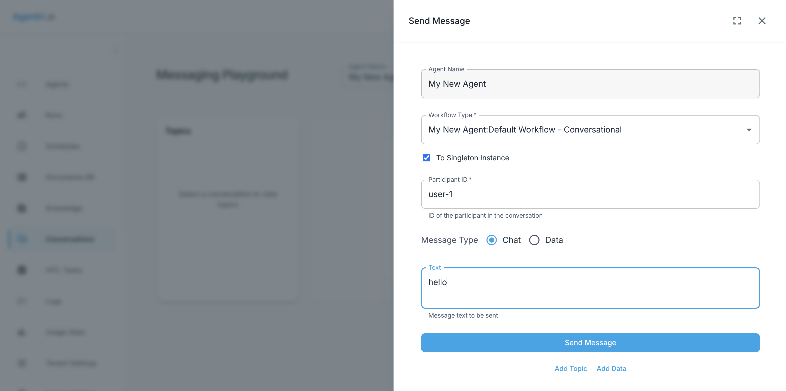

# Quick Start

Get up and running with your first Xians agent in minutes. This guide walks you through creating a simple conversational agent and connecting it to the Xians platform.

---

## Prerequisites

Before you begin, ensure you have the following installed:

- **.NET 9 SDK** - [Download here](https://dotnet.microsoft.com/download)
- **OpenAI API Key** - Get one from [OpenAI Platform](https://platform.openai.com)

---

## Step 1: Create Your Project

Xians agents run as standard .NET applications that can be executed locally or deployed to any server environment. Start by creating a new console project:

```bash
dotnet new console -n MyAgent
cd MyAgent
```

---

## Step 2: Build a Simple Agent with MAF

You can use any framework that supports .NET Core to create your agent. In this guide, we'll use the **Microsoft Agent Framework (MAF)**.

### Install Required Packages

```bash
dotnet add package Azure.AI.OpenAI --prerelease
dotnet add package Azure.Identity
dotnet add package Microsoft.Agents.AI.OpenAI --prerelease
```

### Create the MAF Agent Class

Create a new file called `MafSubAgent.cs`:

> **Note:** We call this class `MafSubAgent`, not `MafAgent`, because production-grade agentic applications typically comprise multiple sub-agents. When you create an agent with Xians, it can have multiple workflows attached to different sub-agents. You'll see this pattern in the following examples.

```bash
touch MafSubAgent.cs
```

Add the following code to `MafSubAgent.cs`:

```csharp
using Microsoft.Agents.AI;
using Microsoft.Extensions.AI;
using OpenAI;
using OpenAI.Chat;

public class MafSubAgent
{
    private readonly ChatClient _chatClient;

    public MafSubAgent(string openAiApiKey, string modelName = "gpt-4o-mini")
    {
        _chatClient = new OpenAIClient(openAiApiKey).GetChatClient(modelName);
    }

    public async Task<string> RunAsync(string message)
    {
        var agent = _chatClient.CreateAIAgent(new ChatClientAgentOptions
        {
            ChatOptions = new ChatOptions
            {
                Instructions = "You are a helpful assistant."
            }
        });

        var response = await agent.RunAsync(message);
        return response.Text;
    }
}
```

### Update Program.cs

Replace the contents of `Program.cs` with:

```csharp
// Get OpenAI API key (replace with your actual key or use environment variable)
var apiKey = Environment.GetEnvironmentVariable("OPENAI_API_KEY") ?? "your-openai-api-key";

// Create the agent
var agent = new MafSubAgent(apiKey);

// Process a user message
var response = await agent.RunAsync("Hello! Can you write a one sentence story about a cat?");
Console.WriteLine($"Agent: {response}");
```

> **Tip:** You can set the `OPENAI_API_KEY` environment variable instead of hardcoding it. This is good practice even for simple tests.

### Test Your Agent

Build and run your agent to verify it works:

```bash
dotnet build
dotnet run
```

You should see a creative response from your agent!

> **Note:** At this point, we've built a simple agent using MAF without any Xians SDK constructs. This demonstrates the core principle of Xians: work with your existing agent frameworks. Next, we'll enhance this agent with the power of the Xians platform.

---

## Step 3: Connect Your Agent to Xians

While a standalone agent is great for demos, production systems require multi-tenancy, user management, conversation threading, and more. Building this infrastructure from scratch is time-consuming, but **Xians provides all of this out of the box**.

### Install the Xians SDK

```bash
dotnet add package Xians.Lib
```

> **Note:** Xians.Lib version 3+ is published under `Xians.Lib`, not `XiansAi.Lib` like previous versions.

### Get Your Xians API Key

Before proceeding, you need to:

1. Set up your Xians platform instance
2. Navigate to **Tenant Settings** in the platform UI
3. Copy your **Agent API Key** and **Server URL**



### Configuration Options

You can configure your agent's credentials in two ways:

#### Option 1: Direct Configuration (Quick Testing)

For quick testing and demos, you can hardcode the values directly in your code.

#### Option 2: Using .env File (Recommended)

For better security and maintainability, use a `.env` file to manage your configuration. This prevents accidentally committing sensitive API keys to version control.

**Install the DotNetEnv package:**

```bash
dotnet add package DotNetEnv
```

**Create a `.env` file** in the root of your project:

```bash
# OpenAI Configuration
OPENAI_API_KEY=your-openai-api-key

# Xians Platform Configuration
XIANS_SERVER_URL=https://your-xians-server.com
XIANS_API_KEY=your-xians-api-key
```

**Add `.env` to your `.gitignore`** to prevent committing secrets:

```bash
echo ".env" >> .gitignore
```

> **Security Tip:** Never commit your `.env` file to version control. Always add it to `.gitignore` to protect your API keys.

### Configure and Connect to Xians

Replace the entire contents of `Program.cs` with the following:

**Using .env file (Recommended):**

```csharp
using DotNetEnv;
using Xians.Lib.Agents.Core;

// Load environment variables from .env file
Env.Load();

// Get configuration from environment variables
var openAiApiKey = Environment.GetEnvironmentVariable("OPENAI_API_KEY") 
    ?? throw new InvalidOperationException("OPENAI_API_KEY not found in environment variables");
var serverUrl = Environment.GetEnvironmentVariable("XIANS_SERVER_URL") 
    ?? throw new InvalidOperationException("XIANS_SERVER_URL not found in environment variables");
var xiansApiKey = Environment.GetEnvironmentVariable("XIANS_API_KEY") 
    ?? throw new InvalidOperationException("XIANS_API_KEY not found in environment variables");

// Initialize Xians Platform
var xiansPlatform = await XiansPlatform.InitializeAsync(new ()
{
    ServerUrl = serverUrl,
    ApiKey = xiansApiKey
});

// Register a new agent with Xians
var xiansAgent = xiansPlatform.Agents.Register(new ()
{
    Name = "My Conversational Agent",
    SystemScoped = true  // See important notes below
});

// Define a built-in conversational workflow
var conversationalWorkflow = xiansAgent.Workflows.DefineBuiltIn(name: "Conversational");

// Create your MAF agent instance
var mafSubAgent = new MafSubAgent(openAiApiKey);

// Handle incoming user messages
conversationalWorkflow.OnUserChatMessage(async (context) =>
{
    var response = await mafSubAgent.RunAsync(context.Message.Text);
    await context.Messages.ReplyAsync(response);
});

// Start the agent and all workflows
await xiansAgent.RunAllAsync();
```

**Or using direct configuration (for quick testing):**

```csharp
using Xians.Lib.Agents.Core;

// Configuration - replace with your actual values (not recommended for production)
var openAiApiKey = "your-openai-api-key";
var serverUrl = "https://your-xians-server.com";
var xiansApiKey = "your-xians-api-key";

// Initialize Xians Platform
var xiansPlatform = await XiansPlatform.InitializeAsync(new ()
{
    ServerUrl = serverUrl,
    ApiKey = xiansApiKey
});

// Register a new agent with Xians
var xiansAgent = xiansPlatform.Agents.Register(new ()
{
    Name = "My Conversational Agent",
    SystemScoped = true  // See important notes below
});

// Define a built-in conversational workflow
var conversationalWorkflow = xiansAgent.Workflows.DefineBuiltIn(name: "Conversational");

// Create your MAF agent instance
var mafSubAgent = new MafSubAgent(openAiApiKey);

// Handle incoming user messages
conversationalWorkflow.OnUserChatMessage(async (context) =>
{
    var response = await mafSubAgent.RunAsync(context.Message.Text);
    await context.Messages.ReplyAsync(response);
});

// Start the agent and all workflows
await xiansAgent.RunAllAsync();
```

### Important Configuration Notes

**SystemScoped Setting:**

- **`SystemScoped = true`**: Adds the agent to the global **Agent Templates** library, making it available for any tenant admin to deploy. This option is only available if you're a **system administrator**.
  
- **`SystemScoped = false`** (default): Immediately deploys the agent to your current tenant. Use this if you only have tenant-level permissions.

**Understanding Workflows:**

- A **Xians agent** is a definition that represents your agent in the platform
- The actual AI logic runs in your **MAF agent** (or any other framework you choose)
- **Built-in workflows** connect Xians' conversation handling capabilities to your agent logic
- One Xians agent can contain multiple built-in workflows, each connected to different AI agent implementations

---

## Step 4: Deploy Your Agent

### For System-Scoped Agents

If you registered your agent with `SystemScoped = true`, you'll find it in the **Agent Templates** section:


Tenant administrators can then deploy instances of this template to their tenants.

### For Tenant-Scoped Agents

If you used `SystemScoped = false`, or after deploying a system template, your agent appears under **Deployed Agents**:


> **What You've Achieved:** Xians has transformed your simple MAF agent into a multi-tenant, enterprise-ready solution. You can now manage agent lifecycles across different tenant scopes through the platform UI.

---

## Step 5: Start a Conversation

Now for the exciting part - talking to your agent!

1. Navigate to **Conversations** in the platform UI
2. Select your deployed agent from the list
3. Click the **+** button to create a new conversation
4. Start chatting with your agent!



---

## Next Steps

Congratulations! You've successfully created and deployed your first Xians agent. Here's what you can explore next:

- **Add Tools & Functions** - Extend your agent with custom capabilities
- **Implement Chat History** - Connect chat history for context-aware responses

Ready to dive deeper? Check out our Core Concepts or explore Advanced Workflows.
