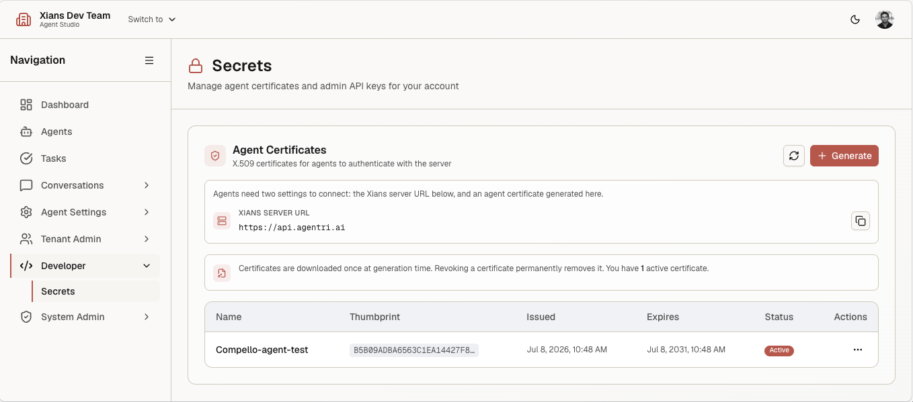
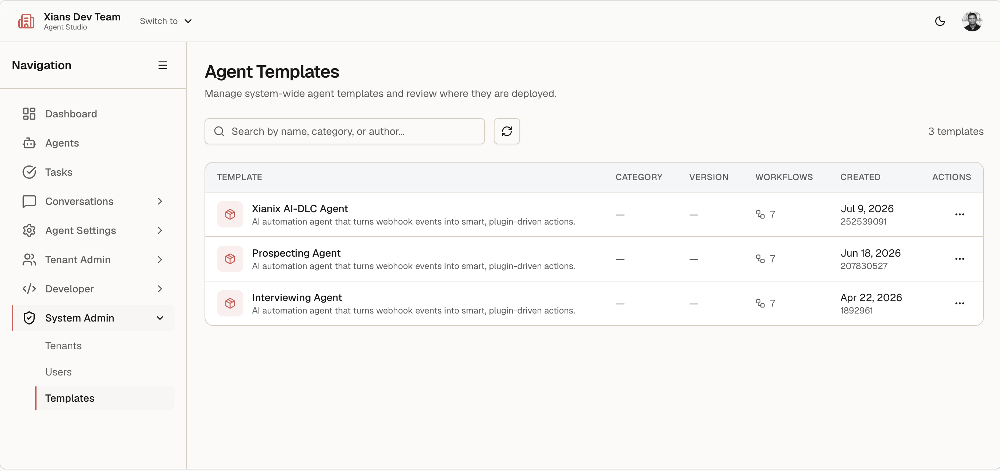
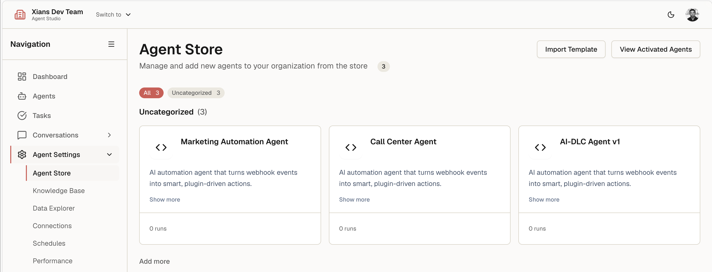
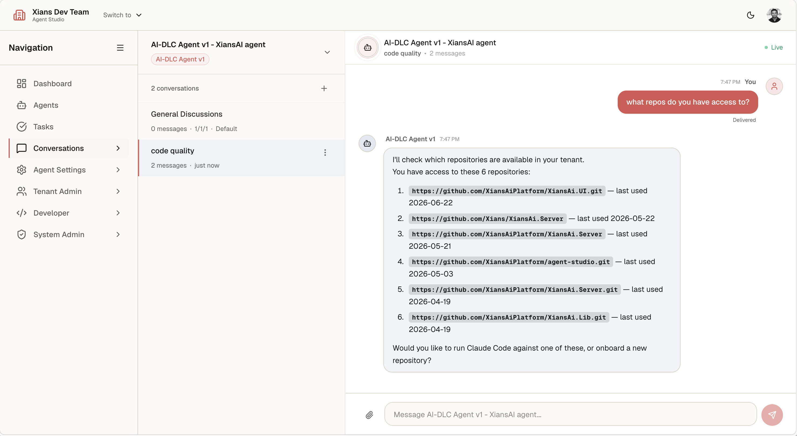

# Quick Start

Get up and running with your first Xians agent in minutes. This guide walks you through connecting a simple agent to the Xians platform, deploying it, and then enhancing it with AI capabilities.

---

## Prerequisites

Before you begin, ensure you have following installed:

- **.NET 10 SDK** - [Download here](https://dotnet.microsoft.com/download)

---

## Step 1: Create Your Project

Xians agents run as standard .NET applications that can be executed locally or deployed to any server environment. Start by creating a new console project:

```bash
dotnet new console -n MyAgent
cd MyAgent
```

### Install Required Packages

```bash
dotnet add package Xians.Lib
dotnet add package DotNetEnv
```

> **Note:** Xians.Lib version 3+ is published under `Xians.Lib`, not `XiansAi.Lib` like previous versions.

---

## Step 2: Connect Your Agent to Xians

Let's get your agent connected to the Xians platform right away. We'll start with a simple echo agent — no AI framework needed yet — so you can see the full platform experience first.

### Get Your Xians API Key

Before proceeding, you need to:

1. Set up your Xians platform instance
2. Navigate to **Tenant Settings** in the platform UI
3. Copy your **Agent Certificate** and **Server URL**



### Configure Environment Variables

For better security and maintainability, use a `.env` file to manage your credentials. This prevents accidentally committing sensitive values to version control.

**Create a `.env` file** in the root of your project:

```bash
# Xians Platform Configuration
XIANS_SERVER_URL=https://your-xians-server.com
XIANS_AGENT_SECRET=your-xians-certificate
```

> **Note:** Replace the placeholder values with your actual server URL and agent certificate from the previous step.

**Add `.env` to your `.gitignore`** to prevent committing secrets:

```bash
echo ".env" >> .gitignore
```

> **Security Tip:** Never commit your `.env` file to version control. Always add it to `.gitignore` to protect your credentials.

### Write the Echo Agent

Replace the contents of `Program.cs` with the following:

```csharp
using DotNetEnv;
using Xians.Lib.Agents.Core;

Env.Load();

var serverUrl = Environment.GetEnvironmentVariable("XIANS_SERVER_URL") 
    ?? throw new InvalidOperationException("XIANS_SERVER_URL not found in environment variables");
var xiansApiKey = Environment.GetEnvironmentVariable("XIANS_AGENT_SECRET") 
    ?? throw new InvalidOperationException("XIANS_AGENT_SECRET not found in environment variables");

var xiansPlatform = await XiansPlatform.InitializeAsync(new ()
{
    ServerUrl = serverUrl,
    ApiKey = xiansApiKey
});

var xiansAgent = xiansPlatform.Agents.Register(new ()
{
    Name = "My Agent",
    IsTemplate = false  // See important notes below
});

var conversationalWorkflow = xiansAgent.Workflows.DefineSupervisor();

conversationalWorkflow.OnUserChatMessage(async (context) =>
{
    await context.ReplyAsync($"Echo: {context.Message.Text}");
});

await xiansAgent.RunAllAsync();
```

This agent simply echoes back whatever the user sends. No AI, no external dependencies — just a direct connection to the Xians platform.

> **Alternative:** If you prefer not to use a `.env` file, you can replace the `Env.Load()` and environment variable calls with hardcoded values, though this is not recommended for production use.

### Build and Run

```bash
dotnet build
dotnet run
```

Your agent is now connected to Xians and listening for messages!

### Important Configuration Notes

**DefineSupervisor shortcut method**

If your workflow is named 'Supervisor Workflow', the `agent studio` by default picks that workflow when the user wants to talk to the agent.

**IsTemplate Setting:**

- **`IsTemplate = true`**: Adds the agent to the global **Agent Templates** library, making it available for any tenant admin to deploy. This option is only available if you're a **system administrator**.
  
- **`IsTemplate = false`** (default): Immediately deploys the agent to your current tenant. Use this if you only have tenant-level permissions.

**Understanding Workflows:**

- A **Xians agent** is a definition that represents your agent in the platform
- The actual AI logic runs in your code (using any framework you choose)
- **Built-in workflows** connect Xians' conversation handling capabilities to your agent logic
- One Xians agent can contain multiple built-in workflows, each connected to different implementations

---

## Step 3: Deploy and Chat with Your Agent

### For System-Scoped Agents

If you registered your agent with `IsTemplate = true`, you'll find it in the **Agent Templates** section:



Tenant administrators can then deploy instances of this template to their tenants.

### For Tenant-Scoped Agents

If you used `IsTemplate = false`, or after deploying a system template, your agent appears under **Deployed Agents**:



### Start a Conversation

Now for the exciting part — talking to your agent!

1. Navigate to **Conversations** in the platform UI
2. Select your deployed agent from the list
3. Click the **+** button to create a new conversation
4. Send a message and see it echoed back!



> **What You've Achieved:** With just a few lines of code, your agent is live on the Xians platform with multi-tenancy, user management, and conversation threading — all out of the box.

---

## Step 4: Add AI with Microsoft Agent Framework (MAF)

Now that your agent is connected to Xians, let's replace the echo logic with a real AI-powered agent using the **Microsoft Agent Framework (MAF)**.
See [Official Microsoft Documentation](https://learn.microsoft.com/en-us/agent-framework/get-started/) for up-to-date information.

### Prerequisites for This Step

- **OpenAI API Key** - Get one from [OpenAI Platform](https://platform.openai.com)

### Install MAF Packages

Note: Please check if stable releases are available from Microsoft and use accordingly.

```bash
dotnet add package Azure.AI.OpenAI --prerelease
dotnet add package Azure.Identity
dotnet add package Microsoft.Agents.AI.OpenAI --prerelease
```

### Update Your Environment Configuration

Add your OpenAI API key to the existing `.env` file:

```bash
# Xians Platform Configuration
XIANS_SERVER_URL=https://your-xians-server.com
XIANS_AGENT_SECRET=your-xians-certificate

# OpenAI Configuration
OPENAI_API_KEY=your-openai-api-key
```

### Create the MAF Agent Class

Create a new file called `MafSubAgent.cs`:

> **Note:** We call this class `MafSubAgent`, not `MafAgent`, because production-grade agentic applications typically comprise multiple sub-agents. When you create an agent with Xians, it can have multiple workflows attached to different sub-agents. You'll see this pattern in the following examples.

```bash
touch MafSubAgent.cs
```

Add the following code to `MafSubAgent.cs`:

```csharp
using Microsoft.Agents.AI;
using Microsoft.Extensions.AI;
using OpenAI;

public class MafSubAgent
{
    private readonly AIAgent _agent;

    public MafSubAgent(string openAiApiKey, string modelName = "gpt-4o-mini")
    {
        _agent = new OpenAIClient(openAiApiKey)
            .GetChatClient(modelName)
            .AsIChatClient()
            .AsAIAgent(new ChatClientAgentOptions
            {
                Name = "MafSubAgent",
                ChatOptions = new ChatOptions
                {
                    Instructions = "You are a friendly assistant. Keep your answers brief."
                }
            });
    }

    public async Task<string> RunAsync(string message)
    {
        var response = await _agent.RunAsync(message);
        return response.Text;
    }
}
```

> **`AsIChatClient()`** bridges the OpenAI SDK `ChatClient` to `Microsoft.Extensions.AI.IChatClient`, which MAF's `AsAIAgent` targets.

### Update Program.cs

Replace the contents of `Program.cs` to wire the MAF agent into your Xians workflow:

```csharp
using DotNetEnv;
using Xians.Lib.Agents.Core;

Env.Load();

var openAiApiKey = Environment.GetEnvironmentVariable("OPENAI_API_KEY") 
    ?? throw new InvalidOperationException("OPENAI_API_KEY not found in environment variables");
var serverUrl = Environment.GetEnvironmentVariable("XIANS_SERVER_URL") 
    ?? throw new InvalidOperationException("XIANS_SERVER_URL not found in environment variables");
var xiansApiKey = Environment.GetEnvironmentVariable("XIANS_AGENT_SECRET") 
    ?? throw new InvalidOperationException("XIANS_AGENT_SECRET not found in environment variables");

var xiansPlatform = await XiansPlatform.InitializeAsync(new ()
{
    ServerUrl = serverUrl,
    ApiKey = xiansApiKey
});

var xiansAgent = xiansPlatform.Agents.Register(new ()
{
    Name = "My Agent",
    IsTemplate = false
});

var conversationalWorkflow = xiansAgent.Workflows.DefineSupervisor();

var mafSubAgent = new MafSubAgent(openAiApiKey);

conversationalWorkflow.OnUserChatMessage(async (context) =>
{
    var response = await mafSubAgent.RunAsync(context.Message.Text);
    await context.ReplyAsync(response);
});

await xiansAgent.RunAllAsync();
```

Notice the only change from the echo agent: instead of echoing back the message, we pass it through the MAF agent and reply with the AI-generated response.

### Rebuild and Run

```bash
dotnet build
dotnet run
```

Go back to **Conversations** in the platform UI and chat with your agent — you'll now get intelligent AI-powered responses instead of echoes!

---

## Next Steps

Congratulations! You've successfully created and deployed your first Xians agent. Here's what you can explore next:

- **Add Tools & Functions** - Extend your agent with custom capabilities
- **Implement Chat History** - Connect chat history for context-aware responses

Ready to dive deeper? Check out our Core Concepts or explore Advanced Workflows.
