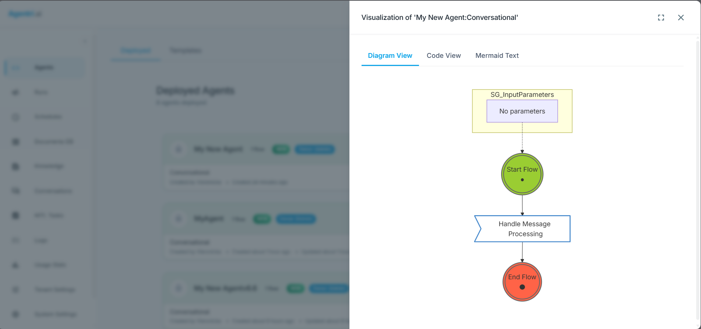

# Getting Started: Temporal Workflows for Business Process Execution

Use Temporal workflows to run durable, fault-tolerant business processes with Xians. Workflows orchestrate **activities**—units of work that can call external APIs, access databases, or perform other non-deterministic operations.

This guide shows a minimal setup: one workflow, one activity, and all configuration in `Program.cs`.

---

## Prerequisites

- .NET 9 SDK
- Xians platform instance (server URL and agent certificate)
- See [Quick Start](quick-start.md) for project creation and Xians connection

---

## Project Setup

Add the required packages:

```bash
dotnet add package DotNetEnv
dotnet add package Xians.Lib
```

Add a project reference to Xians.Lib if using a local build, or the NuGet package as shown above.

---

## 1. Create the Activity Class

Activities perform the actual work. They can call APIs, access databases, or do any I/O. Mark methods with `[Activity]`:

**`GreetingActivities.cs`**

```csharp
using Temporalio.Activities;

public class GreetingActivities
{
    [Activity]
    public Task<string> BuildGreetingAsync(string name)
    {
        return Task.FromResult($"Hello, {name}!");
    }
}
```

---

## 2. Create the Workflow Class

Workflows orchestrate activities. They must be deterministic (no direct I/O, no `DateTime.UtcNow`, etc.). Use `Workflow.ExecuteActivityAsync` to call activities:

**`GreetingWf.cs`**

```csharp
using Temporalio.Exceptions;
using Temporalio.Workflows;

[Workflow("MyAgent:Greeting Workflow")]
public class GreetingWf
{
    private static readonly ActivityOptions Options = new()
    {
        StartToCloseTimeout = TimeSpan.FromMinutes(1),
        RetryPolicy = new RetryPolicy { MaximumAttempts = 3, BackoffCoefficient = 2 },
    };

    [WorkflowRun]
    public async Task<string> RunAsync(string name)
    {
        try
        {
            var greeting = await Workflow.ExecuteActivityAsync(
                (GreetingActivities a) => a.BuildGreetingAsync(name),
                Options);
            return greeting;
        }
        catch (Exception ex)
        {
            Workflow.Logger.LogError($"Greeting workflow failed: {ex.Message}", ex);
            throw new ApplicationFailureException($"Greeting workflow failed: {ex.Message}");
        }
    }
}
```

Key points:

- `[Workflow("AgentName:Workflow Name")]` — Must match the agent name you register.
- `[WorkflowRun]` — Marks the workflow entry point.
- `Workflow.ExecuteActivityAsync` — Invokes an activity; use lambda syntax for type-safe calls.

---

## 3. Set Up Program.cs

Initialize the platform, register the agent, define the workflow with its activities, and start the worker:

**`Program.cs`**

```csharp
using DotNetEnv;
using Microsoft.Extensions.Logging;
using Xians.Lib.Agents.Core;

Env.Load();

var serverUrl = Environment.GetEnvironmentVariable("XIANS_SERVER_URL")
    ?? throw new InvalidOperationException("XIANS_SERVER_URL required");
var apiKey = Environment.GetEnvironmentVariable("XIANS_API_KEY")
    ?? throw new InvalidOperationException("XIANS_API_KEY required");

// Initialize Xians Platform
var xiansPlatform = await XiansPlatform.InitializeAsync(new()
{
    ServerUrl = serverUrl,
    ApiKey = apiKey,
    ConsoleLogLevel = LogLevel.Information,
    ServerLogLevel = LogLevel.Information,
});

// Register agent
var agent = xiansPlatform.Agents.Register(new()
{
    Name = "MyAgent",
    IsTemplate = false,
});

// Define workflow and attach activities
agent.Workflows
    .DefineCustom<GreetingWf>(new WorkflowOptions { Activable = true })
    .AddActivity(new GreetingActivities());

// Start the agent (connects to Temporal and runs workers)
Console.WriteLine("Starting agent...");
await agent.RunAllAsync(CancellationToken.None);
```

---

## 4. Configure Environment

Create a `.env` file:

```bash
XIANS_SERVER_URL=https://your-xians-server.com
XIANS_API_KEY=your-agent-certificate
```

---

## Visualizing the Flow's Logic

You may have noticed a disabled **Visualize** button in the Xians Manager portal when viewing your agent's workflow.

### When is the Visualize button enabled?

The **Visualize** button is **only available for custom workflows**. Built-in workflows do not support visualization because they are created dynamically at runtime.

### Enabling visualization with a custom workflow

To enable the Visualize button, you need to create a custom workflow. Follow these steps:

**1. Update `Program.cs` with the following changes** – Replace the `// Define a built-in conversational workflow` and `// Handle incoming user messages` sections with:

```csharp
// Define a CUSTOM conversational workflow (enables visualization)
var conversationalWorkflow = xiansAgent.Workflows.DefineCustom<MyAgent.ConversationalWorkflow>();

// Register chat handler for the CUSTOM workflow
var tenantId = xiansPlatform.Options?.CertificateTenantId;
BuiltinWorkflow.RegisterChatHandler(
    workflowType: "My New Agent:Conversational",
    handler: async (context) =>
    {
        var response = await mafSubAgent.RunAsync(context.Message.Text);
        await context.ReplyAsync(response);
    },
    agentName: xiansAgent.Name,
    tenantId: xiansAgent.SystemScoped ? null : tenantId,
    systemScoped: xiansAgent.SystemScoped);

// Upload workflow definitions (includes source code for visualization)
await xiansAgent.UploadWorkflowDefinitionsAsync();
```

> **Note:** The `workflowType` must match the `[Workflow("...")]` attribute on your custom workflow class (e.g. `"My New Agent:Conversational"`).

**2. Create `ConversationalWorkflow.cs`** – Add a new file with your custom workflow class:

```csharp
using Temporalio.Workflows;
using Xians.Lib.Temporal.Workflows;

namespace MyAgent
{
    /// <summary>
    /// Custom conversational workflow that extends BuiltinWorkflow.
    /// This workflow can be visualized because it has a source file that can be embedded.
    /// </summary>
    [Workflow("My New Agent:Conversational")]
    public class ConversationalWorkflow : BuiltinWorkflow
    {
        /// <summary>
        /// Main workflow execution method.
        /// This calls the base implementation which handles message processing.
        /// </summary>
        [WorkflowRun]
        public override async Task RunAsync()
        {
            // Call base implementation to handle message processing
            await base.RunAsync();
        }
    }
}
```

**3. Update your `.csproj` file** – Embed the workflow source file as a resource:

```xml
<!-- Embed workflow source for visualization -->
<ItemGroup>
  <EmbeddedResource Include="ConversationalWorkflow.cs">
    <LogicalName>%(Filename)%(Extension)</LogicalName>
  </EmbeddedResource>
</ItemGroup>
```

After these changes, rebuild your project and run the agent. The Visualize button will now be enabled for your custom workflow.

### Troubleshooting

| Issue | Solution |
|-------|----------|
| **Visualize button disabled (built-in workflow)** | This is expected. Built-in workflows do not support visualization. Use a custom workflow (`DefineCustom<T>`) instead. |
| **Visualize button disabled (custom workflow)** | Check: (1) workflow `.cs` is embedded (`EmbeddedResource` with `LogicalName` in `.csproj`), (2) rebuild the project after changing `.csproj`. |

### How to view the flow diagram

In the **Xians Manager** portal, select your agent and click the enabled **Visualize** button.



---

## How It Works

1. **XiansPlatform.InitializeAsync** — Connects to the Xians server and fetches Temporal configuration.
2. **Agents.Register** — Registers your agent with the platform.
3. **DefineCustom&lt;GreetingWf&gt;** — Registers the workflow type; `Activable = true` allows users to start it from the UI.
4. **AddActivity** — Binds the activity instance to the workflow so Temporal can execute it.
5. **RunAllAsync** — Starts Temporal workers that poll for and execute workflow tasks.

Workflows run in Temporal’s durable execution environment. If a worker crashes or restarts, workflows resume from the last successful activity. Activities can retry on failure based on `RetryPolicy`.

---

## Further Reading

- **[Child Workflows](../concepts/workflows.md)** — Start workflows from other workflows using `XiansContext.Workflows.StartAsync` (fire-and-forget) or `ExecuteAsync` (wait for result). Includes workflow ID generation and context scoping.
- **[Unit Testing Temporal Workflows](../concepts/unit-tests.md)** — Test workflows in isolation with Temporal's time-skipping environment and Xians Local Mode. Includes setup, embedding knowledge, and running tests.
- **[Scheduling Workflows](../concepts/scheduling.md)** — Run workflows on a schedule (cron, interval, or one-shot). Configure schedules per workflow and manage them programmatically or via the platform UI.

See also [Logging](../concepts/logging.md) for workflow and activity logging.
