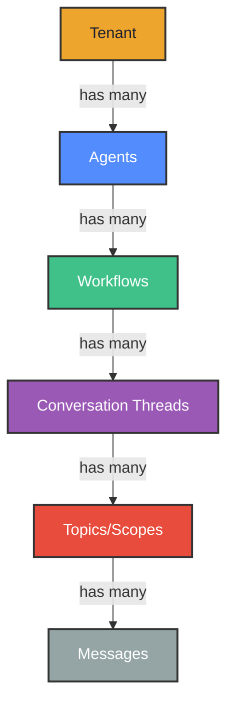
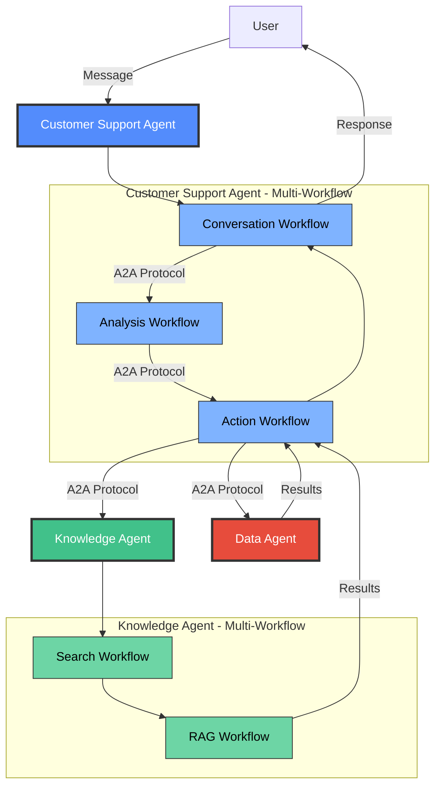
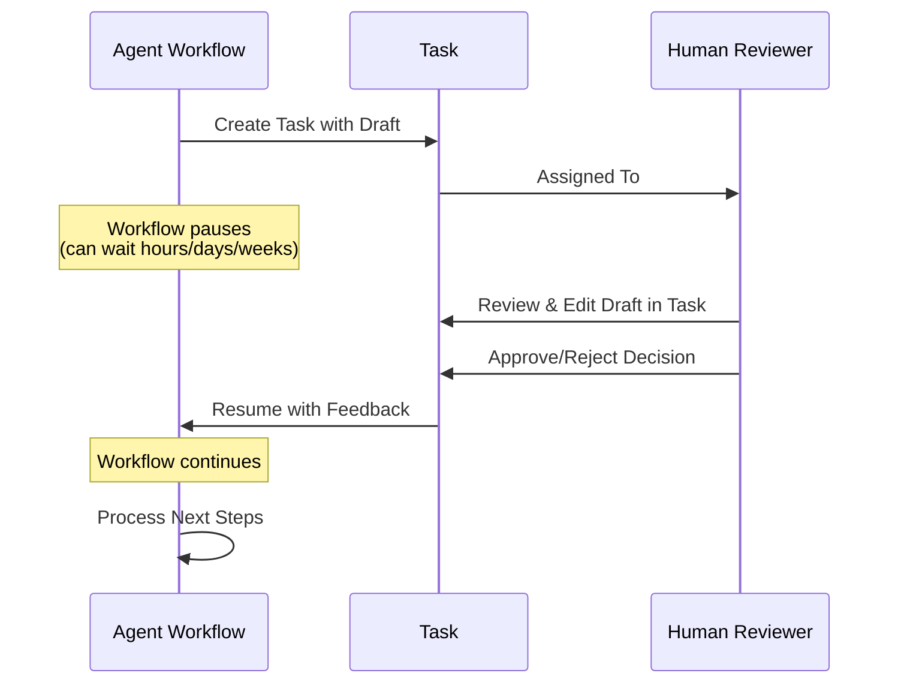

# Features

**Xians** is a **control plane** for AI agents. It sits *alongside* your agent framework - not replacing it. It handles everything that becomes painful once agents graduate from demos to production.

When you register an agent (say, one built with Azure AI Projects) with Xians and it gets following capabilities:

- **[Agent Registry](#agent-registry)** - Framework-agnostic registration and identity management
- **[Multi-tenancy](#multi-tenancy)** - Complete isolation across customers
- **[Agent-User Collaboration](#agent-user-collaboration)** - Rich messaging and conversations
- **[Agent-Agent Collaboration](#agent-agent-collaboration)** - Coordinated multi-agent systems
- **[Human-in-the-Loop](#human-in-the-loop)** - Workflow pauses for human review
- **[Long-Running Workflows](#long-running-workflows)** - Processes that span days or months
- **[Scheduling](#scheduling)** - Time-based agent activation
- **[Webhooks](#webhooks)** - Event-driven triggers and integrations
- **[Document DB](#document-db)** - Flexible storage for structured data
- **[Prompt Management](#prompt-management)** - Centralized prompt versioning and optimization
- **[Sub-Workflows](#sub-workflows)** - Composable, reusable workflow components
- **[Observability](#observability)** - Complete visibility into agent operations

No changes to your agent's code. Because Xians is framework-agnostic, you can mix agents built on different stacks in the same system.

## Agent Registry

Your agents, regardless of framework, register with Xians to get identity, authentication, and operational infrastructure.

Build with **any framework** - Microsoft Agent Framework, LangChain, Semantic Kernel, or raw OpenAI SDK - and register it with Xians. Each agent gets a unique identity, authentication credentials, and seamless integration with the platform's workflows, messaging, and scheduling infrastructure.

**Key capabilities:**

- **Framework-agnostic**: Bring your own agent implementation
- **Unique identity**: Each agent gets a distinct ID and permission management
- **Deployment models**: Publish agents as templates and rollout to tenants
- **Lifecycle management**: Publish, deploy, version control, delete agents

## Multi-Tenancy

Complete isolation of agents, workflows, data, and conversations - while sharing infrastructure. Two flavors:

| Deployment Model  | What It Means                  | When to Use                                         |
|-------------------|--------------------------------|-----------------------------------------------------|
| **System-Scoped** | One runtime serves all tenants | Common agents that will be rolled out to tenants    |
| **Tenant-Scoped** | Dedicated runtime per tenant   | Custom logic, sensitive data, specific agents       |

**Key capabilities:**

- **Data isolation**: Each tenant's workflows and data is completely separated
- **Resource boundaries**: Possible to implement per-tenant quotas and rate limits
- **Custom configurations**: Same agent using different prompts or configurations per tenant

Deploy system agents for the common, create tenant-scoped agents for the advanced deployment models.

## Agent-User Collaboration

Async message passing from users to agents with persistent conversation history and context management.

Messages aren't just text - they're the conversational memory that makes agents intelligent and contextual. Each message thread maintains state across sessions, enabling multi-turn dialogues where agents remember context, preferences, and history.

Xians provides a sophisticated message hierarchy with complete isolation at every level, allowing agents and users to scope conversations for their specific work:

This hierarchy enables powerful conversation organization: a single tenant can have multiple agents, each with different workflows handling various interactions. Within each workflow, users can maintain separate conversation threads, and even within a thread, organize messages by topic for cleaner context management

**Key capabilities:**

- **Conversation hierachy**: Automatic context preservation across sessions
- **Multiple transports**: WebSocket, Server-Sent Events (SSE), REST APIs
- **Rich messages**: Text, structured data, and HITL Tasks
- **Security**: Message encryption, EU AI Act compliant
- **Authentication**: API keys or OIDC/OAuth 2.0 integration

Users can interact with agents across different conversation threads, with full history and context automatically managed.

## Agent-Agent Collaboration

Orchestrate multiple agents working together to solve complex problems through message passing and workflow coordination.

Complex agentic systems often require multiple specialized agents collaborating as a team - one agent conversing with users, another analyzing data, one searching and reading the web, another making decisions. Xians enables sophisticated multi-agent architectures through two key mechanisms:

**Multi-Workflow Agents**: A single agent can contain multiple specialized workflows, each handling a specific responsibility (conversation, research, analysis, decision-making). These workflows operate as a coordinated team behind a unified agent interface.

**Agent-to-Agent Protocol (A2A)**: Agents communicate with each other using Xians' A2A protocol SDK, which provides in-process communication for speed and resource optimization. Messages are routed, context is shared, and results are aggregated automatically.

This architecture enables building sophisticated agent teams where each agent specializes in a domain (customer support, data analysis, web research) and each workflow within an agent handles a specific task type.

## Human-in-the-Loop

Workflows can pause for hours, days, or weeks waiting for human input, then automatically resume.

**Key capabilities:**

- **Task creation**: Agents create tasks requiring human judgment
- **Draft review**: Human reviewers edit and approve agent outputs
- **Flexible timing**: Workflows can wait indefinitely for human input
- **Approval chains**: Multi-step review processes with multiple tasks
- **Audit trails**: Complete history of reviews and decisions

Agents create tasks, attach drafts, and wait for approval. Humans review, edit, approve, or reject. Workflow continues with the feedback. Everything tracked in the audit trail.

## Long-Running Workflows

Built on [Temporal](https://temporal.io), so your workflows can run for days, months, or years with automatic state management and recovery.

Traditional automation breaks on long-running processes. Xians workflows are durable, maintaining state across restarts, failures, and deployments. A customer onboarding workflow can span weeks; an annual compliance workflow runs for months - all reliably managed.

**Key capabilities:**

- **Durable execution**: Workflows survive failures and infrastructure restarts
- **State persistence**: Maintain context across distributed operations
- **Auto-retry**: Automatic recovery from transient failures
- **Composition**: Orchestrate complex multi-step processes

Each agent can have multiple workflows for conversations, events, or custom business processes. The "Default Workflow" gives you all platform functions out-of-the-box.

## Scheduling

Create time-based workflow automation with a modern, fluent API that works the same everywhere - in regular code, agent tools, and even inside workflows themselves.

Time-based automation lets agents work autonomously - generating reports at 9 AM, processing overnight data, sending weekly summaries - without manual triggers.

**Key capabilities:**

- **Flexible scheduling**: Cron expressions, intervals, daily/weekly/monthly helpers, or one-time calendar schedules
- **Timezone support**: Schedule in any timezone using IANA timezone database
- **Workflow-aware**: Same API works both inside and outside workflows with automatic determinism
- **Full lifecycle management**: Create, pause, resume, trigger, update, and delete schedules
- **Dynamic creation**: Agents create schedules based on conversations
- **Multi-tenant isolation**: Automatic tenant security and isolation

Built on Temporal's durable execution, so schedules survive restarts and system failures. Manage everything programmatically via SDK or through the UI.

### Webhooks

TBD.

## Document Storage

Persist and query structured data with a tenant-scoped JSON document store. Save user preferences, conversation memory, session state, analytics - any data your agent needs to remember.

Agents need structured memory beyond conversations. Document storage provides flexible JSON persistence with semantic keys, metadata filtering, and automatic cleanup - without database complexity.

**Key capabilities:**

- **JSON storage**: Store any JSON-serializable object with no schema constraints
- **Semantic keys**: Use meaningful identifiers like "user-123-preferences" instead of random IDs
- **Metadata filtering**: Query by type, metadata fields, and date ranges
- **TTL support**: Auto-delete documents after expiration (sessions, caches, temporary data)
- **Dual access**: Available at agent-level and from within workflow contexts
- **Tenant isolation**: Automatic data separation per customer

Common use cases: conversation memory, user preferences, session state, analytics tracking, API response caching. Simple, fast, and purpose-built for agent workflows.

## Knowledge Management

Shared storage for agent configuration, prompts, instructions, and reference data. Both agents (via code) and humans (via UI) can read and write the same knowledge.

Agents need more than just code - they need prompts, instructions, configs, and reference data that can be updated without redeployment. Knowledge provides a shared filing cabinet accessible to both code and humans.

**Key capabilities:**

- **Dual access**: Agents use SDK methods, humans use UI portal - same data
- **Automatic scoping**: Per-agent and per-tenant isolation
- **Multiple content types**: Prompts, instructions, JSON configs, markdown docs, preferences
- **Simple CRUD**: Get, update, delete, and list operations
- **Fast retrieval**: Automatic caching for performance
- **Flexible storage**: Any text content - no schema constraints

Common uses: AI prompts editable via UI, user preferences, feature flags, instructions, API configurations, templates, FAQ content. Update agent behavior without code changes.

### Sub-Workflows

Composable workflow components that can be reused across different parent workflows.

Complex workflows benefit from modularity. Sub-workflows are reusable building blocks - a "send email" sub-workflow, a "verify identity" sub-workflow - that compose into larger processes.

**Key capabilities:**

- **Reusability**: Define once, use across multiple parent workflows
- **Composition**: Nest workflows for clean architecture
- **Independent scaling**: Sub-workflows can have different worker pools
- **Isolated testing**: Test sub-workflows independently
- **Failure isolation**: Sub-workflow failures don't cascade

Build a library of workflow components. Compose them into sophisticated business processes. Maintain and test each piece separately.

### Observability

Built-in logging, metrics, and audit trails so you can actually see what your agents are doing.

#### Logs & Exceptions

Auto-captured with stack traces. View in the UI, search by agent/tenant/workflow/time. Real-time alerts when things explode.

#### Metrics

| What We Track                | Why              |
|------------------------------|------------------|
| Response times, latency      | Find bottlenecks |
| Token usage, API calls       | Control costs    |
| Job counts, message volumes  | Monitor load     |
| Success/failure rates        | Catch issues     |

#### OpenTelemetry Support

Distributed tracing, structured logs, correlation IDs. Works with Datadog, New Relic, Grafana, and friends.

#### Audit Trails

Immutable execution history for compliance. Every workflow, every action, every decision - timestamped and logged.

---

## In Short

Xians is the infrastructure layer for agents. Keep your agent code focused on AI logic. Let Xians handle the production plumbing: agent registration, multi-tenancy, collaboration, workflows, scheduling, data storage, observability, and human oversight.

Not another agent framework. The control plane that makes your agents production-ready.
