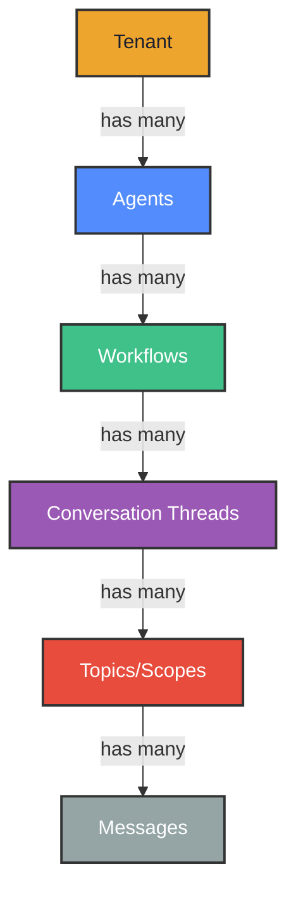
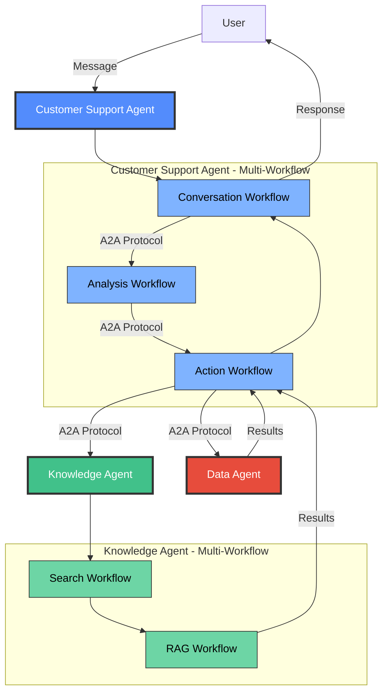
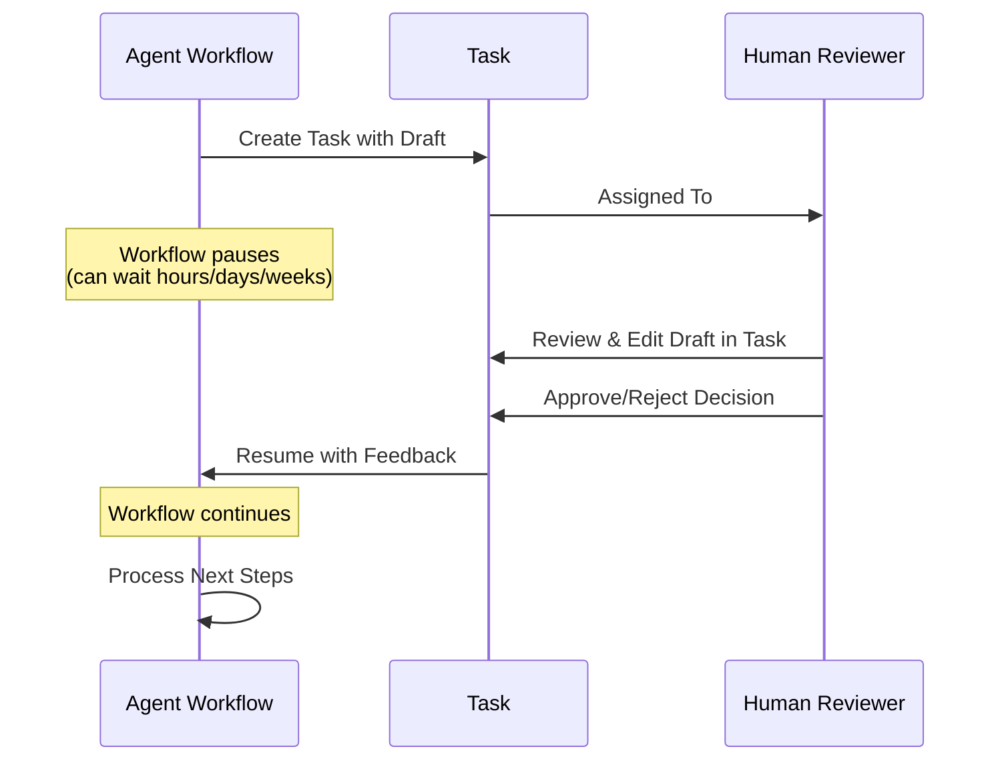

# Agent Control Plane Features

**Xians** is the **open source Agent Control Plane (ACP)** for production AI agents. It sits *alongside* your agent framework - not replacing it. It handles everything that becomes painful once agents graduate from demos to production: multi-tenant governance, business process orchestration, scalability, monitoring, and data management.

When you register an agent (built with any framework like Azure AI Projects, LangChain, Semantic Kernel, or OpenAI SDK) with Xians, it gains enterprise-grade control plane capabilities organized around five core functions:

## 1. Governance & Multi-Tenancy

- **[Agent Registry](#agent-registry)** - Centralized registration, versioning, and lifecycle management
- **[Multi-Tenancy](#multi-tenancy)** - Complete tenant isolation with centralized multi-user coordination
- **[Template-Based Deployment](#template-based-deployment)** - Rollout agents to multiple tenants from a single control point

## 2. Business Process Automation

- **[Durable Workflows](#long-running-workflows)** - Fault-tolerant processes that survive failures and span days, months, or years
- **[Scheduling](#scheduling)** - Time-based automation with cron, intervals, and calendar schedules
- **[Human-in-the-Loop](#human-in-the-loop)** - Automated workflows that pause for human review and approval
- **[Sub-Workflows](#sub-workflows)** - Composable, reusable workflow components
- **[Webhooks](#webhooks)** - Event-driven triggers for business process automation

## 3. Knowledge & Data Management

- **[Prompt Management](#configuration-management)** - Centralized prompt and knowledge storage accessible from code and UI
- **[Document Storage](#document-storage)** - Tenant-scoped persistent storage for agent state and memory
- **[Conversation History](#agent-user-collaboration)** - Hierarchical message organization with complete context preservation

## 4. Visibility & Monitoring

- **[Observability](#observability)** - Real-time logs, distributed tracing, and audit trails
- **[Performance Metrics](#performance-metrics)** - Response times, throughput, success rates, and bottleneck detection
- **[Cost Tracking](#cost-tracking)** - Token usage and API call monitoring across all agents and tenants

## 5. Scalability & Resilience

- **[Horizontal Scaling](#horizontal-scaling)** - Add agent workers dynamically with automatic load distribution
- **[Subnet Isolation](#subnet-isolation)** - Workers run with no incoming ports, only outbound connections
- **[Fault Tolerance](#fault-tolerance)** - Automatic retries, timeouts, and failure recovery
- **[Framework Agnostic](#framework-agnostic)** - Mix agents built on different stacks in the same system

---

No changes to your agent's code. Because Xians is framework-agnostic, you can mix agents built on different stacks in the same system, all governed by a unified control plane.

## Agent Registry

*Part of: Governance & Multi-Tenancy*

The control plane's agent registry provides centralized lifecycle management and coordination for your entire fleet.

Build with **any framework** - Microsoft Agent Framework, LangChain, Semantic Kernel, or raw OpenAI SDK - and register it with Xians. Each agent receives a unique identity and automatic integration with the control plane's governance, monitoring, and orchestration capabilities.

**Key capabilities:**

- **Framework-agnostic**: Bring your own agent implementation - the control plane doesn't care
- **Centralized registry**: Single source of truth for all agents across all tenants
- **Version control**: Track agent versions, configurations, and deployment history
- **Lifecycle management**: Publish, deploy, update, rollback, and decommission agents from one control point

## Template-Based Deployment

*Part of: Governance & Multi-Tenancy*

Publish agents as reusable templates and rollout to multiple tenants with consistent configurations from a centralized control point.

**Key capabilities:**

- **Agent templates**: Define once, deploy to many tenants
- **Configuration per tenant**: Same agent, different prompts and configurations per tenant
- **Centralized updates**: Update templates and propagate changes across all deployments
- **Deployment tracking**: Monitor which tenants have which agent versions
- **Rollback capability**: Revert to previous versions if issues arise

## Multi-Tenancy

*Part of: Governance & Multi-Tenancy*

The control plane provides complete isolation of agents, workflows, data, and conversations across tenants while sharing infrastructure efficiently. Coordinate multi-user operations within tenants and enforce governance across your entire organization. Two deployment models:

| Deployment Model  | What It Means                  | When to Use                                         |
|-------------------|--------------------------------|-----------------------------------------------------|
| **System-Scoped** | One runtime serves all tenants | Common agents rolled out to multiple tenants    |
| **Tenant-Scoped** | Dedicated runtime per tenant   | Custom logic, dedicated resources, specialized agents       |

**Key capabilities:**

- **Tenant isolation**: Each tenant's workflows, data, and conversations are completely separated
- **Multi-user coordination**: Multiple users within a tenant can interact with agents simultaneously
- **Resource governance**: Implement per-tenant quotas and rate limits
- **Custom configurations**: Same agent using different prompts or configurations per tenant
- **Centralized management**: Manage all tenants from a single control plane instance

Deploy system agents for common use cases, create tenant-scoped agents for custom requirements or resource isolation.

## Agent-User Collaboration

*Part of: Knowledge & Data Management*

The control plane provides rich, asynchronous messaging between users and agents with persistent conversation history and hierarchical context management.

Messages aren't just text - they're the conversational memory that makes agents intelligent and contextual. Each message thread maintains state across sessions, enabling multi-turn dialogues where agents remember context, preferences, and history.

Xians provides a sophisticated message hierarchy with complete isolation at every level, allowing agents and users to scope conversations for their specific work:

This hierarchy enables powerful conversation organization: a single tenant can have multiple agents, each with different workflows handling various interactions. Within each workflow, users can maintain separate conversation threads, and even within a thread, organize messages by topic for cleaner context management

**Key capabilities:**

- **Conversation hierachy**: Automatic context preservation across sessions
- **Multiple transports**: WebSocket, Server-Sent Events (SSE), REST APIs
- **Rich messages**: Text, structured data, and HITL Tasks
- **Security**: Message encryption, EU AI Act compliant
- **Authentication**: API keys or OIDC/OAuth 2.0 integration

Users can interact with agents across different conversation threads, with full history and context automatically managed.

## Agent-Agent Collaboration

*Part of: Business Process Automation*

The control plane orchestrates multiple agents working together to solve complex business problems through the Agent-to-Agent (A2A) protocol and workflow coordination.

Complex agentic systems often require multiple specialized agents collaborating as a team - one agent conversing with users, another analyzing data, one searching and reading the web, another making decisions. Xians enables sophisticated multi-agent architectures through two key mechanisms:

**Multi-Workflow Agents**: A single agent can contain multiple specialized workflows, each handling a specific responsibility (conversation, research, analysis, decision-making). These workflows operate as a coordinated team behind a unified agent interface.

**Agent-to-Agent Protocol (A2A)**: Agents communicate with each other using Xians' A2A protocol SDK, which provides in-process communication for speed and resource optimization. Messages are routed, context is shared, and results are aggregated automatically.

This architecture enables building sophisticated agent teams where each agent specializes in a domain (customer support, data analysis, web research) and each workflow within an agent handles a specific task type.

## Human-in-the-Loop

*Part of: Business Process Automation*

The control plane enables automated business workflows that pause for hours, days, or weeks waiting for human input, then automatically resume.

**Key capabilities:**

- **Task creation**: Agents create tasks requiring human judgment
- **Draft review**: Human reviewers edit and approve agent outputs
- **Flexible timing**: Workflows can wait indefinitely for human input
- **Approval chains**: Multi-step review processes with multiple tasks
- **Audit trails**: Complete history of reviews and decisions

Agents create tasks, attach drafts, and wait for approval. Humans review, edit, approve, or reject. Workflow continues with the feedback. Everything tracked in the audit trail.

## Long-Running Workflows

*Part of: Business Process Automation*

Built on [Temporal](https://temporal.io), the control plane orchestrates **fault-tolerant, durable workflows** that handle complex business processes spanning days, months, or years with automatic state management and recovery.

Traditional automation breaks on long-running processes. Xians workflows are durable, maintaining state across restarts, failures, and deployments. A customer onboarding workflow can span weeks; an annual compliance workflow runs for months; a scheduled report runs every day for years - all reliably managed.

**Key capabilities:**

- **Fault tolerance**: Workflows survive agent failures, infrastructure restarts, and network outages
- **Automatic retries**: Transient failures are automatically retried with configurable policies
- **State persistence**: Maintain complete context across distributed operations and long time spans
- **Composition**: Orchestrate complex multi-step business processes with sub-workflows
- **Timeout handling**: Configure timeouts at every step to handle stuck processes

Each agent can have multiple workflows for different business processes: conversations, scheduled tasks, event handlers, or custom workflows. The "Default Workflow" gives you all platform functions out-of-the-box.

## Fault Tolerance

*Part of: Scalability & Resilience*

The control plane's fault tolerance ensures business processes continue even when individual components fail.

**Key capabilities:**

- **Automatic retries**: Failed operations are retried automatically with exponential backoff
- **Timeout policies**: Prevent workflows from hanging indefinitely with configurable timeouts
- **Graceful degradation**: Workflows continue even when external services are temporarily unavailable
- **State recovery**: Workflow state is persisted and recovered automatically after crashes
- **Partial failure handling**: Handle failures in sub-workflows without failing the entire process

## Scheduling

*Part of: Business Process Automation*

The control plane provides time-based business process automation with a modern, fluent API that works the same everywhere - in regular code, agent tools, and even inside workflows themselves.

Time-based automation enables autonomous business processes - generating reports at 9 AM, processing overnight data, sending weekly summaries, running monthly analytics - without manual triggers.

**Key capabilities:**

- **Flexible scheduling**: Cron expressions, intervals, daily/weekly/monthly helpers, or one-time calendar schedules
- **Timezone support**: Schedule in any timezone using IANA timezone database
- **Workflow-aware**: Same API works both inside and outside workflows with automatic determinism
- **Full lifecycle management**: Create, pause, resume, trigger, update, and delete schedules programmatically
- **Dynamic creation**: Agents create schedules based on conversations or business logic
- **Multi-tenant isolation**: Automatic tenant scoping and isolation
- **Durable execution**: Schedules survive restarts and system failures

Manage everything programmatically via SDK or through the UI. Built on Temporal's durable execution for reliability.

## Webhooks

*Part of: Business Process Automation*

Event-driven triggers enable agents to respond to external events and integrate into broader business process automation.

**Key capabilities:**

- **Inbound webhooks**: Receive events from external systems to trigger agent workflows
- **Outbound webhooks**: Send agent events and results to external systems for process continuation
- **Cross-platform integration**: Connect agents with Microsoft 365, Kubernetes, third-party tools, and custom applications
- **Event routing**: Route events to the appropriate agents and workflows based on content and metadata
- **Async processing**: Webhook requests are queued and processed asynchronously for scalability

## Document Storage

*Part of: Knowledge & Data Management*

The control plane provides persistent, **tenant-scoped JSON document storage** for agent state, memory, and data. Save user preferences, conversation memory, session state, analytics - any data your agents need to remember across workflow executions.

Agents need structured memory beyond conversations. Document storage provides flexible JSON persistence with semantic keys, metadata filtering, and automatic cleanup - without database complexity.

**Key capabilities:**

- **JSON storage**: Store any JSON-serializable object with no schema constraints
- **Semantic keys**: Use meaningful identifiers like "user-123-preferences" instead of random IDs
- **Metadata filtering**: Query by type, metadata fields, and date ranges
- **TTL support**: Auto-delete documents after expiration (sessions, caches, temporary data)
- **Dual access**: Available at agent-level and from within workflow contexts
- **Tenant isolation**: Automatic data separation per tenant - no cross-tenant data leakage

Common use cases: conversation memory, user preferences, session state, analytics tracking, API response caching, business process state. Simple, fast, and purpose-built for agent workflows.

## Configuration Management

*Part of: Knowledge & Data Management*

Centralized **prompt and knowledge management** through the control plane. Both agents (via code) and humans (via UI) can read and write the same knowledge, enabling no-code updates to agent behavior.

Also known as **Knowledge Management** or **Prompt Management**.

Agents need more than just code - they need prompts, instructions, configs, and reference data that can be updated without redeployment. The control plane provides a centralized knowledge store accessible to both code and humans.

**Key capabilities:**

- **Dual access**: Agents use SDK methods, humans use UI portal - same data, synchronized
- **Automatic scoping**: Per-agent and per-tenant isolation
- **Multiple content types**: AI prompts, instructions, JSON configs, markdown docs, preferences
- **Version tracking**: Track changes to prompts and configurations over time
- **Simple CRUD**: Get, update, delete, and list operations via SDK or UI
- **Fast retrieval**: Automatic caching for performance
- **No schema constraints**: Store any text content

Common uses: AI prompts editable via UI, user preferences, feature flags, instructions, API configurations, templates, FAQ content. **Update agent behavior without redeployment** by changing prompts in the UI.

## Sub-Workflows

*Part of: Business Process Automation*

The control plane supports composable workflow components that can be reused across different parent workflows to build modular business processes.

Complex business processes benefit from modularity. Sub-workflows are reusable building blocks - a "send email" sub-workflow, a "verify identity" sub-workflow, a "generate report" sub-workflow - that compose into larger processes.

**Key capabilities:**

- **Reusability**: Define once, use across multiple parent workflows and business processes
- **Composition**: Nest workflows for clean, maintainable architecture
- **Independent scaling**: Sub-workflows can have different worker pools for resource optimization
- **Isolated testing**: Test sub-workflows independently before composing
- **Failure isolation**: Sub-workflow failures can be handled without cascading to parent workflow

Build a library of business process components. Compose them into sophisticated multi-step processes. Maintain and test each piece separately.

## Observability

*Part of: Visibility & Monitoring*

The control plane provides comprehensive **logs, distributed tracing, and audit trails** to monitor agent operations and debug issues across your entire fleet.

**Key capabilities:**

- **Structured logs**: Auto-captured with stack traces, searchable by agent/tenant/workflow/time in the UI
- **Distributed tracing**: OpenTelemetry support with correlation IDs to trace requests across agents and workflows
- **Workflow history**: Complete execution history for every workflow with state transitions
- **Audit trails**: Immutable execution history - every workflow, action, and decision timestamped
- **Real-time monitoring**: View logs and traces in real-time as workflows execute
- **Integration**: Export to Datadog, New Relic, Grafana, and other observability platforms

Debug complex multi-agent workflows by tracing requests across the entire system. View complete execution history to understand what happened and when.

## Performance Metrics

*Part of: Visibility & Monitoring*

Track operational performance in real-time to identify bottlenecks, optimize resource usage, and ensure SLAs are met.

| What We Track                | Why              |
|------------------------------|------------------|
| Response times, latency      | Find bottlenecks and optimize performance |
| Throughput (workflows/sec)   | Monitor load and capacity planning |
| Success/failure rates        | Catch issues and track reliability     |
| Queue depths                 | Detect backlog and scaling needs |
| Worker utilization           | Optimize worker pool sizes |

**Key capabilities:**

- **Real-time dashboards**: Visualize performance across all agents and tenants
- **Anomaly detection**: Identify performance degradation and failures automatically
- **SLA monitoring**: Track agent reliability against service level objectives
- **Bottleneck identification**: Find slow workflows and optimize them

## Cost Tracking

*Part of: Visibility & Monitoring*

The control plane tracks resource consumption and costs across your agent fleet in real-time, enabling cost optimization and chargeback.

| What We Track                | Why              |
|------------------------------|------------------|
| Token usage per agent/tenant | Control LLM costs and attribute to customers |
| API calls and volumes        | Monitor consumption patterns    |
| Cost per workflow            | Identify expensive operations     |
| Resource utilization         | Optimize infrastructure costs     |

**Key capabilities:**

- **Per-tenant tracking**: Attribute costs to specific tenants for chargeback and budgeting
- **Budget alerts**: Set spending limits and receive alerts when exceeded (planned)
- **Cost optimization**: Identify expensive agents and workflows for optimization
- **Usage trends**: Analyze cost trends over time to forecast spending

## Horizontal Scaling

*Part of: Scalability & Resilience*

The control plane enables **horizontal scaling** by distributing work across multiple agent worker containers automatically.

**Key capabilities:**

- **Dynamic worker pools**: Add or remove worker containers on demand - work is automatically distributed
- **Automatic load balancing**: Temporal distributes tasks across available workers based on capacity
- **No manual configuration**: Workers auto-register when they start - no service discovery needed
- **Per-tenant scaling**: Scale different worker pools for different tenants or agent types
- **Resource optimization**: Scale workers independently from the control plane server

Simply deploy more worker containers and watch throughput increase linearly. Scale down during off-hours to save costs.

## Subnet Isolation

*Part of: Scalability & Resilience*

Agent workers can run in **private subnets with no incoming ports**, only making outbound connections to pull tasks from the control plane.

**Key capabilities:**

- **No incoming ports**: Workers never accept inbound connections - they only pull tasks via outbound connections
- **Simplified security**: No need to expose agent workers to the internet or configure inbound firewall rules
- **Pull-based architecture**: Workers poll the Temporal queue for tasks, eliminating the need for service discovery
- **Network isolation**: Run workers in isolated subnets or VPCs with restricted network access
- **Defense in depth**: Reduced attack surface since workers can't be directly accessed

This architecture is ideal for security-conscious deployments where agents need to be isolated from external access.

## Framework Agnostic

*Part of: Scalability & Resilience*

The control plane works with any agent framework or implementation approach, enabling you to choose the best tool for each job.

**Key capabilities:**

- **No framework lock-in**: Use Microsoft Agent Framework, LangChain, Semantic Kernel, OpenAI SDK, or custom implementations
- **Mix and match**: Run agents built on different frameworks within the same control plane
- **Bring your own LLM**: Use OpenAI, Azure OpenAI, Anthropic, local models, or any LLM provider
- **Language support**: Currently supports .NET agents, with Python and TypeScript SDKs planned
- **Migration friendly**: Migrate from one framework to another without changing the control plane

Build each agent with the framework that makes the most sense, then govern them all through a unified control plane.

---

## The Control Plane Advantage

Xians is the **Agent Control Plane** that transforms AI agents from demos to production-grade systems. Keep your agent code focused on AI logic. Let the control plane handle multi-tenant governance, business process orchestration, horizontal scalability, monitoring, and data management.

**Not another agent framework.** The open source control plane that provides centralized, proactive control over your entire agent fleet - enabling reliable, scalable, and observable deployment of AI-powered business processes across your organization.
