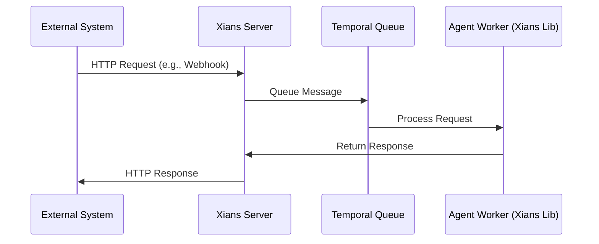

# Where Does it Fit?

Xians is designed to integrate seamlessly into your existing architecture as a dedicated **Agent Microservice**. It sits between your web server and your AI agents, handling all agent management, orchestration, and communication.

## Your Product Architecture

The diagram above illustrates how Xians fits into a typical microservices architecture:

1. **Your Product UI** - Your frontend application where users interact with your product
2. **Your Web Server** - Your backend/BFF (Backend for Frontend) layer that handles UI logic
3. **Agent Microservice (Xians Server)** - The dedicated service for managing AI agents
4. **Your Agents** - The AI agents that perform tasks and interact with users

### Direct Integration Option

Alternatively, the Xians Server can use OIDC to connect directly with your web UI in scenarios where a BFF/Web Server layer is not mediating the communication. Developers may use the **Xians TypeScript SDK** (Optional) to easily integrate with the server's APIs.

## Xians Subcomponents

Xians is built with a modular architecture comprising the following major components:

1. **Xians Server** - The core orchestration engine that provides APIs for agents and external applications to interact with the platform. Both Web and Temporal servers are a part of this.
2. **Xians UI** - A comprehensive web interface for managing and controlling all aspects of your agents (serves as an alternative to direct API integration)
3. **Xians Lib** - A .NET Core class library that agents use to establish connections and communicate with the Xians server

## Built on Temporal

Xians is built on the industry-proven open source [Temporal](https://temporal.io) workflow server, which acts as the agent's work execution engine. This foundation unlocks powerful capabilities:

- **Distributed Execution** - Agents run as independent processes focused purely on business logic, while Xians handles all external interactions
- **Horizontal Scalability** - Simply spawn more agent containers and watch Xians automatically distribute the workload
- **Fault Tolerance** - Leverage Temporal's battle-tested timeout and retry policies to keep your agents resilient
- **Long-running Processes** - Xians can orchestrate durable, multi-step agent workflows that can span minutes, hours, or even years, with state managed reliably by Temporal.

## Asynchronous & Stateless

Xians agents communicate with the external world through a fully asynchronous message queue architecture:

Even when you send a synchronous HTTP webhook request, Xians processes it asynchronously under the hood using queues with configurable timeouts. This architectural choice enables:

- **Massive Scalability** - Handle high loads by distributing work across multiple agents
- **Stateless Execution** - Each request is processed independently, making agents easier to scale and maintain 
