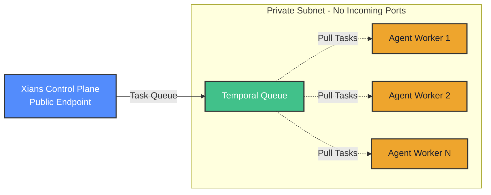
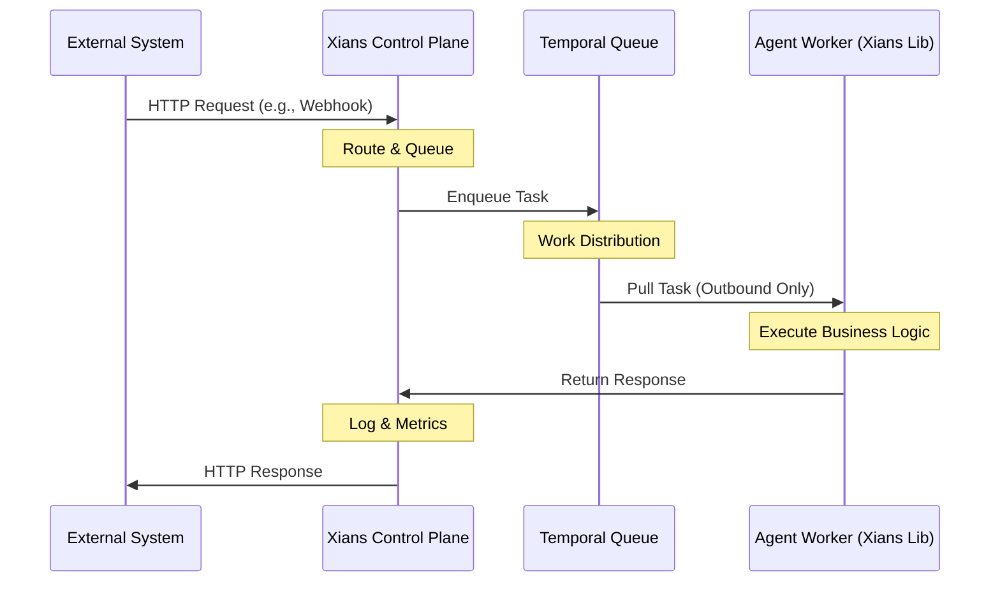

# Where Does it Fit?

Xians is an **Agent Control Plane (ACP)** that provides centralized governance, orchestration, and monitoring for your entire fleet of AI agents. It integrates into your architecture as a dedicated **Agent Microservice**, sitting between your web server and AI agents to coordinate multi-tenant operations, orchestrate business processes, and scale agent workloads across your infrastructure.

## Architecture Overview

The diagram above illustrates how Xians operates as a control plane in a typical microservices architecture:

1. **Your Product UI** - Your frontend application where users interact with your product
2. **Your Web Server** - Your backend/BFF (Backend for Frontend) layer that handles UI logic
3. **Agent Control Plane (Xians Server)** - The centralized platform governing all AI agents
4. **Your Agents** - The AI agents registered with and controlled by Xians

### Centralized Governance & Orchestration

As a control plane, Xians provides a **single point of governance and coordination** for your entire agent fleet:

- **Multi-Tenant Governance**: Complete tenant isolation with centralized management - deploy agents across tenants from a single control point
- **Business Process Orchestration**: Coordinate complex, long-running workflows with fault tolerance and automatic retries
- **Unified Visibility**: Monitor health, performance, costs, and operations across all agents and tenants from one platform
- **Lifecycle Management**: Register, deploy, version, configure, and decommission agents centrally with template-based rollouts
- **Knowledge Management**: Centralize prompts, configurations, and agent knowledge accessible to both code and UI

### Direct Integration Option

The Xians Server can use OIDC to connect directly with your web UI in scenarios where a BFF/Web Server layer is not mediating the communication. Developers may use the [**Xians TypeScript SDK**](https://github.com/XiansAiPlatform/sdk-web-typescript) (Optional) to easily integrate with the server's APIs and leverage the control plane's capabilities.

## Control Plane Components

Xians is built with a modular architecture comprising the following major components:

1. **Xians Server** - The core control plane engine that provides APIs for policy enforcement, monitoring, and agent orchestration. Includes both Web and Temporal servers.
2. **Xians UI** - A comprehensive management console for governing agents, monitoring operations, viewing metrics, configuring policies, and managing lifecycles across your entire fleet
3. **Xians Lib** - A .NET Core class library that agents use to register with the control plane and communicate securely with Xians Server
4. **Xians Agent Studio** – An optional, standalone UI that allows you to quickly onboard human users and enable collaboration with AI agents through chat conversations and human-in-the-loop tasks, right out of the box.

## Layered Architecture View

Understanding where an Agent Control Plane fits in your architecture helps clarify its role and value. The diagram below illustrates Xians' position in a layered view:

The ACP sits **between your agents and the external world** - mediating all interactions with users, systems, and external services. This architectural position enables the control plane to:

**Orchestrate External Interactions:**

- Route messages between users and agents through conversation APIs
- Handle webhook events from external systems to trigger workflows
- Coordinate multi-agent collaboration for A2A
- Manage integrations with third-party platforms and services

**Provide Agent Utilities:**

- Tenant-scoped data storage for state and memory
- Centralized prompt and knowledge management
- Scheduling infrastructure for time-based automation
- Conversation history with hierarchical organization

**Governance & Observability:**

- Multi-tenant isolation with centralized policy enforcement
- Real-time monitoring with logs, metrics, and distributed tracing
- Cost tracking across agents and tenants
- Audit trails for compliance and debugging

**Infrastructure Abstraction:**

- Distributed networking and load balancing across agent workers
- Fault tolerance with automatic retries and state recovery
- Horizontal scalability with dynamic worker pools
- Network isolation (agents run in private subnets with no incoming ports)

By handling these cross-cutting concerns, the control plane allows your agents to focus purely on business logic while the platform manages multi-tenancy, orchestration, scalability, monitoring, and infrastructure complexity.

## Built on Temporal for Durable Orchestration

Xians leverages the industry-proven open source [Temporal](https://temporal.io) workflow server as its orchestration foundation. This enables the control plane to reliably manage business processes and agent workflows at scale:

- **Distributed Execution** - Agents run as independent worker processes focused on business logic, while the control plane handles orchestration and coordination
- **Fault Tolerance** - Built-in timeout and retry policies ensure resilient execution even when agents fail or infrastructure restarts
- **Long-running Processes** - Orchestrate durable, multi-step business workflows that can span minutes, hours, days, or even years with state managed reliably
- **Scheduled Workflows** - Time-based automation with cron expressions, intervals, and calendar schedules for recurring business processes
- **Horizontal Scalability** - Simply add more agent worker containers and watch Xians automatically distribute the workload
- **Audit Trail** - Every workflow execution is recorded with complete history for debugging and compliance tracking

## Scalable & Secure Worker Architecture

Agent workers operate in a **pull-based architecture** that enables massive scalability and secure deployment:

**Key benefits:**

- **Subnet Isolation**: Agent workers run in private subnets with **no incoming ports** - they only make outbound connections to pull tasks
- **Horizontal Scaling**: Add or remove worker containers dynamically based on load - Temporal automatically balances work distribution
- **Network Security**: Workers never accept inbound connections, reducing attack surface and simplifying firewall rules
- **Multi-Tenant Isolation**: Different worker pools can serve different tenants or security zones
- **Auto-Discovery**: Workers automatically register with the control plane when they start - no manual configuration needed

## Asynchronous Processing & Scalability

The control plane manages agent interactions through a fully asynchronous message queue architecture, ensuring massive scalability and resilience:

Even when you send a synchronous HTTP webhook request, the control plane processes it asynchronously using queues with configurable timeouts. This architecture enables:

- **Massive Scalability** - Handle high loads by distributing work across hundreds or thousands of agent workers
- **Stateless Execution** - Each task is processed independently, making workers easy to scale horizontally without shared state
- **Resilient Operations** - Automatic retries, timeouts, and failure handling ensure reliable execution even during outages
- **Load Balancing** - Temporal automatically distributes tasks to available workers based on capacity
- **Complete Observability** - Every interaction is logged with distributed tracing for debugging and performance analysis
