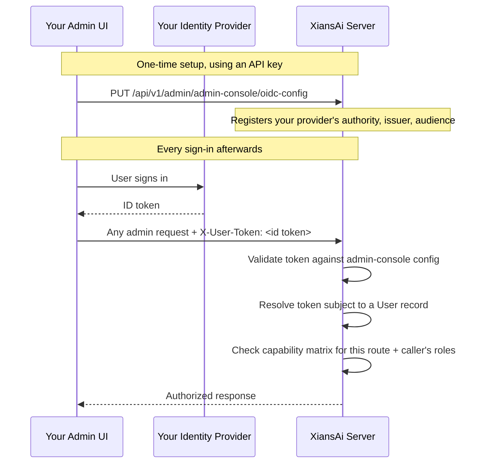
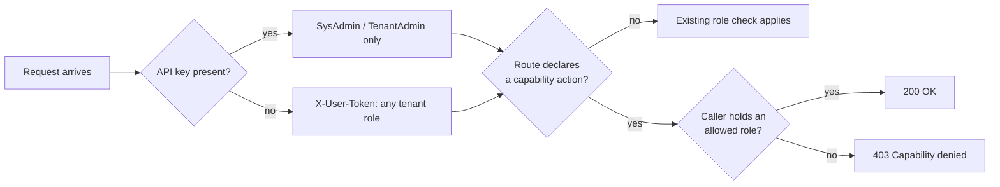

# Admin API Authentication & Access Control

The Admin API (`/api/v1/admin/...`) accepts two kinds of credential: a shared **API key**, or a verified **OIDC ID token** with no API key at all. This page covers both, how the server decides who the caller is and which tenant they act on, and the **capability matrix** that governs what a caller is allowed to do.

## Two ways to authenticate

| | API key | ID token (`X-User-Token`) |
|---|---|---|
| Header | `Authorization: Bearer sk-Xnai-...` | `X-User-Token: <verified OIDC ID token>` |
| Identifies | A service credential | The signed-in person |
| Roles recognized | `SysAdmin`, `TenantAdmin` only | Any tenant role: `SysAdmin`, `TenantAdmin`, `TenantUser`, `TenantParticipant`, `TenantParticipantAdmin` |
| Setup | One key, minted at [bootstrap](bootstrapping.md) or by an admin | One-time [provider registration](#path-2-id-token-keyless) by a `SysAdmin` |
| Best for | Scripts, service integrations, the existing Agent Studio flow | A custom admin UI where each person should act and be audited as themselves |
| Authorizes | What the key owner's `SysAdmin` or `TenantAdmin` role allows, narrowed by the [capability matrix](#the-capability-matrix-rbac) | Only what the [capability matrix](#the-capability-matrix-rbac) grants that caller's roles |

If a request carries both, the API key wins. The server only looks at `X-User-Token` when `Authorization: Bearer` is absent as it never extends or modifies an API-key-authenticated request.

Two endpoint groups always require a real API key, regardless of role are **messaging** and **heartbeat**. Both forward the raw key downstream to agents over Temporal, so there is no key to forward on the ID-token path.

## Path 1: API key

An API key is owned by one user. Every request made with it acts as that owner, and the owner must hold `SysAdmin` or `TenantAdmin`. A key whose owner holds neither role is refused with `User does not have required admin role`.

### Getting a key

- **First key:** the one-time [bootstrap call](bootstrapping.md) returns a key owned by the first `SysAdmin`. It is shown once.
- **More keys:** create named, revocable keys per user with the key-management endpoints below.

All routes are under `/api/v1/admin/tenants/{tenantId}/admin-apikeys` and take `userId` as a query parameter. A `SysAdmin` may pass any `userId`. Everyone else must pass their own.

| Method | Path | Does |
|---|---|---|
| `POST` | `?userId=` | Creates a key. Body: `{ "name": "ci-deploy" }`. The raw `apiKey` is returned once |
| `GET` | `?userId=` | Lists that user's keys (metadata only, never the secret) |
| `GET` | `/{id}?userId=` | Reads one key's metadata |
| `POST` | `/{id}/rotate?userId=` | Issues a new secret for the key. The new `apiKey` is returned once |
| `POST` | `/{id}/revoke?userId=` | Permanently deletes the key. Its name can be reused |

### Using a key

```http
GET /api/v1/admin/tenants/acme01/agents
Authorization: Bearer sk-Xnai-...
```

- The key goes in the `Authorization: Bearer` header only. A `?apikey=` query parameter is not supported, because query strings leak into proxy logs, CDN logs and browser history.
- Keys always start with `sk-Xnai-`. Any other format is rejected.
- Treat a key as a backend credential. Do not ship it to a browser.

### Which tenant the request acts on

The tenant comes from `tenantId` in the query string, then the route, then the `X-Tenant-Id` header. What happens next depends on the owner's role:

| Owner holds | No tenant supplied | Tenant supplied |
|---|---|---|
| `SysAdmin` | The key's own tenant | Any existing tenant. An unknown tenant returns `404` |
| `TenantAdmin` only | The key's own tenant | Must equal the key's tenant, otherwise `Tenant ID does not match API key tenant` |

Admin access is never inferred from an email domain. The owner must hold the role explicitly.

### Attributing actions to a person

A key identifies its owner, not the person using your UI. To record who actually triggered an action in the [audit log](audit-log.md), send their identity alongside the key:

```http
Authorization: Bearer sk-Xnai-...
X-On-Behalf-Of: auth0|64f2ab...
```

The header is an unverified assertion by whoever holds the key. It is stored as the audit row's `participant_id` and never changes what the request is authorized to do. `logged_in_user` stays the key owner. If every person needs their own verified identity and permissions, use the ID-token path below.

## Path 2: ID token (keyless)

A custom admin UI shared by several people is a poor fit for one API key: everyone shares one credential and the audit log cannot tell them apart. For that case, the Admin API also accepts a verified OIDC ID token in `X-User-Token`, with no API key.

### Setting it up for your own admin UI

The mechanism isn't tied to a specific product as the server doesn't know or care which UI is calling. Any client with its own login screen can register itself. Tokens are checked against a dedicated **`admin-console` pseudo-tenant**, separate from any real tenant's own OIDC rules, since the people using an admin UI usually span several tenants rather than belonging to one.

Everything here is runtime configuration: there's nothing to add to `.env`, and no restart is needed.



#### 1. Get an API key

You need one API key to register the OIDC configuration in the first place. See [Platform Bootstrapping](bootstrapping.md).

#### 2. Register your identity provider

```bash
curl -X PUT https://your-server.example.com/api/v1/admin/admin-console/oidc-config \
  -H "Authorization: Bearer sk-Xnai-..." -H "Content-Type: application/json" \
  -d '{
    "allowedProviders": ["microsoft"],
    "providers": {
      "microsoft": {
        "authority": "https://login.microsoftonline.com/<tenant-id>/v2.0",
        "issuer": "https://login.microsoftonline.com/<tenant-id>/v2.0",
        "expectedAudience": ["your-admin-ui-client-id"]
      }
    }
  }'
```

| Method | Path | Does |
|---|---|---|
| `GET` | `/api/v1/admin/admin-console/oidc-config/template` | Returns a starter template |
| `GET` | `/api/v1/admin/admin-console/oidc-config` | Reads back the current configuration |
| `PUT` | `/api/v1/admin/admin-console/oidc-config` | Creates or replaces the configuration |
| `DELETE` | `/api/v1/admin/admin-console/oidc-config` | Removes the configuration |

All four require `SysAdmin`. You can register more than one provider each with its own entry in `providers` if more than one admin UI needs to sign in.

#### 3. Call the API with the ID token

```http
GET /api/v1/admin/tenants/acme01/agents
X-User-Token: eyJhbGciOi...
```

Send no `Authorization` header at all its absence is what tells the server to use this path.

### Resolving the caller's identity

The ID token doesn't create a user. It has to match an existing `User` record, the same one created at [bootstrap](bootstrapping.md), by an invite, or by signing in through one of the [regular auth providers](../studio/installation.md#authentication-providers-at-least-one). The server resolves it in this order:

1. The token's `sub` claim (falling back to `oid`), matched against `User.UserId`.
2. If nothing matches, the token's own verified email address. If more than one account shares that address, the request is refused rather than guessed at.

!!! warning "Azure AD: `sub` differs per app registration"
    Azure AD issues a different, pairwise `sub` for every application registration. A token from your admin UI's registration will **not** carry the same `sub` as a token from Agent Studio's registration, even for the same person in the same Azure tenant. If your users already have accounts from signing in to Agent Studio, set `"providerSpecificSettings": {"userIdClaim": "oid"}` on your provider entry so both paths resolve to the same account or rely on the email fallback above.

Each Azure AD (or other) tenant you want to accept sign-ins from must be registered by its real issuer URL. There's no "accept any tenant" setting: without an exact issuer match, the server would have no way to verify a caller's `email` claim, and anyone can create a free Azure AD tenant with that claim set to any address.

### Tenant scoping on the ID-token path

- A `SysAdmin` calling a tenant-scoped route must pass `tenantId` explicitly as there's no API key to infer a default tenant from.
- Any other caller defaults to their own tenant, provided they hold an approved role in exactly one.
- Routes that aren't tenant-scoped like the admin-console configuration endpoints don't require a `tenantId` at all.

## The capability matrix (RBAC)

The **capability matrix** decides what each role can actually do on the Admin API. It applies to both credentials: the check reads the caller's roles, whether they come from an ID token or from the owner of an API key. ID-token auth is what makes it matter most, since it accepts any tenant role and not just `SysAdmin` and `TenantAdmin`. The matrix maps named actions (`tenant.users.delete`, `tenant.schedules.pause`, and so on) to the roles allowed to perform them.



A few things to know before editing it:

- Every action ships with a default, so nothing needs configuring to get today's behavior.
- `SysAdmin` always bypasses the matrix, with either credential. That isn't a row you can edit or remove. A key owned by a `SysAdmin` is never restricted by it.
- A key owned by a `TenantAdmin` is restricted. If you remove `TenantAdmin` from an action, that key is refused with `403 Capability denied` too.
- In a group that enforces the matrix, a route that declares no action is denied to everyone except `SysAdmin`, on both paths.
- Actions can be **non-delegable**. Their roles are fixed at `SysAdmin` only (or, for a few tenant-level ones, `TenantAdmin`) and cannot be changed. These are mostly actions that reach across tenants or change how the platform is secured:
    - `global.users.*`: listing, reading, or updating any account, granting or revoking `SysAdmin`, disabling or deleting an account.
    - `global.participants.*`: looking up a participant by email or user ID across tenants.
    - `tenants.delete` and `tenants.metadata.list` / `tenants.metadata.get`.
    - `tenant.temporalConfig.get` / `tenant.temporalConfig.set` and `tenant.oidcConfig.upsert`.
    - `tenant.agentAccess.access`, `tenant.ownership.get` and `tenant.templates.access`, which stay `TenantAdmin`.

    `GET /catalog` is the authoritative list.
- A route that hasn't been migrated onto the matrix keeps whatever check it already had. The matrix only applies where a route explicitly declares an action.

### Viewing and editing the matrix

All endpoints below require `SysAdmin` and live under `/api/v1/admin/admin-console/capability-matrix/`:

| Method | Path | Does |
|---|---|---|
| `GET` | `/` | The effective matrix — every action with its resolved roles |
| `GET` | `/catalog` | The full action catalog compiled into the server: names, descriptions, defaults, and which are non-delegable |
| `PUT` | `/{action}` | Replaces an action's allowed roles |
| `DELETE` | `/{action}` | Clears a stored override. The action reverts to its code default |

```bash
# See what's currently allowed
curl https://your-server.example.com/api/v1/admin/admin-console/capability-matrix \
  -H "Authorization: Bearer sk-Xnai-..."

# Let TenantUser, in addition to TenantAdmin, pause schedules
curl -X PUT https://your-server.example.com/api/v1/admin/admin-console/capability-matrix/tenant.schedules.pause \
  -H "Authorization: Bearer sk-Xnai-..." -H "Content-Type: application/json" \
  -d '{"allowedRoles": ["TenantAdmin", "TenantUser"], "description": "Let power users pause their own schedules"}'
```

`PUT` replaces the rule rather than adding to it, so you can tighten an action below its default as well as widen it. An empty `allowedRoles` list means `SysAdmin` only. An unknown action name, or one marked non-delegable, is rejected. Unrecognized role names are saved with a server-side warning, so check the spelling.

`GET /` lists `SysAdmin` separately under `effectiveRoles`, because it bypasses the matrix in code and never appears in `allowedRoles`.

`DELETE` removes the stored override, so the action goes back to its default. It never closes an action off. To close one, `PUT` an empty `allowedRoles` list instead.

## Security considerations

- A leaked API key acts as its owner until it is revoked. Prefer named per-user keys you can revoke and rotate over sharing the bootstrap key.
- `X-On-Behalf-Of` (used to attribute audit log entries on API-key calls) is an unverified assertion. `X-User-Token` is a cryptographically verified identity, but only as trustworthy as the issuer you registered for it.
- Widening the capability matrix can hand a capability to a `TenantUser`, not just an admin. Check who actually holds a role before granting it an action.
- Leaving the admin-console OIDC configuration unset is the safe default. It keeps the Admin API API-key-only.

## Related

- [Platform Bootstrapping](bootstrapping.md) — mint the API key needed to configure everything above
- [Tenant OIDC Providers](../studio/oidc-providers.md) — the separate, per-tenant OIDC mechanism for Agent Studio and User API sign-in
- [Studio Installation → Authentication providers](../studio/installation.md#authentication-providers-at-least-one) — the deployment-wide sign-in providers (Auth0, Azure AD, Azure B2C, Keycloak)
