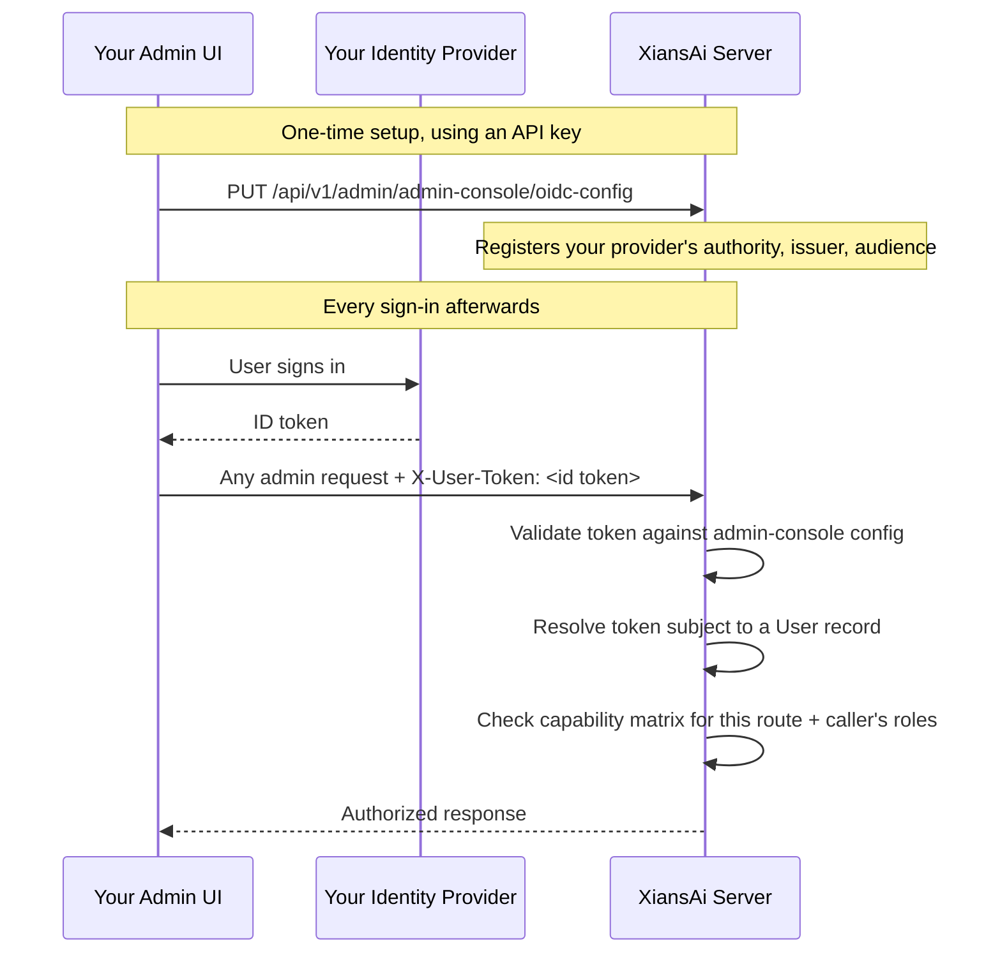
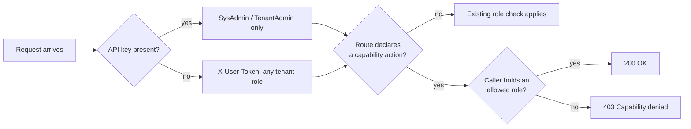

# Admin API Authentication & Access Control

The Admin API (`/api/v1/admin/...`) is normally authenticated with a single shared **API key** — see [Platform Bootstrapping](bootstrapping.md). Anyone holding that key can act as `SysAdmin` or `TenantAdmin`. That works well for scripts and service integrations, but it's a poor fit for a **custom admin UI** used by several people where everyone shares one credential, and audit logs can't tell them apart.

For that case, the Admin API also accepts a verified **OIDC ID token**, with no API key at all. This page covers that ID-token path, and the **capability matrix** that governs what an ID-token-authenticated caller is allowed to do.

!!! info "Not the same as Tenant OIDC Providers"
    [Tenant OIDC Providers](../studio/oidc-providers.md) controls sign-in to **Agent Studio** and to your own **User API** clients, per tenant. This page controls sign-in to the **Admin API** itself. The two are configured separately and serve different audiences.

## Two ways to authenticate

| | API key | ID token (`X-User-Token`) |
|---|---|---|
| Header | `Authorization: Bearer sk-Xnai-...` | `X-User-Token: <verified OIDC ID token>` |
| Identifies | A service credential | The signed-in person |
| Roles recognized | `SysAdmin`, `TenantAdmin` only | Any tenant role: `SysAdmin`, `TenantAdmin`, `TenantUser`, `TenantParticipant`, `TenantParticipantAdmin` |
| Best for | Scripts, service integrations, the existing Agent Studio flow | A custom admin UI where each person should act and be audited as themselves |
| Authorizes | Everything the role allows | Only what the [capability matrix](#the-capability-matrix-rbac) grants that caller's roles |

If a request carries both, the API key wins. The server only looks at `X-User-Token` when `Authorization: Bearer` is absent as it never extends or modifies an API-key-authenticated request.

Two endpoint groups always require a real API key, regardless of role are **messaging** and **heartbeat**. Both forward the raw key downstream to agents over Temporal, so there is no key to forward on the ID-token path.

## Setting up ID-token auth for your own admin UI

The mechanism isn't tied to a specific product as the server doesn't know or care which UI is calling. Any client with its own login screen can register itself. Tokens are checked against a dedicated **`admin-console` pseudo-tenant**, separate from any real tenant's own OIDC rules, since the people using an admin UI usually span several tenants rather than belonging to one.

Everything here is runtime configuration: there's nothing to add to `.env`, and no restart is needed.



### 1. Get an API key

You need one API key to register the OIDC configuration in the first place. See [Platform Bootstrapping](bootstrapping.md).

### 2. Register your identity provider

```bash
curl -X PUT https://your-server.example.com/api/v1/admin/admin-console/oidc-config \
  -H "Authorization: Bearer sk-Xnai-..." -H "Content-Type: application/json" \
  -d '{
    "allowedProviders": ["microsoft"],
    "providers": {
      "microsoft": {
        "authority": "https://login.microsoftonline.com/<tenant-id>/v2.0",
        "issuer": "https://login.microsoftonline.com/<tenant-id>/v2.0",
        "expectedAudience": ["your-admin-ui-client-id"]
      }
    }
  }'
```

| Method | Path | Does |
|---|---|---|
| `GET` | `/api/v1/admin/admin-console/oidc-config/template` | Returns a starter template |
| `GET` | `/api/v1/admin/admin-console/oidc-config` | Reads back the current configuration |
| `PUT` | `/api/v1/admin/admin-console/oidc-config` | Creates or replaces the configuration |
| `DELETE` | `/api/v1/admin/admin-console/oidc-config` | Removes the configuration |

All four require `SysAdmin`. You can register more than one provider each with its own entry in `providers` if more than one admin UI needs to sign in.

### 3. Call the API with the ID token

```http
GET /api/v1/admin/tenants/acme01/agents
X-User-Token: eyJhbGciOi...
```

Send no `Authorization` header at all its absence is what tells the server to use this path.

## Resolving the caller's identity

The ID token doesn't create a user. It has to match an existing `User` record, the same one created at [bootstrap](bootstrapping.md), by an invite, or by signing in through one of the [regular auth providers](../studio/installation.md#authentication-providers-at-least-one). The server resolves it in this order:

1. The token's `sub` claim (falling back to `oid`), matched against `User.UserId`.
2. If nothing matches, the token's own verified email address. If more than one account shares that address, the request is refused rather than guessed at.

!!! warning "Azure AD: `sub` differs per app registration"
    Azure AD issues a different, pairwise `sub` for every application registration. A token from your admin UI's registration will **not** carry the same `sub` as a token from Agent Studio's registration, even for the same person in the same Azure tenant. If your users already have accounts from signing in to Agent Studio, set `"providerSpecificSettings": {"userIdClaim": "oid"}` on your provider entry so both paths resolve to the same account — or rely on the email fallback above.

Each Azure AD (or other) tenant you want to accept sign-ins from must be registered by its real issuer URL. There's no "accept any tenant" setting: without an exact issuer match, the server would have no way to verify a caller's `email` claim, and anyone can create a free Azure AD tenant with that claim set to any address.

## Tenant scoping

- A `SysAdmin` calling a tenant-scoped route must pass `tenantId` explicitly as there's no API key to infer a default tenant from.
- Any other caller defaults to their own tenant, provided they hold an approved role in exactly one.
- Routes that aren't tenant-scoped like the admin-console configuration endpoints don't require a `tenantId` at all.

## The capability matrix (RBAC)

ID-token auth accepts any tenant role, not just `SysAdmin` and `TenantAdmin`. The **capability matrix** decides what each of those roles can actually do: it maps named actions (`tenant.users.delete`, `tenant.schedules.pause`, and so on) to the roles allowed to perform them.



A few things to know before editing it:

- Every action ships with a default, so nothing needs configuring to get today's behavior.
- `SysAdmin` always bypasses the matrix; that isn't a row you can edit or remove.
- Actions can be **non-delegable** mainly ones that reach across tenants (`global.users.*`: listing, reading, or updating any account. Granting or revoking `SysAdmin`. Disabling or deleting an account). Those stay `SysAdmin` only.
- A route that hasn't been migrated onto the matrix keeps whatever check it already had. The matrix only applies where a route explicitly declares an action.

### Viewing and editing the matrix

All endpoints below require `SysAdmin` and live under `/api/v1/admin/admin-console/capability-matrix/`:

| Method | Path | Does |
|---|---|---|
| `GET` | `/` | The effective matrix — every action with its resolved roles |
| `GET` | `/catalog` | The full action catalog compiled into the server: names, descriptions, defaults, and which are non-delegable |
| `PUT` | `/{action}` | Replaces an action's allowed roles |
| `DELETE` | `/{action}` | Clears a stored override; the action reverts to its code default |

```bash
# See what's currently allowed
curl https://your-server.example.com/api/v1/admin/admin-console/capability-matrix \
  -H "Authorization: Bearer sk-Xnai-..."

# Let TenantUser, in addition to TenantAdmin, pause schedules
curl -X PUT https://your-server.example.com/api/v1/admin/admin-console/capability-matrix/tenant.schedules.pause \
  -H "Authorization: Bearer sk-Xnai-..." -H "Content-Type: application/json" \
  -d '{"allowedRoles": ["TenantAdmin", "TenantUser"], "description": "Let power users pause their own schedules"}'
```

`PUT` replaces the rule rather than adding to it, so you can tighten an action below its default as well as widen it. An unknown action name, or one marked non-delegable, is rejected.

## Security considerations

- `X-On-Behalf-Of` (used to attribute audit log entries on API-key calls) is an unverified assertion. `X-User-Token` is a cryptographically verified identity, but only as trustworthy as the issuer you registered for it.
- Widening the capability matrix can hand a capability to a `TenantUser`, not just an admin. Check who actually holds a role before granting it an action.
- Leaving the admin-console OIDC configuration unset is the safe default — it keeps the Admin API API-key-only.

## Related

- [Platform Bootstrapping](bootstrapping.md) — mint the API key needed to configure everything above
- [Tenant OIDC Providers](../studio/oidc-providers.md) — the separate, per-tenant OIDC mechanism for Agent Studio and User API sign-in
- [Studio Installation → Authentication providers](../studio/installation.md#authentication-providers-at-least-one) — the deployment-wide sign-in providers (Auth0, Azure AD, Azure B2C, Keycloak)
