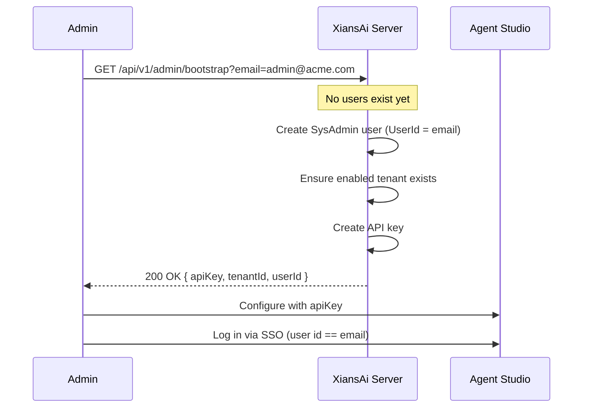

# Platform Bootstrapping

When you deploy a fresh XiansAi Server, the database has no users, no system administrator, and (optionally) no tenant. The **bootstrap endpoint** lets you initialize the platform with a single call: it creates the first system administrator, ensures a tenant exists, and returns an API key you can use to configure Agent Studio.

## Overview

The bootstrap endpoint is intentionally **unauthenticated**, because there is no administrator yet to authenticate as. To keep it safe, it is protected by a single rule:

!!! warning "One-time, gated operation"
    The endpoint only succeeds while **no users exist** in the database. As soon as the first user is created, every subsequent call returns `409 Conflict`. In effect, this is a single-use endpoint.

A typical bootstrap flow looks like this:



## Endpoint

```text
GET /api/v1/admin/bootstrap
```

### Query parameters

| Parameter  | Required | Description |
|------------|----------|-------------|
| `email`    | Yes      | Email address of the first system administrator. It is used as **both** the user id and the email, so the administrator can later log in through your identity provider with a token whose user id equals this email. |
| `tenantId` | No       | Tenant to create or attach the administrator to. Defaults to `default` when omitted. If the tenant already exists but is disabled, it will be enabled. |

### Responses

| Status | Meaning |
|--------|---------|
| `200 OK` | Platform bootstrapped. The body contains the API key, tenant id, and user id. |
| `400 Bad Request` | The `email` parameter is missing or not a valid email address. |
| `409 Conflict` | The platform already has users; bootstrapping is no longer allowed. |

### Success response body

```json
{
  "apiKey": "sk-Xnai-XXXXXXXXXXXXXXXXXXXXXXXXXXXXXXXXXXXXXXXXXXX",
  "tenantId": "default",
  "userId": "admin@acme.com"
}
```

!!! danger "Save the API key now"
    The raw `apiKey` is returned **only once** and is never retrievable again. Store it securely. If you lose it, the bootstrapped administrator can still sign in to Agent Studio and mint a new key from the UI.

## What the endpoint does

When called on an empty platform, the endpoint performs the following steps in order:

1. **Validates** the `email` query parameter.
2. **Checks the gate** — confirms that no users exist. If any user is present, it returns `409 Conflict`.
3. **Ensures a tenant** — uses the supplied `tenantId` (or `default`). It creates the tenant as *enabled* if missing, or enables it if it exists but is disabled.
4. **Creates the system administrator** — a user whose id and email are the supplied `email`. Because the platform is empty, this first user is automatically granted the `SysAdmin` role.
5. **Creates an API key** owned by the new administrator within the tenant.
6. **Returns** the raw API key together with the tenant id and user id.

## Usage

### Default tenant

```bash
curl "https://your-server.example.com/api/v1/admin/bootstrap?email=admin@acme.com"
```

### Custom tenant

```bash
curl "https://your-server.example.com/api/v1/admin/bootstrap?email=admin@acme.com&tenantId=acme"
```

## Configuring Agent Studio

After bootstrapping:

1. Copy the returned `apiKey`.
2. In Agent Studio, configure the server connection using this API key. Because the key is owned by a `SysAdmin`, it authorizes the full Admin API surface.
3. Sign in to Agent Studio through your identity provider. Ensure the user id in the issued token matches the bootstrap `email`, so your account resolves to the `SysAdmin` created during bootstrap.

## Security considerations

- **Restrict network exposure during setup.** Although the "no users" gate prevents reuse after bootstrapping, you should expose the endpoint only long enough to complete initialization — for example, behind a private network or a temporary ingress rule.
- **The gate is the only protection.** If the `users` collection is ever emptied, the endpoint becomes callable again. Treat an empty user collection as an un-bootstrapped platform.
- **Use a real administrator email.** The value becomes the permanent identity of your first `SysAdmin` and must match what your identity provider issues for that person.

## Troubleshooting

**`409 Conflict` on first call**: A user already exists in the database (for example, created by a prior login or seed). Bootstrapping is only available on a truly empty platform.

**`400 Bad Request`**: The `email` query parameter is missing or malformed. Provide a valid email address.

**Administrator cannot sign in to Agent Studio**: Confirm that the user id issued by your identity provider exactly matches the `email` used during bootstrap.
