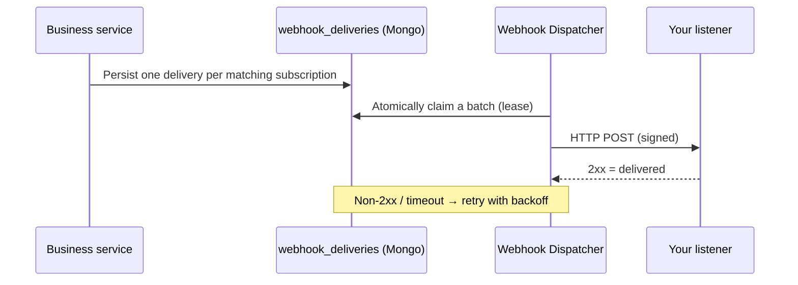

# Outbound Event Webhooks

The XiansAi Server can notify external systems whenever a significant event happens on the platform — for example when a user is added, a tenant is created, or an agent is deleted. You register **listener URLs** in the server configuration, and the server delivers a signed HTTP `POST` to each listener that is subscribed to the event.

!!! note "Outbound vs inbound webhooks"
    This page covers **outbound** notifications the server *sends* to your systems. It is different from *inbound* webhooks (Slack, Teams, generic webhooks) that *receive* HTTP calls to drive agents — see [Slack Integration](slack-integration.md) and [Teams Integration](teams-integration.md).

## How it works

Events are delivered through a durable **outbox** so they survive restarts and work correctly even when several server instances run at once.



1. When an event occurs, the server writes one durable row per matching subscription into the `webhook_deliveries` collection.
2. A background dispatcher (running on every instance) atomically claims due rows using a short lease, so **exactly one instance** delivers each row.
3. On a `2xx` response the delivery is marked delivered. On failure it is retried with exponential backoff up to the configured maximum, after which it is marked failed and kept for inspection.
4. If an instance crashes mid-delivery, the lease expires and another instance automatically reclaims the row.

## Registering a webhook

Webhooks are configured under the `Webhooks` section of your server configuration (`appsettings.json` or environment variables). Nothing is queued or delivered until the feature is enabled.

!!! tip "Environment variable form"
    Every setting can be supplied as an environment variable by replacing `:` with `__`. For example `Webhooks:Enabled` becomes `Webhooks__Enabled`.

### Global settings

| Setting | Required | Default | Description |
|---------|----------|---------|-------------|
| `Webhooks:Enabled` | Yes | `false` | Master switch. When `false`, nothing is queued and the dispatcher does not run. |
| `Webhooks:Subscriptions` | Yes | `[]` | The list of listeners (see below). At least one is required for anything to be delivered. |
| `Webhooks:PollIntervalSeconds` | No | `5` | How often the dispatcher checks the outbox for due deliveries. |
| `Webhooks:RequestTimeoutSeconds` | No | `10` | Per-request HTTP timeout for each delivery attempt. |
| `Webhooks:MaxAttempts` | No | `5` | Number of attempts before a delivery is marked `Failed`. |
| `Webhooks:LeaseSeconds` | No | `60` | Claim lease duration; also the crash-recovery window before a stuck delivery is retried by another instance. |
| `Webhooks:BatchSize` | No | `20` | Maximum number of deliveries processed per poll. |
| `Webhooks:AllowInsecureHttp` | No | `false` | Allow `http://` listener URLs. When `false`, listener URLs **must** use HTTPS. |

### Subscription settings

Each entry in `Webhooks:Subscriptions` describes one listener.

| Field | Required | Default | Description |
|-------|----------|---------|-------------|
| `Url` | Yes | — | Absolute destination URL that receives the `POST`. Must be HTTPS unless `AllowInsecureHttp` is `true`. |
| `Name` | Yes | — | Stable identifier for the listener. It is persisted on every delivery row and useful for auditing and debugging. |
| `EventTypes` | No | `["*"]` | The event types this listener receives. Empty or `["*"]` means **all** events. Otherwise, list specific event types (see [Supported events](#supported-events)). |
| `Secret` | No (recommended) | — | Shared secret. When set, each request is signed with an HMAC-SHA256 signature so you can verify authenticity. Strongly recommended. |
| `Enabled` | No | `true` | Whether this subscription is active. Set to `false` to temporarily disable a listener without removing it. |

### Example (`appsettings.json`)

```json
{
  "Webhooks": {
    "Enabled": true,
    "PollIntervalSeconds": 5,
    "RequestTimeoutSeconds": 10,
    "MaxAttempts": 5,
    "LeaseSeconds": 60,
    "BatchSize": 20,
    "AllowInsecureHttp": false,
    "Subscriptions": [
      {
        "Name": "crm-listener",
        "Url": "https://example.com/hooks/xians",
        "Secret": "a-long-random-shared-secret",
        "EventTypes": ["user.created", "user.tenant.added", "tenant.created"],
        "Enabled": true
      },
      {
        "Name": "audit-sink",
        "Url": "https://audit.internal.example.com/events",
        "Secret": "another-long-random-secret",
        "EventTypes": ["*"],
        "Enabled": true
      }
    ]
  }
}
```

## Request format

The dispatcher sends `POST <Url>` with `Content-Type: application/json` and the following headers:

| Header | Description |
|--------|-------------|
| `X-Xians-Event` | Event type (for example `user.created`). |
| `X-Xians-Event-Id` | Logical event id. Identical across every subscription that receives the same event. |
| `X-Xians-Delivery` | Unique id of this specific delivery attempt row. |
| `X-Xians-Attempt` | Attempt number, starting at `1`. |
| `X-Xians-Timestamp` | Unix time (seconds) when the request was signed. Bound into the signature to defend against replay. |
| `X-Xians-Signature` | Present only when a `Secret` is configured: `sha256=<hex HMAC of "{timestamp}.{body}">`. |

### Body envelope

Every request body has the same envelope. The `data` object varies by event type.

```json
{
  "eventType": "user.created",
  "eventId": "0f4c9b1e8a...",
  "tenantId": "acme",
  "occurredAt": "2026-07-01T05:00:00Z",
  "actor": {
    "userId": "admin@acme.com",
    "userType": "UserApiKey",
    "tenantId": "acme",
    "roles": ["TenantAdmin"]
  },
  "data": {
    "userId": "user-123",
    "email": "jane@acme.com",
    "name": "Jane Doe",
    "tenantId": "acme",
    "role": "TenantUser"
  }
}
```

| Field | Description |
|-------|-------------|
| `eventType` | The event that occurred. |
| `eventId` | Logical id shared across all deliveries of this event. Use it to deduplicate. |
| `tenantId` | The tenant the event targets. May be `null` for global events (for example some user or template events). |
| `occurredAt` | UTC timestamp when the event was published. |
| `actor` | Who triggered the event, taken from the authenticated request context. `null` for system-originated events. |
| `data` | Event-specific payload. |

!!! info "Secrets are never sent"
    Event payloads describe *what changed* (ids, names, scopes) but never contain secret values, API key material, certificate private keys, or message content.

## Securing the calls

### Verify the signature

When a `Secret` is configured, verify every request before trusting it:

1. Read the `X-Xians-Timestamp` header and reject the request if it is too old (for example, more than a few minutes) to defend against replay attacks.
2. Compute `HMAC-SHA256(secret, "{timestamp}.{rawRequestBody}")`, hex-encode it, and compare it in **constant time** with the value after `sha256=` in the `X-Xians-Signature` header.
3. Reject the request if the signatures do not match.

```python
import hashlib, hmac, time

def verify(secret: str, timestamp: str, body: bytes, signature_header: str) -> bool:
    # 1. Reject stale requests (5 minute window)
    if abs(time.time() - int(timestamp)) > 300:
        return False
    # 2. Recompute the signature over "{timestamp}.{body}"
    signed = f"{timestamp}.".encode() + body
    expected = "sha256=" + hmac.new(secret.encode(), signed, hashlib.sha256).hexdigest()
    # 3. Constant-time compare
    return hmac.compare_digest(expected, signature_header)
```

### Transport hardening

- **HTTPS is required by default.** Set `Webhooks:AllowInsecureHttp=true` only for trusted internal listeners on plain HTTP, since payloads may contain personal data.
- **Redirects are not followed.** A `3xx` response is treated as a delivery failure. This prevents a compromised listener from redirecting requests toward internal endpoints.
- **Minimal client surface.** The dispatcher does not read the response body, sends no cookies, and does not decompress responses, limiting the impact of a hostile or misbehaving listener.
- **TLS is validated normally.** There is no option to bypass certificate validation.

## Delivery semantics

Delivery is **at-least-once**. A listener may occasionally receive the same event more than once (for example, if it returns `2xx` after a network timeout). Always deduplicate using `eventId`.

- Respond with any `2xx` status to acknowledge receipt.
- Respond quickly. If your processing is slow, accept the request and process it asynchronously; otherwise you risk the `RequestTimeoutSeconds` timeout and unnecessary retries.
- Failed deliveries are retried with exponential backoff up to `MaxAttempts`, then marked `Failed` and retained for inspection.

## Supported events

Events are published from the server's shared services, so they fire regardless of whether the change came via the Admin API, Agent API, or Web API.

!!! note "High-volume telemetry is not delivered"
    Per-message conversation writes, agent logs, activity history, usage metrics, ephemeral cache writes, and heartbeats are intentionally **not** emitted as webhooks, to avoid overwhelming listeners.

### Tenants

| Event type | Description |
|------------|-------------|
| `tenant.created` | A new tenant was created. |
| `tenant.updated` | A tenant's profile, theme, or logo was updated. |
| `tenant.enabled` | A tenant was enabled. |
| `tenant.disabled` | A tenant was disabled. |
| `tenant.deleted` | A tenant was deleted. |
| `tenant.oidc.updated` | A tenant's OIDC configuration was created or updated. |
| `tenant.oidc.deleted` | A tenant's OIDC configuration was deleted. |

### Users

| Event type | Description |
|------------|-------------|
| `user.created` | A new user account was created. |
| `user.tenant.added` | An existing user was granted membership in a tenant. |
| `user.tenant.removed` | A user's membership in a tenant was removed (also fires when their last role is removed). |
| `user.updated` | A user's name or email was updated. |
| `user.approved` | A user's tenant membership was approved. |
| `user.unapproved` | A user's tenant membership approval was revoked. |
| `user.role.changed` | A role was added to a user within a tenant. |
| `user.role.removed` | A role was removed from a user within a tenant. |
| `user.sysadmin.granted` | A user was granted the system administrator flag. |
| `user.sysadmin.revoked` | A user's system administrator flag was revoked. |
| `user.enabled` | A user account was enabled (unlocked). |
| `user.disabled` | A user account was disabled (locked out). |

### Agents, deployments, and templates

| Event type | Description |
|------------|-------------|
| `agent.registered` | An agent was registered for the first time (via the Agent API). |
| `agent.deleted` | An agent and its dependent resources were deleted. |
| `agent.deployment.updated` | An agent deployment's configuration was updated (via the Admin API). |
| `agent.ownership.transferred` | Ownership of an agent was transferred to another user. |
| `agent.template.deployed` | A system template agent was deployed into a tenant. |
| `template.updated` | A system-scoped template agent's metadata was updated. |
| `template.deleted` | A system-scoped template agent was deleted. |

### Flow definitions

| Event type | Description |
|------------|-------------|
| `flow.definition.created` | A new workflow (flow) definition was registered. |
| `flow.definition.updated` | An existing workflow definition changed (its hash changed). |

### Activations

| Event type | Description |
|------------|-------------|
| `activation.created` | An agent activation was created. |
| `activation.updated` | An agent activation was updated. |
| `activation.activated` | An agent activation was activated and its workflows started. |
| `activation.deactivated` | An agent activation was deactivated. |
| `activation.deleted` | An agent activation was deleted. |

### Knowledge

| Event type | Description |
|------------|-------------|
| `knowledge.created` | A knowledge item (or override/version) was created. |
| `knowledge.updated` | A knowledge item was updated (a new version was stored). |
| `knowledge.deleted` | A knowledge item was deleted. |

### Secrets, keys, and certificates

| Event type | Description |
|------------|-------------|
| `secret.created` | A vault secret was created. |
| `secret.updated` | A vault secret was updated. |
| `secret.deleted` | A vault secret was deleted. |
| `apikey.created` | An API key was created. |
| `apikey.revoked` | An API key was revoked. |
| `apikey.rotated` | An API key was rotated. |
| `certificate.created` | A client certificate was issued. |
| `certificate.revoked` | A client certificate was revoked. |

### App integrations

| Event type | Description |
|------------|-------------|
| `integration.created` | An app integration was created. |
| `integration.updated` | An app integration was updated. |
| `integration.deleted` | An app integration was deleted. |
| `integration.enabled` | An app integration was enabled. |
| `integration.disabled` | An app integration was disabled. |
| `integration.webhook.created` | A builtin webhook integration was created. (Deletion emits `integration.deleted`.) |

## Auditing

Beyond delivering to listeners, every row in the `webhook_deliveries` collection records audit fields you can query directly in the database:

| Field | Description |
|-------|-------------|
| `actor_user_id` | The user who triggered the event (indexed with `created_at` for per-user audit queries). |
| `actor_user_type` | How that user authenticated (for example `UserApiKey`). |
| `tenant_id` | The event's target tenant. |
| `event_type`, `event_id` | The event and its logical id. |
| `created_at` | When the event was queued. |
| `status`, `attempt_count`, `delivered_at`, `last_error` | The delivery outcome and history. |

## Troubleshooting

**Nothing is delivered**: Confirm `Webhooks:Enabled` is `true` and that at least one subscription is defined and `Enabled`.

**A listener receives no events but others do**: Check the subscription's `EventTypes` — it may not include the event types you expect. Use `["*"]` to receive everything.

**Deliveries fail with a redirect**: The dispatcher does not follow redirects. Configure the listener at its final URL.

**Signature verification fails**: Ensure you sign `"{timestamp}.{rawBody}"` (raw bytes, before any parsing) with the exact `Secret`, and compare against the value after `sha256=`.

**Server refuses an `http://` URL**: HTTPS is required unless `Webhooks:AllowInsecureHttp` is `true`.
