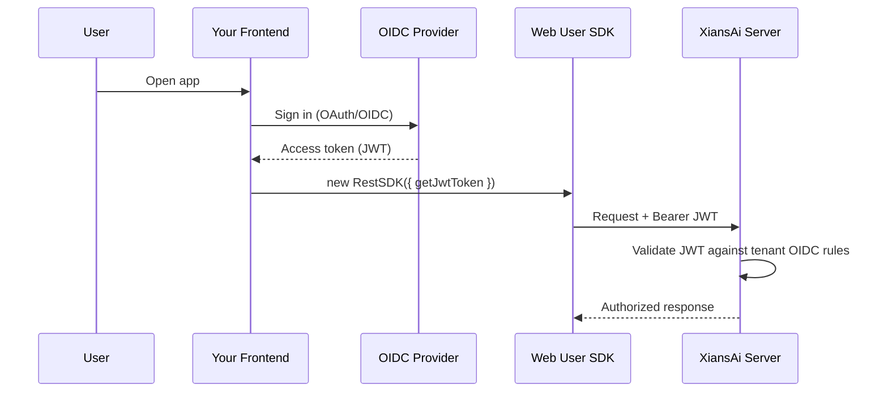

# Tenant OIDC Providers

Tenants can configure their own OIDC authentication rules independently of the global providers configured in the platform's `.env` file. This is useful when a tenant needs to enforce a specific identity provider or restrict logins to a particular organization.

These rules govern **who is allowed in** — both for users signing into Agent Studio and for any custom frontend you build with the [Web User SDK](https://github.com/XiansAiPlatform/sdk-web-typescript) (`@99xio/xians-sdk-typescript`). The SDK forwards a JWT issued by your identity provider, and the server validates that token against the tenant's OIDC rules.

## Where

`Tenant Admin → OIDC Providers`

Requires the **Tenant Admin** role (or System Admin).

## How it works (Studio side)

The OIDC rules are configured as a **JSON document** whose schema is owned by the backend (`TenantOidcRules`). The Studio provides a JSON editor with format, validate, and reset actions. The saved configuration is applied to sign-in flows for users in that tenant.

!!! info
    The exact shape of the OIDC rules document depends on your backend version. Refer to the server-side `TenantOidcRules` schema documentation for the supported fields.

!!! note "Two layers of OIDC configuration"
    Global providers (Keycloak, Visma Connect, etc.) are configured once in the server `.env` file — see the [Studio Installation guide](installation.md#authentication-providers-at-least-one). Tenant OIDC Providers layer **per-tenant** rules on top of that, without touching the server config.

## How tenant OIDC connects to your frontend (SDK side)

When you build a custom chat UI or embed the agent widget, your app authenticates the user with the tenant's identity provider, obtains a JWT, and hands that token to the SDK. The XiansAi server validates the token against the tenant's OIDC rules before allowing the request.



The SDK never talks to your identity provider directly. Your app owns the login flow; the SDK only needs a way to *read the current token*, which you supply via the `getJwtToken` callback.

## Authenticating the Web SDK with OIDC tokens

All three transport SDKs — `RestSDK`, `SocketSDK`, and `SseSDK` — share the same authentication options (`tenantId`, `serverUrl`, and one of `apiKey` / `jwtToken` / `getJwtToken`). For OIDC-backed user sessions, prefer the **`getJwtToken` callback**: it is invoked fresh for each request (and each reconnect), so expired tokens are transparently refreshed.

```typescript
import { RestSDK, SocketSDK, SseSDK } from '@99xio/xians-sdk-typescript';

// `getJwtToken` is called on every request / (re)connection,
// so returning a freshly-refreshed token here keeps the session alive.
const getJwtToken = async (): Promise<string> => {
  const user = await oidcClient.getUser();        // e.g. oidc-client-ts
  if (!user || user.expired) {
    const renewed = await oidcClient.signinSilent();
    return renewed.access_token;
  }
  return user.access_token;
};

const config = {
  tenantId: 'your-tenant-id',
  serverUrl: 'https://api.yourdomain.com',
  getJwtToken,
};

const restSDK = new RestSDK(config);
const socketSDK = new SocketSDK(config);
const sseSDK = new SseSDK(config);
```

!!! tip "`getJwtToken` may be sync or async"
    The callback signature is `() => Promise<string> | string`, so you can return a cached token synchronously or `await` a refresh — both are supported.

### Authentication precedence

When more than one method is supplied, the SDK picks one in this order (highest first). You can inspect the active method at runtime with `getAuthType()`, which returns `'apiKey'`, `'jwtToken'`, or `'jwtCallback'`.

| Option | `getAuthType()` | When to use |
| --- | --- | --- |
| `getJwtToken` | `jwtCallback` | **Recommended** for OIDC user sessions — supports refresh. |
| `jwtToken` | `jwtToken` | A single, long-lived token you already hold. |
| `apiKey` | `apiKey` | Server-to-server integrations, not user sign-in. |

### How each SDK transports the token

The OIDC JWT reaches the server differently depending on transport — all verified against the SDK source:

| SDK | JWT transport |
| --- | --- |
| `RestSDK` | `Authorization: Bearer <jwt>` header on every request (also copied into the message `authorization` field). |
| `SocketSDK` | SignalR `accessTokenFactory` — the callback is re-invoked on each connect/reconnect. The token is **not** placed in the query string. |
| `SseSDK` | `Authorization: Bearer <jwt>` header where the environment supports it; otherwise falls back to an `access_token` query parameter (browser `EventSource` cannot set headers). |

### Rotating the token on an existing instance

Each SDK exposes setters to switch credentials without recreating the object. For `SocketSDK` this transparently re-establishes the connection with the new token.

```typescript
socketSDK.updateJwtTokenCallback(getNewTokenFn); // switch to a callback
restSDK.updateJwtToken(freshToken);              // swap a static token
sseSDK.updateApiKey('sk-...');                   // switch to API key auth
```

### Handling expiry

Listen for `401` responses and trigger a silent renewal (or redirect to login). With `SocketSDK` / `SseSDK` this surfaces through the connection-error handlers:

```typescript
const socketSDK = new SocketSDK({
  tenantId: 'your-tenant-id',
  serverUrl: 'https://api.yourdomain.com',
  getJwtToken,
  eventHandlers: {
    onConnectionError: (error) => {
      if (error.statusCode === 401) {
        // token rejected — renew via your OIDC client, then reconnect
        oidcClient.signinSilent().catch(() => oidcClient.signinRedirect());
      }
    },
  },
});
```

## Related

- [Authentication Examples](https://github.com/XiansAiPlatform/sdk-web-typescript/blob/main/docs/examples/authentication.md) — full API-key and JWT recipes for every SDK
- [Studio Installation → Authentication providers](installation.md#authentication-providers-at-least-one) — configuring global OIDC providers in the server `.env`
- [Web User SDK](https://github.com/XiansAiPlatform/sdk-web-typescript) — `@99xio/xians-sdk-typescript` source and reference
