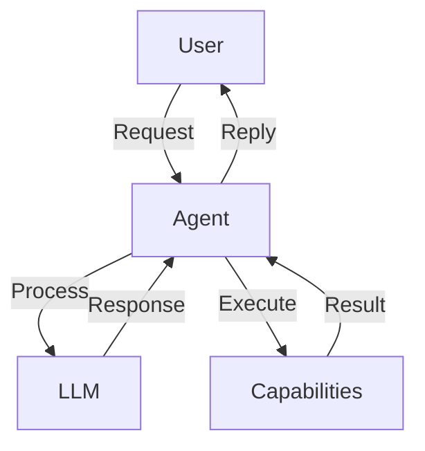

# User Guide Overview

Welcome to the Xians.ai User Guide. This comprehensive guide will help you master agent development with Xians.ai.

## What You'll Learn

This guide covers everything you need to know to build production-ready AI agents:

- **Agent Architecture** - Understanding how agents work
- **Development Workflow** - Best practices for agent development
- **Deployment** - Taking your agents to production
- **Monitoring & Debugging** - Keeping your agents healthy
- **Advanced Topics** - Multi-agent systems, workflows, and more

## Getting Started

If you're new to Xians.ai, we recommend following this learning path:

1. **[Installation](../getting-started/installation.md)** - Set up your environment
2. **[Quick Start](../getting-started/quick-start.md)** - Create your first agent
3. **Configuration** - Learn about configuration options

## Core Concepts

### Agents

Agents are autonomous AI systems that can:

- Understand natural language
- Execute tasks and workflows
- Learn from interactions
- Collaborate with other agents

### Capabilities

Capabilities are specific skills or functions that agents can perform:

```python
@capability(description="Send email to user")
def send_email(self, to: str, subject: str, body: str) -> bool:
    # Implementation
    return True
```

### Workflows

Workflows orchestrate multiple agent capabilities into complex processes:

```python
workflow = Workflow("customer_onboarding")
workflow.add_step("verify_email")
workflow.add_step("create_account")
workflow.add_step("send_welcome")
```

## Architecture Overview



## Development Workflow

### 1. Design

- Define agent purpose and capabilities
- Identify required integrations
- Plan conversation flows

### 2. Implement

- Create agent class
- Define capabilities
- Configure LLM and settings

### 3. Test

- Unit test capabilities
- Integration testing
- User acceptance testing

### 4. Deploy

- Production configuration
- Monitoring setup
- Gradual rollout

## Best Practices

!!! tip "Development Best Practices"
    - Start simple and iterate
    - Test thoroughly before deployment
    - Monitor agent performance
    - Keep capabilities focused and modular
    - Document your agent's behavior

!!! warning "Common Pitfalls"
    - Overly complex initial implementations
    - Insufficient error handling
    - Poor testing coverage
    - Inadequate monitoring

## Next Steps

Explore specific topics:

- [Agent Development](#) - Detailed agent development guide
- [Capabilities](#) - Creating custom capabilities
- [Workflows](#) - Building complex workflows
- [Deployment](#) - Production deployment guide
- [Monitoring](#) - Observability and debugging

## Community & Support

- **[Discord Community](https://discord.gg/xians)** - Get help and share ideas
- **[GitHub Discussions](https://github.com/XiansAiPlatform/discussions)** - Ask questions
- **[Examples](https://github.com/XiansAiPlatform/samples)** - Sample projects
- **[Blog](https://xians.ai/blog)** - Latest updates and tutorials


